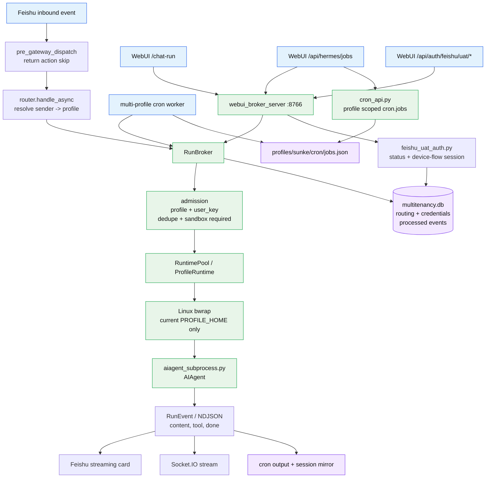
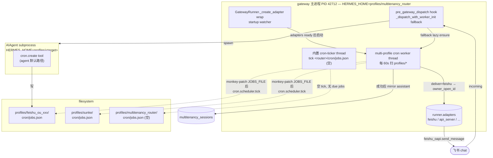

# hermes-multitenancy 架构指南

> 本 GUIDE 是 hermes-multitenancy 仓的"内部地图"。每个章节都是为"下一次改它的人"写的——着重锚点、契约、陷阱，而不是教科书介绍。
>
> 上游主仓 `hermes-feishu-uat` 的 GUIDE 把"飞书 inbound → adapter → hook"那段讲完了。**本 GUIDE 重点从 multitenancy plugin 被加载/触发开始**：inbound 由 `pre_gateway_dispatch` 接管；cron delivery 则由 gateway startup watcher 启动 multi-profile worker，不再依赖先有一条 inbound 消息。

> [!warning] 2026-05-14 cron/sandbox 修正
> multi-profile cron worker 在存在 `multitenancy.db` 时只扫描 `active=1` 的 routed profile，避免 inactive 历史 profile（例如旧 `feishu_ou_*`）继续执行遗留 job。Linux bwrap policy 也不再把整个 shared `~/.hermes` 只读挂入 profile subprocess；它只创建 shared 目录骨架，并挂载当前 `PROFILE_HOME` 与明确允许的 shared 文件/目录，从而避免 agent 枚举 sibling profiles。追加部署 `726c79c` / `af285d4` 后，profile `.env/auth.json` 在 bwrap 启动前由父进程读取并转换为 AIAgent env，bwrap 内 shared `.env/auth.json/auth.lock` 用 `/dev/null` 遮蔽；profile `.env` 若是 shared symlink 不直接 bind 遮蔽，避免 bwrap spawn 失败，读取面由 hermes-agent 的 file tool 拒绝与 terminal hardline 兜底。

> [!warning] 2026-05-14 credential vault
> `51044dc` 新增 `hermes_multitenancy.credentials.CredentialStore` 与 `multitenancy_credentials` 表，用 dedicated credential rows 存 Feishu UAT / provider token metadata + encrypted payload，不把 token 混进 routing table。`credential_tool.py` 注册的是 status-only 诊断工具，只返回 provider、subject、scope、expires_at、status、storage，不返回 access_token/refresh_token/api_key。`agent_real._install_feishu_uat_db_broker()` 会优先从 DB 取当前 profile/open_id 的 Feishu UAT；缺失时兼容读取 profile-local JSON 并写入 DB。生产 router gateway 通过 systemd drop-in 提供 `HERMES_MULTITENANCY_CREDENTIAL_KEY`，该 key 只作为 AIAgent 子进程 plumbing 透传，terminal/code subprocess 仍按 secret-name 过滤。
>
> `fcd55ac` 把 Feishu app credential 也收进 vault：`_install_feishu_app_db_broker()` patch `tools.feishu_oapi_client._resolve_feishu_credentials()`，优先取全局行 `profile_name=__global__ / subject_id=feishu_app / provider=feishu / secret_kind=app`；用户 UAT 仍按 `profile_name + open_id + provider=feishu + secret_kind=uat` 精确过滤。`_build_subprocess_env()` 不再转发 `FEISHU_APP_ID` / `FEISHU_APP_SECRET` / `FEISHU_DOMAIN`，profile `.env` 中这三项也会被过滤。生产 `yaojunhua` canary 已验证 app credential 与 UAT 均从 credential vault 加载，`feishu_get_my_user_info` `error=False`。
>
> `7471cac` 补齐 UAT refresh -> vault 同步边：`sync.feishu_org._migrate_feishu_uat_for_employee()` 在把 shared `feishu_uat/<open_id>.json` 复制进 profile-local `feishu_uat/` 时，也 best-effort 写入 `multitenancy_credentials`。这保持 DB credential source 与 OAuth/refresh daemon 产出的 JSON 对齐；缺少 credential key 的旧部署仍保留 JSON copy fallback。
>
> `91221d3` 修正 shared model env 继承边界：sandboxed AIAgent 在 bwrap 前会从 shared `~/.hermes/.env` 只继承 `_MODEL_ENV_ALLOWLIST` 中的 provider key/base URL（如 `ANTHROPIC_API_KEY` / `ANTHROPIC_BASE_URL`），profile-local `.env` 仍可覆盖；若 profile `.env` symlink 到 shared `.env`，同样按 shared allowlist 过滤，避免 `GITLAB_TOKEN` / `PUBLIC_RUNTIME_FLAG` 这类非模型配置进入租户 AIAgent env。Feishu app/UAT 继续由 credential vault 读取，不走 env。生产 `sunke` / `zhanglina` RunBroker canary 已验证 bwrap AIAgent 正常取到模型 key。
>
> `69fe59a` 修正 sandbox media 投递兜底：AIAgent/浏览器类工具可能把真实文件保存到 `PROFILE_HOME/home/Downloads/logo.png`，但模型回复仍写 `MEDIA:/tmp/logo/logo.png`。router 仍禁止投递 profile 外路径；只有当同名文件存在于当前 profile 的固定产物目录（`home/Downloads`、`cache/images`、`tmp`、`data`）时，才接受该产物。当前实现会进一步把这类产物发布到 WebUI 可见的 `PROFILE_HOME/workspace/Downloads/<name>`，并让 Feishu `MEDIA:` 也引用这个 workspace 路径；没有 profile 内产物时继续拦截，避免 host `/tmp` 或其他租户文件泄露。
>
> 2026-05-15 追加收口：如果模型没有写 `MEDIA:`，而是在回复文本里直接写出一个当前 profile 内真实存在的文件路径（例如 `.ai-docs/.../*.md`），router 出站层会自动复制一个 WebUI 可见副本到 `PROFILE_HOME/workspace/Downloads/`，把可见卡片里的宿主路径替换为附件提示，并追加内部 `MEDIA:` 指令让 Feishu 直接投递文件。敏感路径仍 fail-closed：`.env`、`auth.json`、`config.yaml`、`feishu_uat/`、`credentials/`、`tokens/`、`.ssh/` 等不会自动发送。
>
> `299f0a4` / `00f22a0` 把 Feishu 入站 CSV/XLSX 兼容收敛到 multitenancy router：仍优先调用 Hermes 原生 `gateway._prepare_inbound_message_text()`，仅当上游没有内联本地缓存的表格附件时，由 plugin 用 stdlib 提取小片段追加到模型上下文。`00f22a0` 确保 `media_types` 数量少于 `media_urls` 时仍处理后续附件，并对本地文件、文本预览、XLSX XML member 做大小上限。不要再为 `.csv/.xlsx` 修改 `hermes-agent/gateway/platforms/feishu.py`；升级时只检查这个 plugin fallback 与 upstream 私有方法签名是否仍匹配。
>
> 2026-05-15 keep-record 图片 UAT 暴露出入站附件边界：Feishu adapter 把图片缓存到 `multitenancy_router/cache/images/...`，但 routed AIAgent 的 Linux bwrap 只挂载目标 profile，导致 sunke 的 skill 能看到 router cache 路径却无法读取。`_materialize_inbound_media_for_profile()` 在 enrichment/RunRequest 前把本地入站附件复制到目标 profile：图片进 `profile/cache/images/`，其他文件进 `profile/uploads/`，并同步改写 `event.media_urls` 与文本里的路径。这样 `keep-record` 这类上传图片的 skill 能直接读取当前 profile 内的附件路径。

> [!warning] 2026-05-14 generic token runtime compatibility
> 多租户不再要求 token-bearing skills 为 Hermes 改写专用 storage API。`agent_real._build_subprocess_env()` 把 `HOME`、`WORKSPACE`、`XDG_*`、`TMPDIR` 统一 pivot 到当前 `PROFILE_HOME`，设置 `HERMES_PROFILE` / `KEP_PROFILE`，并把 shared `~/.hermes/bin` 放到 PATH 首位；Linux bwrap 同步把 `PROFILE_HOME/workspace` bind 到 `/workspace`，`hermes-agent` 的 MCP stdio safe env 也允许这些 profile anchor 下传。`agent_real._install_skill_runtime_compat()` 只在 routed AIAgent 子进程内把 OpenClaw/ClawHub 常见的 `{baseDir}` skill 模板变量解释为当前 skill 根目录，不修改 skill 包或 hermes-agent 源码。结果是 ClawHub/Hermes skills hub 的主流玩法（`~/.tool`、XDG cache、MCP env、npx/uvx、`/workspace/credentials`、`{baseDir}/scripts/...`、profile-aware CLI）按当前 routed profile 自然隔离。全员默认 skill 由运行时 `<shared>/.hermes/profile-skill-defaults.yaml` 指向 `<shared>/.hermes/skills/...`，org sync/auto-provision 复制到每个 profile 并跳过 `.env`、`*.token`、`*.secret`、`*.key` 等敏感文件；后续新员工下一次 sync 自动继承。批量/部门级 token 由 `credential_materializer.py` 从 vault 行 `profile_name=__shared__` 按 `credential-materialization.yaml` audience list 写入目标 profile（如 `workspace/credentials/gitlab.token`），`profiles: ["*"]` 表示活跃 routing profile 全量；若 entry 声明 `env: GITLAB_TOKEN`，routed AIAgent 还会从 vault 注入该 env 并注册 terminal/code passthrough，让命令使用 `${GITLAB_TOKEN}` 而不是让模型读取 token 文件。这样避免 OpenClaw 式 per-skill wrapper/fanout。
>
> 2026-05-15 生产二次收口：WebUI/Feishu 真实 UAT 暴露出 Hermes terminal/code 子进程还有一层 secret-name scrub，单靠 env passthrough registry 在 routed AIAgent 路径不够稳。`hermes-multitenancy@09cdfdd` 在 credential env 注入时同步设置 `_HERMES_FORCE_<ENV>` plumbing，复用 Hermes local environment builder 的 force-prefix 通道，把 `GITLAB_TOKEN` 还原给 terminal/code 子命令，但不把 `_HERMES_FORCE_*` 本身暴露给 shell。WebUI 会话 `webui_gitlab_visible_20260515_0130` 返回 `WEBUI_GITLAB_ENV_OK LEN=20`；Feishu DM UAT 返回 `FEISHU_GITLAB_ENV_OK LEN=20`；`kep-prd-analysis` 进一步完成 GitLab clone + L1/L2 sparse-checkout + 飞书 PRD 读取。
>
> `fed1702` 追加 Keep Hades 的 slash alias：`router._maybe_rewrite_skill_slash_command()` 在标准 skill command key 解析失败后，会把 `/hades` 映射到 `kep-hades-cli`，因此 `/hades get <apply_id>` 与 `/kep-hades-cli get <apply_id>` 走同一个全员默认 skill。随后补齐 Run Broker 入口：`run_broker.py` 在 dispatch/admit 前复用 `skill_slash.py`，让 WebUI/cron 这类不经过 Feishu router 的入口也能把 `/hades` 转成 native skill invocation。2026-05-15 Feishu 真实复测发现 `multitenancy_router` profile 自身没有 Keep skills，router 在 slash rewrite 时必须先进入目标 `profile_home` 的 `_profile_gateway_context`，否则 `sunke` 明明有 `kep-hades-cli` 仍会被 router profile 判成 unknown；已加回归 `test_skill_slash_uses_routed_profile_home`。这个兼容属于 multitenancy 执行入口别名，不改 skill 包、不改 Hermes agent core，也不为 Hades 做专用 token plumbing。生产同时修正了 `kep-hades-cli` 的文案：`kep-auth status` 有效但 `hades-cli` 返回 `HTTP 403` / openresty 时，应该报告 Hades 上游网关或权限拒绝；不要把它判断成 profile 未登录，也不要默认要求用户重登。

> [!info] 2026-05-14 全员可进入目标态
> 生产目标不是灰度 allowlist。Feishu org sync 负责为全员创建/更新 canonical routing/profile；用户自己完成 `feishu_auth` 后即可通过 Feishu bot / WebUI 消费工具。`HERMES_MULTITENANCY_AUTO_PROVISION=0` 只表示不为未知 open_id 创建临时 fallback profile，避免历史 `feishu_ou_*` 残留继续扩散；它不等于人工准入。未命中 routing/profile 时应优先排查 org sync 是否覆盖到该用户，而不是要求人工审批。

> [!warning] 2026-05-14 Feishu inbound duplicate guard
> 真实 Feishu DM canary 后发现：同一会话中旧长任务可能被 Feishu/WebSocket flush 或事件重投递再次送入 router，绕过仅内存态的 `_active_sessions` guard，重新启动 `bwrap -> aiagent_subprocess.py`。本仓新增 `multitenancy_processed_events` 表：优先按 Feishu `message_id` 做 24h 持久化去重；无稳定 `message_id` 时，对 40 字以上 normalized prompt 做 2h hash fallback。去重发生在 route 命中之后、in-flight cancellation 与 sandbox 子进程启动之前；slash command 不走这条去重。

> [!info] 2026-05-14 Run Broker 目标态骨架
> `run_models.py` / `run_broker.py` 已新增 channel-neutral contract：`RunRequest(channel, profile_name, user_key, content, message_id/idempotency_key, credential_subject, requires_host_tools, ...)`、`RunEvent(kind, text, payload)`、`RunResult(content, duplicate, run_id)` 与最小 `RunBroker.run()` / `RunBroker.admit()`。Feishu `handle_async` route 命中后已构造 `RunRequest(channel="feishu")` 并通过 broker admission 执行 sandbox policy + idempotency；minimal 非 streaming adapter 分支和 full CardKit streaming 分支都已通过 `RunBroker.run(..., admitted=True)` 执行。WebUI 已有 HTTP/SSE sidecar endpoint；cron 已有 `HERMES_MULTITENANCY_CRON_RUN_BROKER=1` run_job patch，会把 due job 构造成 `RunRequest(channel="cron")`。生产 66 已启用 WebUI/cron broker：`127.0.0.1:8766` sidecar active，WebUI Socket.IO canary 返回 `SANDBOX=1`，真实 router cron worker job `e79412276d8f` 输出 `Run Path: RunBroker` + `SANDBOX=1`。CardKit 具体 renderer、session history 和 media delivery 仍保留在 `router.py`。

> [!info] 2026-05-15 WebUI Feishu UAT ensure
> `feishu_uat_auth.py` 在 Run Broker sidecar 内提供 WebUI 专用的 UAT 状态检查与 device-flow 授权会话。新增接口：`GET /api/run-broker/credentials/feishu/uat/status`、`POST /api/run-broker/feishu-auth/sessions`、`GET /api/run-broker/feishu-auth/sessions/{session_id}`、`DELETE /api/run-broker/feishu-auth/sessions/{session_id}`。这些接口只接受 broker Bearer key 保护下的 `profile_name + user_key(open_id)`，并先用 `multitenancy_routing` 校验该 open_id 是否仍 active 绑定到该 profile。
>
> 授权开始/轮询阶段复用 `hermes_cli.feishu_auth` 的 device-flow helper，不把 device_code、access_token、refresh_token 回传给 WebUI。授权完成后会校验 Feishu 返回的 `open_id` 与 WebUI session open_id 一致，再写入 `multitenancy_credentials(profile_name, open_id, feishu, uat)`，并同步写一份 profile-local `profiles/<profile>/feishu_uat/<open_id>.json` 作为 Hermes tool 兼容路径。WebUI 只获得 `missing/expired/scope_missing/valid/pending/success/error` 等状态与授权 URL/user code。

> [!info] 2026-05-14 Run Broker jobs API 收口
> `5d48dcd` 新增 `cron_api.py` 与 `/api/run-broker/jobs`，WebUI chat plane 的 job 创建、列表、修改、删除、暂停、恢复都进入本仓 sidecar，不再要求 `hermes-gateway@sunke.service` profile apiserver 常驻。生产验证时停止 `hermes-gateway@sunke.service`，WebUI BFF 仍能创建并删除 job `0dbd12ced3b1`。`a19f456` / `7d2cf1e` 是本 GUIDE 的 docs-only 同步。
>
> `114fd3e` 修正 WebUI/broker cron 创建的服务端默认投递语义：`POST /api/run-broker/jobs` 若未显式传 `deliver`，`cron_api.create_job()` 默认写入 `deliver=feishu`，仍允许显式 `local` 作为调试/本地目标。生产 `yaojunhua` canary `87272ee05aa6` 验证：创建请求未传 `deliver`，返回 job 为 `deliver=feishu`，真实 router worker 输出 `Run Path: RunBroker`，日志记录 `delivered to feishu:ou_ec1d... via live adapter`，并 mirror 到 `multitenancy_sessions(profile=yaojunhua, user_key=ou_ec1d...)`。

---

## §1 TL;DR

### 1.1 一图



### 1.2 一段话

multitenancy 是 hermes-agent 的**进程内插件**。它在 `pre_gateway_dispatch` 钩子里**接管**飞书 inbound，做三件事：(1) 把 `sender_open_id` 路由到一个独立 `profile_home` 目录（`~/.hermes/profiles/<name>/`）；(2) 在 LRU `RuntimePool` 里维护 per-profile 的 `ProfileRuntime`；(3) 用 `asyncio.create_subprocess_exec` 起一个 `aiagent_subprocess.py` 子进程，把 `AIAgent` 跑在那里——通过 NDJSON 协议把 `content/thinking/tool_started/tool_completed/approval_required/approval_resolved/done` 事件流回父进程，父进程再喂给 `GatewayStreamConsumer` 走飞书 streaming card 更新。cron 场景下，它还在 router gateway 中启动 multi-profile worker，扫描各 profile 的 `cron/jobs.json`，用 live Feishu adapter 投递给 owner，并 mirror 到 `multitenancy_sessions`。**"One Feishu bot, N users, N profiles"** 这一行宣传的实现就在这。

### 1.3 它不做什么

- **不**自己跟飞书业务 OpenAPI 直接说话——adapter 是 hermes-agent 的 `FeishuAdapter`，工具调用仍由 hermes-agent / hermes-feishu-uat 完成。WebUI UAT ensure 只在 sidecar 内复用 `hermes_cli.feishu_auth` 的 device-flow helper 启动/轮询授权，并把结果落到 credential vault。
- **不**写飞书 token 文件——`~/.hermes/feishu_uat/<ou_*>.json` 是 `hermes-feishu-uat` 的产物
- **不**起 launchd/supervisor——`hermes_multitenancy` 是 plugin，跟 gateway 同进程
- **不**修改 hermes-agent core 文件来完成多租户投递。少数 integration seam 会在 plugin runtime 内做有边界的 patch（如 `GatewayRunner._create_adapter`、`cron.scheduler` delivery、Feishu open_id send），目标是复用 hermes-agent adapter/scheduler，不把 core fork 继续扩散

---

## §2 Plugin manifest 与加载

### 2.1 物理注册位置

| 位置 | 类型 | 说明 |
|---|---|---|
| `/Users/kite/code/hermes-multitenancy` | git 仓 (eggyrooch-blip/hermes-multitenancy, main) | 真源 |
| `~/.hermes/plugins/multitenancy` | **symlink** → 上面 | hermes-agent 实际加载路径 |

验证：

```bash
$ ls -la ~/.hermes/plugins/multitenancy
lrwxr-xr-x ... multitenancy -> /Users/kite/code/hermes-multitenancy
```

所以**直接在 `~/code/hermes-multitenancy` 里改 .py 文件就生效**，不需要 reinstall。改完重启 gateway 即可（plugin import 是 startup-once 的）。

### 2.2 manifest 三件套

#### `plugin.yaml` (`/Users/kite/code/hermes-multitenancy/plugin.yaml:1-9`)

```yaml
manifest_version: 1
name: multitenancy
version: 0.1.0
description: "Multi-tenant Feishu routing for Hermes: one bot, many users, isolated profiles."
author: Hermes Multitenancy Contributors
kind: standalone
provides_hooks:
  - pre_gateway_dispatch
```

唯一 hook 声明：`pre_gateway_dispatch`。`kind: standalone` 意味着这个插件可以独立 `pip install`（不需要 hermes-agent 的 monorepo 上下文）。

#### `pyproject.toml` (`/Users/kite/code/hermes-multitenancy/pyproject.toml:1-56`)

- 包名 `hermes-multitenancy`，version `0.1.0`
- 依赖：`hermes-agent>=1.0`、`openai>=1.0`、`python-dotenv>=1.0`、`PyYAML>=6.0`
- console script：`hermes-multitenancy-sync = "hermes_multitenancy.sync.cli:main"`
- **entry-point**：

  ```toml
  [project.entry-points."hermes_agent.plugins"]
  multitenancy = "hermes_multitenancy"
  ```

  发布到 PyPI 后，hermes-agent 通过 `importlib.metadata.entry_points(group="hermes_agent.plugins")` 自动发现。开发环境走 `~/.hermes/plugins/<name>/` 目录扫描这条路径。
- packages：`["hermes_multitenancy", "hermes_multitenancy.sync"]`

#### `hermes_multitenancy/plugin.yaml`

`MANIFEST.in` 里 `package-data` 把 `plugin.yaml` 打进 wheel，但**当前 hermes 加载逻辑只看顶层 `/Users/kite/code/hermes-multitenancy/plugin.yaml`**——子目录那份只是 setuptools 打包形式上的副本。

### 2.3 顶层 `__init__.py` shim

`/Users/kite/code/hermes-multitenancy/__init__.py`：

```python
try:
    from .hermes_multitenancy import on_pre_gateway_dispatch, register
except ImportError:
    from hermes_multitenancy import on_pre_gateway_dispatch, register
__all__ = ["register", "on_pre_gateway_dispatch"]
```

这层 shim 让 hermes 走 `~/.hermes/plugins/multitenancy/__init__.py` 这条**目录式 install path** 时，能直接 import 到 `register`。生产链路走的就是这条。

### 2.4 `register(ctx)` 入口

(`hermes_multitenancy/__init__.py:18-38`)：

```python
def register(ctx) -> None:
    from .agent_real import real_run_agent
    from .cron_worker import install_cron_runtime_patches, install_gateway_startup_watcher
    from .pool import RuntimePool
    from .router import override_pool
    from .runtime import ProfileRuntime

    def _real_factory(profile_name, profile_home):
        return ProfileRuntime(profile_home=profile_home, run_agent_fn=real_run_agent)

    override_pool(RuntimePool(runtime_factory=_real_factory))
    install_cron_runtime_patches()
    install_gateway_startup_watcher()
    ctx.register_hook("pre_gateway_dispatch", _dispatch_with_worker_init)
```

做三件事，**顺序很重要**：

1. **`install_cron_runtime_patches()` / `install_gateway_startup_watcher()`** — 在 plugin runtime 内接管 gateway adapter 创建后的时机，启动 multi-profile cron watcher，并修正 cron delivery 对 Feishu owner/open_id 的投递语义。
2. **`override_pool(RuntimePool(...))`** — 用 `real_run_agent` 把 `pool.py:_default_factory` / `runtime.py:_default_run_agent` echo stub 全替掉。这一步发生在 hook 注册之前，确保插件 enable 后**第一条消息**就走真 LLM，不会先 echo 一发。
3. **`ctx.register_hook("pre_gateway_dispatch", _dispatch_with_worker_init)`** — `ctx` 是 hermes-agent 的 `hermes_cli.plugins.PluginContext`，`register_hook` 是它的标准方法。pre-dispatch 仍是 inbound 主入口，也保留 worker 启动 fallback。

`override_pool` 在 `router.py:1605-1612` 实现，写入 `_GLOBAL_POOL` singleton；后续 `_get_pool()` 读这个 singleton（router.py:1614-1622）。

---

## §3 `pre_gateway_dispatch` hook 流程

### 3.1 Sync 回调入口

(`hermes_multitenancy/router.py:337-363`)

```python
def on_pre_gateway_dispatch(*, event, gateway, session_store=None, **_kwargs) -> dict:
    try:
        if _should_defer_gateway_processing_complete(event):
            _defer_gateway_processing_complete(event, gateway)
        loop = asyncio.get_running_loop()
        task = loop.create_task(handle_async(event=event, gateway=gateway))
        task.add_done_callback(_log_task_failure)
    except RuntimeError:
        if os.environ.get("PYTEST_CURRENT_TEST"):
            try:
                asyncio.run(handle_async(event=event, gateway=gateway))
            except Exception as exc:
                logger.warning("multitenancy: sync fallback dispatch failed: %s", exc)
        else:
            logger.error("multitenancy: pre_gateway_dispatch invoked without a running loop — dropping event")
    except Exception as exc:
        logger.warning("multitenancy: failed to schedule handle_async: %s", exc)
    return {"action": "skip", "reason": "multitenancy router took over"}
```

四个关键点：

| 关键 | 说明 |
|---|---|
| **kwargs-only 签名** | `(*, event, gateway, session_store=None, **_kwargs)`。`session_store` 入参没用上——插件用自己的 `SessionStore`（§9） |
| **fire-and-forget** | sync hook 拿到 loop → `create_task(handle_async(...))` → 立即返回。`_log_task_failure` (router.py:2509-2515) 把后台异常打到 logger.error |
| **返回 `action: skip`** | 这是 hermes-agent gateway 的契约：让 gateway 主流程**不**再继续处理这条消息。控制权完全交给插件 |
| **pytest fallback** | 没有 running loop（test 直接 sync 调） + `PYTEST_CURRENT_TEST` 在 env → `asyncio.run(handle_async(...))`。生产永不走这条 |

### 3.2 `_should_defer_gateway_processing_complete`

(`router.py:366-385`)

判断"是否要阻止 gateway 自己 ack 这条消息（reaction/读状态等），交给插件最后再 ack"。返回 True 的条件：

- 不是 slash command（slash 让 gateway 自己 ack）
- 已能 resolve 到 profile_home，或
- auto-provision 开了 + routing table 可用 + sender 不为 `unknown`/空

然后 `_defer_gateway_processing_complete` (router.py:388-396) 调用 `adapter.defer_processing_complete(event)`。这个方法由 `FeishuAdapter` 提供——hermes-feishu-uat 那边的 `gateway/platforms/feishu/...` 里实现。

### 3.3 `handle_async` 主路径

(`router.py:402-544`)

```
sender         = _resolve_sender_for_routing(event)
sender_alt     = event.source.user_id_alt
text           = event.text

# ── Slash 短路 ────────────────────────────────────
cmd = parse_command(text)
if cmd:
    cmd_profile = _resolve_route(sender, alt_id=sender_alt)
    if _maybe_rewrite_skill_slash_command(...):
        text = event.text (重写后)
    else:
        await _handle_command(...)   # /stop /status /new /approve /deny /help /...
        return

# ── 路由 ──────────────────────────────────────────
profile_name, profile_home = _resolve_or_auto_provision_route(sender, alt_id=sender_alt)
if profile_home is None: return                # 无路由,丢

# ── 适配器探测 ────────────────────────────────────
adapter      = _get_feishu_adapter(gateway)
feishu_full  = adapter has edit_message + on_processing_start + on_processing_complete

# ── 入站去重（持久化）────────────────────────────
if not _mark_routed_event_seen(event, profile_name, sender, sender_alt, text):
    if feishu_full:
        await adapter.complete_deferred_processing(event, SUCCESS)
    return

# ── 槽位（per-sender in-flight task）─────────────
prev = _user_inflight_tasks.get(sender)
if prev and not prev.done() and prev != current:
    prev.cancel()
_user_inflight_tasks[sender] = current_task

if feishu_full: await adapter.on_processing_start(event)

# ── 多模态 enrichment（复用 hermes 主线）───────────
enriched_text = await _enrich_via_hermes_pipeline(event, gateway)
    # 委托给 gateway._prepare_inbound_message_text(event, source, history=[])

# ── 历史 ──────────────────────────────────────────
hist_key = (profile_name, _tenant_user_key(sender, sender_alt))
prior    = _load_history(hist_key)             # cache miss → SessionStore.load_recent
user_msg = _build_user_message(event, text_override=enriched_text)
conversation = prior + [user_msg]
agent_event  = _event_with_text(event, user_msg["content"])

# ── 发送（双路径）─────────────────────────────────
if feishu_full:
    response = await _stream_into_feishu(adapter, chat_id, profile_name, profile_home,
                                          agent_event, messages=conversation)
    if response:
        await _deliver_media_from_stream_response(gateway, response, agent_event, adapter, profile_home)
else:
    await adapter.send_typing(chat_id)
    response = await _get_pool().dispatch(profile_name, profile_home, agent_event)
    await adapter.send(chat_id, response)

# ── 落历史 ────────────────────────────────────────
if response: _persist_turn(hist_key, user_msg, response)
_touch_route(sender, sender_alt)

# ── 收尾 ──────────────────────────────────────────
if feishu_full:
    adapter.complete_deferred_processing(event, outcome) or on_processing_complete
if _user_inflight_tasks.get(sender) is current:
    _user_inflight_tasks.pop(sender, None)
```

---

## §4 Sender 解析层叠

`_resolve_sender_for_routing` (`router.py:158-196`) 按优先级挑稳定的飞书用户键：

```
1. feishu_oapi_client.current_sender_open_id.get()    # adapter 设的 ContextVar,最权威
2. event.sender_open_id
3. event.source.open_id
4. event.source.user_id
5. event.source.user_id_alt
6. event.raw / event.raw_event / event.event 里 5 条 nested path:
     (sender, sender_id, open_id)
     (event, sender, sender_id, open_id)
     (event, message, sender, sender_id, open_id)
     (message, sender, sender_id, open_id)
     (sender_id, open_id)
7. fallback (默认 "unknown")
```

`_is_feishu_open_id` 只接受 `ou_*` 开头的 string——**不是 `ou_*` 就跳过**，继续往下找。

注释里讲明了原因：飞书 SDK 偶尔会把 `source.user_id` 填成 tenant-local 短 ID（例 `g41a5b5g`），但**真权威**是 app-scoped 的 `ou_*`。UAT 文件和路由表都按 `ou_*` 索引。

### 4.1 alt_id 是什么

`sender_alt = event.source.user_id_alt`。这一字段是飞书 IM 给的"备用 ID"——通常是 `on_*`（union_id 风格，跨 app 稳定）。multitenancy 把它当成"如果 sender 没拿到 `ou_*` 就用它，且查路由时也再查一遍"。

`_resolve_route` 用 `candidates = [sender] + ([alt_id] if alt_id != sender)` 两个都查 `lookup_by_open_id`——这意味着 sync 把行的 `open_id` 列填成 `on_*` 时也能命中。

---

## §5 Routing 表 schema 与 lookup 层叠

### 5.1 数据库定位

(`routing.py:24`)

```python
DEFAULT_DB_PATH = Path.home() / ".hermes" / "multitenancy.db"
```

**独立**于 `~/.hermes/state.db`（注释明说为了不跟 gateway 的 sessions/pairing/cron 抢 WAL）。同一个 `.db` 文件里至少有这些 multitenancy 表：

- `multitenancy_routing` — `RoutingTable` 用
- `multitenancy_sessions` — `SessionStore` 用（§9）
- `multitenancy_processed_events` — Feishu inbound 去重用（§9.4）
- `multitenancy_credentials` — credential vault 用（credential vault 章节）

两个 class 各开一个 `sqlite3.connect(..., check_same_thread=False)`，共享 WAL。

> **历史坑**：`~/.hermes/multitenancy_routing.db`（**不是** `multitenancy.db`）是个 0 字节空壳，没人用。路由真正落地的是 `multitenancy.db`。改 schema 别认错文件。

### 5.2 multitenancy_routing schema

实测 `sqlite3 ~/.hermes/multitenancy.db ".schema"` 输出：

```sql
CREATE TABLE multitenancy_routing (
    user_id        TEXT PRIMARY KEY NOT NULL,
    profile_name   TEXT NOT NULL,
    open_id        TEXT NOT NULL,
    union_id       TEXT,
    active         INTEGER NOT NULL DEFAULT 1,
    deleted_at     INTEGER,
    synced_at      INTEGER NOT NULL,
    version        INTEGER NOT NULL DEFAULT 1,
    last_active_at INTEGER,
    created_at     INTEGER NOT NULL,
    updated_at     INTEGER NOT NULL
);
CREATE UNIQUE INDEX idx_routing_open_id_active
    ON multitenancy_routing(open_id) WHERE active = 1;   -- partial UNIQUE
CREATE INDEX idx_routing_active_user
    ON multitenancy_routing(active, user_id);
```

定义在 `routing.py:26-44`。

**关键约束** — `idx_routing_open_id_active` 是 **partial UNIQUE INDEX**：

- 同一 `open_id` 在 active=1 中只能有一条（防止双路由）
- 同一 `open_id` 软删历史可堆 N 条（active=0）—— 允许迁移：临时行 soft_delete 后插正式行

`profile_name` **不 UNIQUE**：guest profile 可以服务多个用户（一对多）。

### 5.3 open_id 列的设计意图（最容易混淆的点）

`open_id` 列被注释明确**过载**为"任何 stable Feishu user identifier"（router.py:1234-1282 `_resolve_route` 注释也讲了这一点）。它可以是：

- 真 `ou_*`（sync 正常拉的）
- 真 `on_*`（某些 alt 路径）
- 或 sync 自选的占位 token（例如 auto-provision 路径下，sender 是 tenant 短 ID 时直接把它当 open_id）

也就是说：**"open_id 列"≠ "Feishu open_id 协议字段"**。它是个广义的稳定查找键。

`union_id` 列**是真正的 union_id 通道**——sync 会把 employee 的 `union_id`（`on_*`）写到这里。

### 5.4 三条 lookup 通道

`RoutingTable` 暴露三个 lookup（routing.py:82-119）：

| 方法 | 行 | 走的列 | 谁在用 |
|---|---|---|---|
| `lookup_by_open_id(open_id)` | 82-89 | `open_id` | router 主路径（`_resolve_route` 先查 sender、再查 alt） |
| `lookup_by_union_id(union_id)` | 91-103 | `union_id` | **5/11 dirty 修**：alt 是 `on_*` 时显式查 union_id 列 |
| `lookup_by_user_id(user_id)` | 105-119 | `user_id` PK | sync / ops 工具用 |

三个都加了 `AND active = 1` 过滤，软删历史不会被误命中。

### 5.5 `_resolve_route` 当前完整流程（含 5/11 dirty）

(`router.py:1234-1282` + dirty 改动)

```python
def _resolve_route(sender: str, *, alt_id: str | None = None) -> tuple[str, Path | None]:
    candidates = [sender] + ([alt_id] if alt_id and alt_id != sender else [])

    table = _get_routing_table()
    if table is not None:
        # ── 主通道:open_id 列 ──
        for candidate in candidates:
            try:
                row = table.lookup_by_open_id(candidate)
            except Exception as exc:
                logger.debug("multitenancy: routing lookup_by_open_id failed (%s)", exc)
                continue
            if row is not None:
                return (row.profile_name, _profile_name_to_home(row.profile_name))

        # ── 5/11 dirty:union_id 列回查 ──
        # alt_id is the dedicated union_id channel — when sync chose to store a
        # tenant user_id placeholder in the open_id column, the real on_* still
        # lives in the union_id column. Query it directly so router doesn't end
        # up provisioning a duplicate route for the same physical user.
        if alt_id and isinstance(alt_id, str) and alt_id.startswith("on_"):
            try:
                row = table.lookup_by_union_id(alt_id)
            except Exception as exc:
                logger.debug("multitenancy: routing union_id lookup failed (%s)", exc)
            else:
                if row is not None:
                    return (row.profile_name, _profile_name_to_home(row.profile_name))

    # ── Spike fallback (Phase 1 compat / unit tests) ──
    for candidate in candidates:
        spike_home = _spike_resolve(candidate)
        if spike_home is not None:
            return (spike_home.name, spike_home)

    return (sender, None)  # 没命中
```

### 5.6 5/11 dirty 修的具体场景

**问题**：同一物理用户的 `on_*` 被 sync 写到了 `union_id` 列，但 `open_id` 列被填了 tenant `user_id` 占位符（auto-provision 早期路径下会发生）。原 `_resolve_route` 只查 `open_id` 列就会漏，触发 `_auto_provision_route` 又开一条新路由——同一物理用户出现两条 active 行，LLM 历史割裂。

**修法**：明确知道 alt 是 `on_*` 时（`startswith("on_")`）显式走一遍 `union_id` 列。

**为什么不直接合并这两个 lookup**：因为 `open_id` 列被过载成"广义稳定键"，存的可能根本不是 Feishu 协议意义上的 union_id；而 `union_id` 列 schema 保证只有真正的 `on_*`。两条通道职责清晰。

**未提交状态**：截 2026-05-11，这两个改动还在 working tree dirty 里，没 commit、没 stash。`git status` 看：

```
modified:   hermes_multitenancy/router.py
modified:   hermes_multitenancy/routing.py
```

HEAD 是 `bd97b1f Wire sandbox wrapper + simplify session-source retag`，dirty 是在它之上的增量。

### 5.7 auto-provision 触发条件

(`_resolve_or_auto_provision_route` `router.py:1285-1301` + `_auto_provision_route` `router.py:1324-1365`)

```
alt_lookup = None if sender 是 ou_* else alt_id
profile_name, profile_home = _resolve_route(sender, alt_id=alt_lookup)

if profile_home:
    _repair_auto_profile(...)              # 已有路由也跑 ensure,补缺失文件
    return (profile_name, profile_home)

if HERMES_MULTITENANCY_AUTO_PROVISION (默认 "1"):
    return _auto_provision_route(sender, alt_id) 或 fallback
```

`_auto_provision_route`：

- 拒绝 `sender == "" or "unknown"`
- `profile_name = _auto_profile_name(sender)` = `"feishu_<safe_chars>"`（`router.py:1368-1373` 把 sender 里非 `[a-z0-9_-]` 换成 `_`）
- `profile_home = ~/.hermes/profiles/feishu_<safe_chars>`（`router.py:1516-1521`）
- `_ensure_auto_profile`: mkdir + 写 `config.yaml` / `SOUL.md` + symlink `auth.json`/`.env` 到 shared home
- `table.upsert(user_id=sender, profile_name=..., open_id=sender, union_id=alt_id if alt_id != sender else None)`

> 这就是 §5.3 提的"`open_id` 列被填 tenant 短串"的来源：auto-provision 时 sender 是 tenant 短 ID（不是 `ou_*`）就直接当 open_id 写进去。后续 sync 拉到真 employee 信息会触发 `apply_users` 的 `current_by_open_id` 冲突路径，soft_delete 占位行 + insert 正式行。

### 5.8 当前 active 路由（实测）

```bash
$ sqlite3 ~/.hermes/multitenancy.db "SELECT COUNT(*) FROM multitenancy_routing WHERE active=1;"
2
```

具体两行内容不在本 GUIDE 里转录（属于运行时状态）。诊断时直接 `sqlite3 ~/.hermes/multitenancy.db "SELECT user_id, profile_name, open_id, union_id, last_active_at FROM multitenancy_routing WHERE active=1;"` 自查。

---

## §6 ContextVar `HERMES_HOME` 切换语义

### 6.1 为什么不用 env var

(`runtime.py:1-21, 38-40, 90-156`)

```python
_PROFILE_HOME_VAR: contextvars.ContextVar[Optional[Path]] = contextvars.ContextVar(
    "hermes_multitenancy_profile_home", default=None
)
```

**ContextVar 是真相**。原因：

- 每个 asyncio task 拿到独立的 context 拷贝，**并发**多 profile dispatch 时彼此看不到对方的 profile_home
- env var 是进程全局，A profile 写完 B profile 立刻能看见——这才需要 lock 串行

但纯 ContextVar 不够，因为 hermes-agent 的 `hermes_constants.get_hermes_home()` 等 **legacy 模块从 `os.environ` 读** HERMES_HOME。两者必须同时切。

### 6.2 `ProfileRuntime.dispatch` 双切实现

(`runtime.py:117-133`)

```python
async def dispatch(self, event: Any) -> str:
    token = _PROFILE_HOME_VAR.set(self.profile_home)      # 先切 ContextVar
    try:
        async with _get_env_lock():                       # 拿 env lock
            original = os.environ.get(HERMES_HOME_ENV)
            os.environ[HERMES_HOME_ENV] = str(self.profile_home)   # 再切 env
            try:
                self._verify_switch()                     # sanity check
                return await self._run_agent_fn(event, self.profile_home)
            finally:
                if original is None:
                    os.environ.pop(HERMES_HOME_ENV, None)
                else:
                    os.environ[HERMES_HOME_ENV] = original
    finally:
        _PROFILE_HOME_VAR.reset(token)
```

### 6.3 env lock 为什么按 loop 分

(`runtime.py:48-64`)

```python
_ENV_LOCKS: dict[asyncio.AbstractEventLoop, asyncio.Lock] = {}

def _get_env_lock() -> asyncio.Lock:
    loop = asyncio.get_running_loop()
    lock = _ENV_LOCKS.get(loop)
    if lock is None:
        lock = asyncio.Lock()
        _ENV_LOCKS[loop] = lock
    return lock
```

`asyncio.Lock` 在第一次 acquire 时**绑定 loop**。pytest 每个 test 起新 loop——如果用 module-level lock，第二个 test 会抛 "bound to a different event loop"。所以按 loop 缓存。生产单 loop，这个 dict 一直只有 1 条。

### 6.4 `_verify_switch` sanity check

(`runtime.py:135-156`)

跑一次："ContextVar.get() 跟 `hermes_constants.get_hermes_home()` 都对齐到 self.profile_home 了吗"。**对不齐只 warning，不抛**——为了在 hermes_constants 不可 import 的纯插件单测里也能跑。

### 6.5 已知 caveat

注释 `runtime.py:14-17`：

> Modules that cache `_hermes_home` at import time (e.g. `run.py:93`) do NOT see the env switch. Either reload them or add a contextvars-based upstream PR so Hermes reads the same ContextVar this module sets.

也就是说：**hermes-agent 上游有些模块在 import 时一次性缓存 HERMES_HOME**，dispatch 切了它们也不变。规避方式是把这些模块的 `get_hermes_home()` 调用懒迁到运行时——或者推 upstream PR 让 hermes 直接读 `_PROFILE_HOME_VAR`。

---

## §7 RuntimePool + ProfileRuntime

### 7.1 默认参数

(`pool.py:28-31`)

```python
DEFAULT_MAX_LOADED            = 50      # LRU 上限
DEFAULT_IDLE_EVICT            = 300.0   # 秒,空闲驱逐
DEFAULT_COLD_START_CONCURRENCY = 8      # 冷启动 Semaphore
DEFAULT_INFLIGHT_TIMEOUT      = 600.0   # 单次 dispatch 总超时
```

### 7.2 数据结构

(`pool.py:34-39`)

```python
@dataclass
class _PoolEntry:
    profile_name: str
    runtime: ProfileRuntime
    last_used: float = field(default_factory=time.time)
    in_flight: int = 0

self._entries: OrderedDict[str, _PoolEntry]
self._cold_start_sem: asyncio.Semaphore(8)
```

### 7.3 `dispatch` 主路径

(`pool.py:93-111`)

```python
async def dispatch(self, profile_name, profile_home, event) -> str:
    entry = await self._acquire(profile_name, profile_home)
    try:
        return await asyncio.wait_for(
            entry.runtime.dispatch(event),
            timeout=self.inflight_timeout_seconds,    # 600s 默认
        )
    finally:
        entry.in_flight -= 1
        entry.last_used = self._now()
```

### 7.4 `_acquire` LRU + cold-start

(`pool.py:115-141`)

```python
async def _acquire(self, profile_name, profile_home) -> _PoolEntry:
    self._evict_idle_inplace()                # 每次 acquire 先扫一遍 idle

    existing = self._entries.get(profile_name)
    if existing:
        self._entries.move_to_end(profile_name)    # LRU 续命
        existing.in_flight += 1
        existing.last_used = self._now()
        return existing

    # cold-start path
    async with self._cold_start_sem:
        existing = self._entries.get(profile_name)    # double-check
        if existing:
            self._entries.move_to_end(profile_name)
            existing.in_flight += 1
            existing.last_used = self._now()
            return existing
        self._evict_to_capacity()
        runtime = self._factory(profile_name, profile_home)
        entry = _PoolEntry(profile_name, runtime, self._now(), in_flight=1)
        self._entries[profile_name] = entry
        return entry
```

### 7.5 驱逐策略

(`pool.py:143-181`)

- `_evict_idle_inplace`：`last_used < now - 300` 且 `in_flight == 0` → 删除
- `_evict_to_capacity`：满时丢最老的非-in-flight。**全部 in-flight 时不阻塞**，允许超容量 + `logger.warning("pool over capacity ... all in-flight")`。注释说 Phase 3 才加 wait queue
- `inflight_no_evict` 不是单独参数，是 `if entry.in_flight > 0: continue` 内联在 evict 里（pool.py:148）

### 7.6 ProfileRuntime 工厂

由 `register(ctx)` 在 `__init__.py:33-36` 装的：

```python
def _real_factory(profile_name, profile_home):
    return ProfileRuntime(profile_home=profile_home, run_agent_fn=real_run_agent)
```

`real_run_agent` 来自 `agent_real.py`——见 §8。

---

## §8 AIAgent subprocess + NDJSON 协议

`agent_real.py` 是这个仓最长的文件（1474 行），承担"把 hermes-agent 的 `AIAgent` 跑在隔离子进程里"这件事。

### 8.1 三个外部入口

| 函数 | 行 | 用途 |
|---|---|---|
| `real_run_agent(event, profile_home, *, messages=None) -> str` | 223-251 | 单次调用,返回最终文本。优先 `_run_aiagent_subprocess`,失败 fallback `_legacy_real_run_agent`（裸 OpenAI client） |
| `stream_run_agent(event, profile_home, *, messages=None)` | 63-112 | async generator,yield `(kind, payload)`。优先 `_stream_aiagent_subprocess`,失败 fallback `_stream_loop`（裸 OpenAI `chat.completions.create(stream=True)`） |
| `_run_with_aiagent(event, profile_home, *, messages=None, event_sink=None) -> str` | 1147-1381 | **同步**! 在 `aiagent_subprocess.py` 里被调用,真正构造 `AIAgent` 实例并跑 `run_conversation` |

### 8.2 子进程 spawn — `_run_aiagent_subprocess`

(`agent_real.py:645-722`)

```python
proc = await asyncio.create_subprocess_exec(
    sys.executable,
    str(child_script),       # Path(__file__).with_name("aiagent_subprocess.py")
    stdin=PIPE, stdout=PIPE, stderr=PIPE,
    env=_build_subprocess_env(profile_home, approval_dir=approval_dir)
```

**为什么用子进程而不是 `asyncio.to_thread`**：注释明说"避免 gateway-async-loop ↔ AIAgent-sync deadlock"。代价是每次 ~0.5-1s 启动开销。

`_build_subprocess_env` 是 token-bearing skills/MCP/CLI 的通用兼容层：

- 从父 gateway env 只继承 allowlist，避免 `GITLAB_TOKEN` / `OPENAI_API_KEY` 等 ambient secret 泄露。
- 把 `HOME`、`WORKSPACE`、`XDG_CACHE_HOME`、`XDG_CONFIG_HOME`、`XDG_STATE_HOME`、`XDG_DATA_HOME`、`TMPDIR` 都指到当前 `PROFILE_HOME` 下。
- 设置 `HERMES_HOME`、`HERMES_SHARED_HOME`、`HERMES_PROFILE`、`KEP_PROFILE`，并把 shared `~/.hermes/bin` 放到 PATH 首位。
- Linux bwrap 下同时把 `PROFILE_HOME/workspace` bind 到 `/workspace`，让 OpenClaw/ClawHub 风格 `/workspace/credentials/...` 不用改 skill。
- `_install_skill_runtime_compat()` 在 import `run_agent.AIAgent` 前 patch skill template substitution，把 `{baseDir}` 展开为当前 skill 根目录；这是 multitenancy 子进程内兼容，不改 upstream skill 或 hermes-agent 文件。
- `profile-skill-defaults.yaml` 存在时，org sync/auto-provision 会从 shared `skills/` 复制默认 skill 到 profile `skills/`，并跳过 secret-looking 文件。
- `credential-materialization.yaml` 存在时，`pull-feishu` 结束后会把 vault 中的 group token materialize 到授权 profile 的 workspace/home/tokens 目标路径；`profiles: ["*"]` 展开为 active routing profile；若 entry 有 `env`，AIAgent env 同步注入并注册 terminal/code passthrough；也可单独跑 `hermes-multitenancy-sync materialize-credentials`。

`approval_dir = tempfile.mkdtemp(prefix="hermes-mt-approval-")`，finally 里 `shutil.rmtree(ignore_errors=True)`。

`HERMES_AIAGENT_SUBPROCESS_TIMEOUT` 默认 300s，超时 `proc.kill()` 抛 `RuntimeError`。

### 8.3 stdin payload

(`_event_to_subprocess_payload` `agent_real.py:596-642`)

```json
{
  "event": {
    "text": "...",
    "message_id": "...",
    "sender_open_id": "ou_xxx",
    "source": {"platform": "feishu", "chat_id": "...", "user_id": "...", ...}
  },
  "profile_home": "/Users/.../.hermes/profiles/<name>",
  "messages": [...]
}
```

`sender_open_id` 由 `_resolve_subprocess_sender_open_id` 在父进程里挑出真 `ou_*` 后传过去。

### 8.4 stdout NDJSON 协议（流式）

(`_stream_aiagent_subprocess` `agent_real.py:725-861`)

额外 env：`HERMES_AIAGENT_EVENT_STREAM=1`。

每行一条 JSON：

```json
{"event": "content",          "text": "..."}
{"event": "thinking",         "text": "..."}
{"event": "tool_started",     "name": "feishu_calendar_list_events", "preview": "..."}
{"event": "tool_completed",   "name": "...", "duration": 1.2, "is_error": false}
{"event": "approval_required","approval_id": "approval_xxx", "session_key": "...",
                              "command": "...", "decision_path": "/tmp/.../approval_xxx.json",
                              "pattern_keys": [...], "description": "..."}
{"event": "approval_resolved","approval_id": "...", "session_key": "...",
                              "choice": "once|session|always|deny", "timed_out": false}
{"event": "done",             "result": "...", "error": null}
```

Generator yield 形式：

- `("content", text)` / `("thinking", text)` — 直接转发 string
- `("tool_started", payload_dict)` / `("tool_completed", payload_dict)`
- `("approval_required", payload_dict)` / `("approval_resolved", payload_dict)`
- `("done", final_text)` — 最后

读到 `done` 不立即 break，继续读完 EOF。`saw_done=False` 且 EOF → `RuntimeError("AIAgent subprocess stream ended without done event")`。

### 8.5 非流式协议

(`_run_aiagent_subprocess` `agent_real.py:645-722`)

stdout 只一条 JSON `{"result": str, "error": str|null}`，最后一行。stderr 是 hermes 内部 `print` 全部被 `aiagent_subprocess.py:88-89 sys.stdout = sys.stderr` 重定向过去的"脏 output"。

### 8.6 子进程脚本 `aiagent_subprocess.py`

(`hermes_multitenancy/aiagent_subprocess.py`)

```python
def main():
    payload = json.loads(sys.stdin.read())
    event = _ReplayedEvent(payload["event"])      # 鸭子类型,只暴露 text/message_id/sender_open_id/source
    profile_home = Path(payload["profile_home"])
    messages = payload.get("messages") or None

    _run_with_aiagent = _load_run_with_aiagent()  # 兼容 hermes_multitenancy 包名/独立路径
    event_stream = os.getenv("HERMES_AIAGENT_EVENT_STREAM") == "1"

    def emit(event, **payload):
        protocol_stdout.write(json.dumps({"event": event, **payload}, ensure_ascii=False) + "\n")
        flush()

    sys.stdout = sys.stderr   # 把 hermes 内部 print 全部赶到 stderr
    if event_stream:
        result = _run_with_aiagent(event, profile_home, [messages=,] event_sink=emit)
        out = {"event": "done", "result": result, "error": None}
    else:
        result = _run_with_aiagent(event, profile_home, [messages=])
        out = {"result": result, "error": None}

    sys.stdout = protocol_stdout
    protocol_stdout.write(json.dumps(out)); if event_stream: write("\n"); flush()
```

关键：**exit code always 0**。所有错误走 `out["error"]`。

### 8.7 `_run_with_aiagent` 同步主体

(`agent_real.py:1147-1381`)

子进程里跑的"真核心"。流程：

1. `os.environ["HERMES_HOME"] = str(profile_home)` 锚定
2. 读 profile config：`config.yaml`（`_load_yaml`）+ `auth.json`（`_load_json`）+ `.env`（`dotenv_values`）
3. `_split_model_spec("zai/glm-5.1") → ("zai", "glm-5.1")`（`agent_real.py:335-340`）
4. 解析 api_key：env vars (`<PROVIDER>_API_KEY`) → `auth.credential_pool[provider][?].access_token`（跳 `last_status=="exhausted"`）
5. 解析 base_url：primary 走 `config.model.base_url` overrides，否则 `_PROVIDER_BASE_URLS[provider]`（见 §8.10 表）
6. lazy import `from run_agent import AIAgent`
7. **`_configure_feishu_uat_home(feishu_oapi_module, profile_home)`**（`agent_real.py:412-417`）：
    - `feishu_oapi.FEISHU_UAT_PATH = shared_home / "feishu_uat.json"`
    - `feishu_oapi.FEISHU_UAT_DIR  = shared_home / "feishu_uat"`
    - `shared_home` = `HERMES_SHARED_HOME` env > `profile_home.parent.parent`（如 profile 在 `profiles/xxx`）> profile_home
    - **关键**：UAT token 物理只一份在 shared `~/.hermes/feishu_uat/`，不是 per-profile 副本
8. **`_configure_cron_home(shared_home)`**（`agent_real.py:445-510`）：
    - **多租户嵌套布局（`HERMES_HOME=<root>/profiles/<name>`）下为 no-op**：cron 写入沿用 agent 默认 `<target_profile>/cron/jobs.json`，由 §15 的 multi-profile worker 在 gateway 进程内做 tick 与回程 delivery。
    - **Legacy / 单 profile 布局**保留原 v1 行为：重绑 `cron.jobs.JOBS_FILE = shared_home/cron/jobs.json` + patch `tools.cronjob_tools._validate_cron_script_path` 强制脚本必须在 `shared_home/scripts/` 内（防穿越，用 `tools.path_security.validate_within_dir`）。
    - **Why**：multitenancy 插件的本分是转发与路由，不应该越界做存储层重绑。v1 的 shared 重绑造成 gateway ticker 在 router profile 路径下空 tick + 写入端 jobs 永远 `state=scheduled`，新版让两端都走 agent 默认即可对齐。详见 commit `1e4c6f6`、笔记 `修复 — Hermes 多租户 cron 双管齐下 2026-05-12.md` 与附录 D。
9. **`_resolve_enabled_toolsets(config, "feishu", ...)`**（`agent_real.py:1384-1448`）：
    - 默认 = **merge default**（把 `platform_toolsets.feishu` 跟 hermes feishu 默认 toolsets 取并集）
    - 设 `HERMES_MULTITENANCY_TOOLSETS_MODE=explicit/strict/replace` 或 `config.multitenancy.toolsets_mode=...` 才走严格替换
    - **Why**：注释明说"otherwise profile-local `platform_toolsets.feishu` 想加点 UAT toolset，反而把 web/search/file 全清空了——agent 在飞书里看着能用,一搜网就傻"
10. `sender_open_id = current_sender_open_id.get() or _resolve_sender_open_id(event)`（agent_real.py:1219）
11. **`session_id`**（`_resolve_aiagent_session_id` `agent_real.py:905-966`）：
    ```
    agent:profile:<name>:platform:feishu:chat_type:<type>:chat:<id>:thread:<id>:user:<ou_*>
    ```
    过长用 sha1 后缀。**关键：不用 message_id 做 key**（message_id 每轮变会丢历史；只在没其他字段时 fallback）
12. **`gateway_session_key`**（`_resolve_multitenant_gateway_session_key` `agent_real.py:969-991`）：
    ```
    multitenancy:<platform>:<profile_name>:<chat_id>:<user_key>
    ```
    给 hermes 的 approval bridge 用（`tools.approval.set_current_session_key`）
13. `with sender_open_id_scope(sender_open_id):` 把 contextvar 改到这个用户——UAT 工具用 `current_sender_open_id` 找 token 文件
14. `gateway.session_context.set_session_vars` / `clear_session_vars` 把 platform/chat_id/user_id 等塞到 hermes session contextvars
15. 注册 stream callbacks：`tool_progress_callback` / `stream_delta_callback` / `reasoning_callback` / `tool_gen_callback`——各自调 `event_sink(...)` emit NDJSON 给父进程
16. **`approval_cleanup = _configure_gateway_approval_bridge(event_sink, gateway_session_key)`**（`agent_real.py:1042-1144`）：
    - register `_approval_notify_sync` callback
    - 这个 callback 在子进程里**同步**轮询 `approval_dir/<approval_id>.json` 文件（0.1s 一次,timeout 默认 300s）
    - 父进程那边由 router 的 `_handle_pending_approval_command`（`router.py:725-768`）把 `/approve [args]` `/deny [args]` 写进 decision_path 文件
17. 构造 `AIAgent`：
    ```python
    agent = AIAgent(
        model=model_only,
        api_key=..., base_url=...,
        max_iterations=os.getenv("HERMES_MAX_ITERATIONS","30"),
        quiet_mode=True,
        session_id=..., platform="feishu",
        user_id=..., chat_id=...,
        gateway_session_key=...,
        tool_progress_callback=..., stream_delta_callback=...,
        reasoning_callback=..., tool_gen_callback=...,
        enabled_toolsets=..., fallback_model=...,
    )
    ```
18. `result = agent.run_conversation(user_message=user_text, task_id=session_id, conversation_history=...)` 同步阻塞
19. finally：approval bridge cleanup + session vars clear + `agent.close()` / `agent.cleanup()`
20. return `result["final_response"]`

**fallback model**：`fallback_models[0] if fallback_models else None`（agent_real.py:1236）。**只取第一个**，不是整个 list。

### 8.8 `AIAgent` 收到的 model name 去 provider 前缀

注释 `agent_real.py:1326-1331`：

> AIAgent expects bare model name; provider prefix would otherwise be forwarded verbatim to OpenAI client and rejected with `1211 Unknown Model`.

所以 `_split_model_spec("zai/glm-5.1") → ("zai", "glm-5.1")` 后，传给 `AIAgent` 的是 `"glm-5.1"`。

### 8.9 `_legacy_real_run_agent` fallback

(`agent_real.py:254-329`)

回退路径（subprocess spawn 失败时）：裸 `AsyncOpenAI(api_key, base_url).chat.completions.create(messages=[soul, *history, user], max_tokens=512)`，按 candidates 顺序遍历直到 `text != ""`。

**没有 tool-loop**——但至少能回话，不会让 bot 沉默。

### 8.10 Provider 表

(`_PROVIDER_ENV_KEYS` agent_real.py:41-48; `_PROVIDER_BASE_URLS` agent_real.py:53-60)

| provider | env vars | base_url |
|---|---|---|
| `zai` | `GLM_API_KEY`, `ZAI_API_KEY` | `https://api.z.ai/api/coding/paas/v4` |
| `openrouter` | `OPENROUTER_API_KEY` | `https://openrouter.ai/api/v1` |
| `anthropic` | `ANTHROPIC_API_KEY` | `https://api.anthropic.com/v1` |
| `openai` | `OPENAI_API_KEY` | `https://api.openai.com/v1` |
| `moonshot` | `MOONSHOT_API_KEY` | `https://api.moonshot.cn/v1` |
| `deepseek` | `DEEPSEEK_API_KEY` | `https://api.deepseek.com` |

---

## §9 SessionStore（multitenancy.db 第二张表）

### 9.1 表

(`sessions.py:25-38`)

```sql
CREATE TABLE multitenancy_sessions (
    profile_name TEXT NOT NULL,
    user_key     TEXT NOT NULL,
    ts           INTEGER NOT NULL,
    role         TEXT NOT NULL,
    content      TEXT NOT NULL,
    PRIMARY KEY (profile_name, user_key, ts, role)
);
CREATE INDEX idx_sessions_profile_user
    ON multitenancy_sessions(profile_name, user_key, ts);
```

`ts` 用 `time.monotonic_ns()`（sessions.py:56）—— 纳秒避免 burst dedupe。

### 9.2 API

| 方法 | 行 | 用途 |
|---|---|---|
| `append(profile_name, user_key, role, content)` | 54-62 | `INSERT OR IGNORE` 单行 |
| `load_recent(profile_name, user_key, limit)` | 64-74 | `ORDER BY ts DESC LIMIT N` 然后 `rows.reverse()` 还原 oldest-first |
| `clear(profile_name, user_key) -> int` | 76-83 | DELETE rowcount |
| `count(profile_name, user_key) -> int` | 85-92 | 诊断 |
| `mark_event_processed(event_key, ...) -> bool` | sessions.py | Feishu inbound 持久化去重：第一次 True，TTL 内重复 False |

### 9.3 router 的两层 cache

(`router.py:36-39, 64-111`)

```python
_session_history: dict[(profile_name, user_key), list[dict]] = {}    # 进程内 cache,trim 到 20
_session_loaded: set[(profile_name, user_key)] = set()               # hydrate 标记(仅一次)
_pending_approval_requests: dict[session_key, list[dict]] = {}       # /approve /deny 用

_SESSION_HISTORY_MAX = 20    # 最多保留 20 条 message(user+assistant 交替)
```

`_load_history(key)`：第一次访问 → `SessionStore.load_recent(profile, user, 20)` 注入 cache；后续直接读 cache。

`_persist_turn(key, user_msg, assistant_text)`：cache append + trim 20，同时 `SessionStore.append(profile, user, role, content)` 两次（user + assistant）。

`_clear_history(key)`：cache pop + `SessionStore.clear`。

`_history_key(profile, sender, sender_alt) = (profile, _tenant_user_key(sender, sender_alt))`，其中 `_tenant_user_key` 优先 sender 非空非 unknown，否则 sender_alt。

> **注意**：历史 key 不带 alt_id 双通道。意味着同一物理用户的 sender 表示形式变化（例如从 tenant 短 ID 切到真 `ou_*`）会**切割历史**。union_id fallback 修复减小了这种概率，但没根治。

### 9.4 processed_events 入站去重

`multitenancy_processed_events` 跟 `multitenancy_sessions` 共用 `SessionStore` / `multitenancy.db`。它不是对话历史，而是“这条入站事件近期是否已经触发过 agent run”的防重表：

```sql
CREATE TABLE multitenancy_processed_events (
    event_key    TEXT PRIMARY KEY,
    profile_name TEXT NOT NULL,
    user_key     TEXT NOT NULL,
    message_id   TEXT,
    content_hash TEXT,
    ts           INTEGER NOT NULL
);
```

router 在 profile route 命中后调用 `_mark_routed_event_seen(...)`：

- 有 Feishu `message_id`：`event_key = msg:<profile>:<user_key>:<message_id>`，默认 TTL 24h，可用 `HERMES_MULTITENANCY_EVENT_DEDUPE_TTL_SECONDS` 调整。
- 无稳定 `message_id` 且 normalized text 长度 >= 40：`event_key = content:<profile>:<user_key>:sha256(text)`，默认 TTL 2h，可用 `HERMES_MULTITENANCY_CONTENT_DEDUPE_TTL_SECONDS` 和 `HERMES_MULTITENANCY_CONTENT_DEDUPE_MIN_CHARS` 调整。
- 命中重复时不会注册 `_user_inflight_tasks`、不会取消当前任务、不会启动 sandbox 子进程；如果 Feishu adapter 已经 defer 了 processing complete，会立即以 success 关闭这次重复事件的 lifecycle。
- slash command 在去重之前已短路，允许用户重复 `/status`、`/stop`、`/new` 等命令。

---

## §10 Slash commands

### 10.1 `parse_command` 短路

(`commands.py:64-80`)

```python
def parse_command(text: str) -> Optional[tuple[str, str]]:
    if not text or not text.startswith("/"):
        return None
    parts = text.split(maxsplit=1)
    raw = parts[0][1:].lower()
    args = parts[1] if len(parts) > 1 else ""
    if "/" in raw or not raw:
        return None
    canonical = resolve_command_name(raw) or raw
    return (canonical, args)
```

**未知命令也返回**——让 router 回 "unknown command" 而不是把 `/foo` 当 prompt 喂给 LLM。

### 10.2 `resolve_command_name` 三层 lookup

(`commands.py:83-108`)

1. 先 try `from hermes_cli.commands import is_gateway_known_command, resolve_command`（hermes-agent 模块）→ 命中拿 canonical
2. 失败 fallback dict：
    - `_FALLBACK_ALIASES`（9 条：`provider→model, reset→new, bg/btw→background, tasks→agents, q→queue, fork→branch, set-home→sethome, reload_mcp→reload-mcp`）
    - `_FALLBACK_GATEWAY_COMMANDS`（31 条 frozenset：`agents, approve, background, branch, commands, compress, debug, deny, fast, help, insights, model, new, personality, profile, queue, reasoning, reload-mcp, restart, resume, retry, rollback, sethome, status, steer, stop, title, undo, update, usage, verbose, voice, yolo`）

fallback dict 的存在是为了"插件可以脱离 hermes checkout 跑测试"。

---

## §10A Run Broker 目标态骨架

`run_models.py` 和 `run_broker.py` 是把 Feishu / WebUI / cron 收敛到同一执行控制面的第一步。当前 Feishu route 已接入 broker admission 和 `RunBroker.run(...)`；WebUI 已有 opt-in HTTP/SSE seam；cron 已有 opt-in run_job seam。Feishu 的 CardKit renderer/session history/media delivery 还在 `router.py`。

### 10A.1 Contract

`RunRequest` 是所有 channel 的统一输入：

| 字段 | 说明 |
|---|---|
| `channel` | `feishu` / `webui` / `cron` |
| `profile_name` | 目标 tenant profile，例如 `sunke` |
| `user_key` | canonical tenant user key，优先 Feishu `ou_*` |
| `content` | 本轮用户/cron prompt |
| `chat_id` / `session_id` | channel 回传和会话定位用 |
| `message_id` / `idempotency_key` | 去重 key；显式 key > message_id > content hash |
| `delivery_mode` | stream / final 等 channel 策略标签 |
| `credential_subject` | credential vault subject；默认等于 `user_key` |
| `requires_host_tools` | 需要 terminal/file/code/browser/delegation 等 host-capable tools 时必须走 sandbox |

`RunEvent` 是 broker 对 channel renderer 输出的中立事件：`content`、`thinking`、`tool_started`、`tool_completed`、`approval_required`、`approval_resolved`、`done`、`error`。

### 10A.2 当前 RunBroker 行为

`RunBroker.run(request)` 现在做四件事：

1. `RunRequest` 构造时校验 `channel/profile_name/user_key/content`。
2. `requires_host_tools=True` 且 sandbox 不可用时，抛 `RunRejected("sandbox is required...")`。
3. 如果注入了 `mark_seen(request)`，在 dispatch 前做 idempotency；重复请求返回 `RunResult(duplicate=True)`，不调用 agent dispatcher。
4. 调用注入的 `dispatch_agent(request)`，再输出 channel-neutral `RunEvent(content)` 和 `RunEvent(done)`。

`RunBroker.admit(request)` 是迁移期接口：只执行 sandbox policy 与 idempotency，不 dispatch agent。`router.handle_async` 当前用它承接 Feishu 入站去重和 sandbox fail-closed；minimal 非 streaming 分支通过 `RunBroker.run(request, admitted=True)` 执行 `pool.dispatch`，full streaming 分支通过同一个入口调用现有 `_stream_into_feishu(...)`，避免重复 idempotency 检查。

`webui_broker_server.py` 是 WebUI 迁移 seam：启用 `HERMES_MULTITENANCY_RUN_BROKER_SERVER=1` 后，router gateway 进程内会调度一个 localhost-only aiohttp sidecar，默认监听 `127.0.0.1:8766`，提供 `POST /api/run-broker/runs`。该 endpoint 接收 WebUI 构造的 `RunRequest(channel="webui")`，通过 `RunBroker.run()` 执行，返回 `text/event-stream` 格式的 channel-neutral events。若设置 `HERMES_MULTITENANCY_RUN_BROKER_KEY`，请求必须带 `Authorization: Bearer <key>`；WebUI 侧对应 `HERMES_RUN_BROKER_KEY`。

同一 sidecar 的 `/api/run-broker/jobs` 是 profile-aware cron management API。创建 job 时会强制覆盖 `owner_open_id=user_key` 与 `owner_profile=profile_name`，防止前端伪造 owner；如果请求没传 `deliver`，服务端默认写入 `deliver=feishu`。这是 WebUI cron 的主路径语义：提醒/定时任务默认回投给 Feishu 用户，`local` 只能显式指定。

同一 sidecar 还提供 WebUI UAT ensure API：`/api/run-broker/credentials/feishu/uat/status` 做 credential vault/profile-local JSON 的 redacted 状态检查，`/api/run-broker/feishu-auth/sessions` 创建 device-flow 会话，`/api/run-broker/feishu-auth/sessions/{session_id}` 轮询 token 结果并在 open_id 匹配后写 vault + profile-local JSON，`DELETE` 用于取消未完成会话。这个 API 是 WebUI 进入 chat 前的授权补齐面，等价于用户在飞书里发 `/feishu_auth`，但身份来自 WebUI BFF 的 server-side session，不信任浏览器传入的 profile/open_id。

cron 的 opt-in seam 在 `cron_worker._patch_cron_run_broker()`：plugin register 时 patch `cron.scheduler.run_job`，但只有 `HERMES_MULTITENANCY_CRON_RUN_BROKER=1` 时才启用。启用后，due job 先复用 scheduler 的 `_build_job_prompt(job, prerun_script=None)` 得到最终 prompt，再构造 `RunRequest(channel="cron", profile_name, user_key, content, session_id="cron:<job_id>", message_id=<job_id>, credential_subject, requires_host_tools=True)`，通过 `RunBroker.run()` 调 profile runtime，最后返回原 scheduler 期待的 `(success, output_doc, final_response, error)`。`cron.scheduler.tick()` 仍负责 save output、Feishu delivery、mark_job_run 和 repeat/next_run_at 语义。

这不是最终 broker。最终要把现有 `router.handle_async` 的 session history、Feishu renderer、`_stream_into_feishu`、approval bridge、`agent_real.stream_run_agent` 等逐步迁到这个 contract 后面。

### 10A.3 已有测试

`tests/test_run_broker.py` 覆盖：

- 缺 `profile_name/user_key/content` 直接拒绝；
- 未知 channel 拒绝；
- `message_id` 生成稳定 idempotency key；
- host-tool-capable run 在无 sandbox 时 fail-closed；
- idempotency 在 dispatch 前挡住重复 run；
- `admit()` 可只做 policy/idempotency、不调用 dispatcher；
- Feishu routed path 会构造 `RunRequest(channel="feishu")` 并提交 broker admission；
- minimal 非 streaming Feishu dispatch 会进入 `RunBroker.run(..., admitted=True)`；
- full Feishu streaming dispatch 会进入 `RunBroker.run(..., admitted=True)`，内部仍复用 `_stream_into_feishu(...)`；
- `tests/test_webui_broker_server.py` 覆盖 WebUI HTTP/SSE endpoint 可接收 `RunRequest(channel="webui")`、输出 `content/done` SSE，并在配置 broker key 时拒绝未授权请求；
- `tests/test_webui_feishu_uat_auth.py` 覆盖 UAT status redaction、route-scope 校验、device-flow poll 成功写 vault/profile-local JSON、open_id mismatch fail-closed；
- `test_cron_run_broker_patch_submits_cron_run_request` 覆盖 `HERMES_MULTITENANCY_CRON_RUN_BROKER=1` 时 cron job 会构造成 `RunRequest(channel="cron")` 并通过 `RunBroker.run()` 执行；
- broker 输出 channel-neutral events。

### 10A.4 下一步

2026-05-14 生产验证：66 已拉取 `hermes-multitenancy@5d48dcd` 并启用 `HERMES_MULTITENANCY_RUN_BROKER_SERVER=1`、`HERMES_MULTITENANCY_CRON_RUN_BROKER=1`。WebUI Socket.IO canary 通过 `POST /api/run-broker/runs` 进入 bwrap，terminal 输出 `SANDBOX=1`；profile-local one-shot cron job `e79412276d8f` 由真实 router worker 扫描执行，输出文件包含 `Run Path: RunBroker` 与 `SANDBOX=1`；WebUI jobs canary 在 `hermes-gateway@sunke.service` 停止期间通过 `POST /api/run-broker/jobs` 创建并删除 job `0dbd12ced3b1`。回滚方式是关闭 WebUI/cron broker feature flag，但保留 host-tool sandbox guard。

### 10.3 router 里的命令分发

(`_handle_command` `router.py:640-722`)

| cmd | 处理 |
|---|---|
| `approve` / `deny`（有 pending child approval） | `_handle_pending_approval_command` 写 decision file,reply ✅/❌ |
| `stop` | `_user_inflight_tasks.pop().cancel()` |
| `status` | 报告 `运行中/空闲` + profile + history len |
| `new` / `reset` | `_clear_history(key)` |
| `help` | `_gateway_help_text()` — 先 try hermes 的 `gateway_help_lines` |
| 其它 | `_dispatch_gateway_command` → `_dispatch_quick_command` → `_dispatch_plugin_command` → 否则 `is_known_command` 给 "recognized but not exposed by this gateway"，否则 `unknown_command_message` |

### 10.4 Skill slash 重写

`_maybe_rewrite_skill_slash_command`（`router.py:565-637`）：

- cmd 不是 gateway-known、不是 quick command、不是 plugin command,但 `agent.skill_commands.resolve_skill_command_key(cmd)` 命中 skill → 用 `build_skill_invocation_message(cmd_key, args, task_id=...)` **重写 `event.text`** 走 LLM（返回 `(True, None)`）
- skill 在该平台 disabled → 回报 "...is disabled for feishu" `(True, "Enable it with: hermes skills config")`

### 10.5 Gateway / quick / plugin command 委托

- **gateway**（`_dispatch_gateway_command` `router.py:856-938`）：先 `gateway._dispatch_slash_command(event, multitenancy_context={profile_name, profile_home, sender_open_id, session_key_override})`；否则按命名约定找 `gateway._handle_<normalized>_command`（`sethome` 多挂 `_handle_set_home_command`）。整段进 `async with _profile_gateway_context(...)`：env lock 下临时把 `HERMES_HOME` 设到 profile_home，monkey-patch `gateway._session_key_for_source` 返回 multitenancy session key
- **quick**（`_dispatch_quick_command` `router.py:941-1010`）：`gateway.config.quick_commands[cmd]`；`type=exec` 默认禁，需 `HERMES_MULTITENANCY_ALLOW_QUICK_EXEC=1` 或 plugin config `multitenancy.allow_quick_exec=true` 或单条 `multitenancy_allow_exec=true` 才放；`type=alias` 重写 `event.text` 然后递归 `_dispatch_gateway_command(new_cmd, ...)`
- **plugin**（`_dispatch_plugin_command` `router.py:1051-1083`）：`hermes_cli.plugins.get_plugin_command_handler(cmd.replace("_","-"))`，handler 接 `args`，可能是 coro

---

## §11 Sync 子流程

`hermes_multitenancy/sync/` 子包：从飞书 Contact v3 API 拉员工 → 写 routing 表 + per-profile 目录。

### 11.1 CLI 入口

(`sync/cli.py`, 触发命令 `python -m hermes_multitenancy.sync` 或 `hermes-multitenancy-sync`)

```
apply  <users.json>  [--db PATH]
  └─ JSON list of UserSpec → apply_users(table, users) → {upserted, soft_deleted, kept}

pull-feishu  [--dept ID] [--dry-run] [--db PATH] [--snapshot-out PATH]
             [--api-delay 0.65]
             [--soft-delete-missing/--no-soft-delete-missing]
  └─ sync_feishu_org(...)
```

**默认 `--api-delay 0.65`**：Feishu Contact API 限流间隔。

**`soft_delete_missing` 默认**：full sync（`dept_id is None`）默认开；`--dept` 子树同步默认关——子树同步不应该影响树外的路由。

### 11.2 `apply_users` 幂等核心

(`sync/feishu_hr.py:29-84`)

```python
def apply_users(table, users, *, soft_delete_missing=True) -> dict[str, int]:
    desired = {u.user_id: u for u in users}
    current = {row.user_id: row for row in active rows}
    current_by_open_id = {row.open_id: row for row in current.values()}

    upserted = soft_deleted = kept = 0
    for u in desired.values():
        existing = current.get(u.user_id)
        if existing matches profile_name + open_id + union_id:
            kept += 1; continue
        # open_id 冲突:同一 open_id 已被另一条 active 行(不同 user_id)占
        conflict = current_by_open_id.get(u.open_id)
        if conflict and conflict.user_id != u.user_id:
            if table.soft_delete(conflict.user_id): soft_deleted += 1
            current.pop(conflict.user_id, None)
        table.upsert(user_id=u.user_id, profile_name=u.profile_name,
                     open_id=u.open_id, union_id=u.union_id)
        upserted += 1

    if soft_delete_missing:
        for user_id in current:
            if user_id not in desired:
                if table.soft_delete(user_id): soft_deleted += 1

    return {"upserted": ..., "soft_deleted": ..., "kept": ...}
```

**幂等**：再跑一次同样的 list = 0 upsert + 0 soft_delete + N kept（modulo synced_at/version，这俩在 kept 路径不动）。

`plan_users`（sync/feishu_hr.py:87-117）：同样的逻辑但不写——`--dry-run` 用。

### 11.3 `UserSpec`

(`sync/feishu_hr.py:20-26`)

```python
@dataclass(frozen=True)
class UserSpec:
    user_id: str
    profile_name: str
    open_id: str
    union_id: Optional[str] = None
```

### 11.4 Feishu Contact v3 拉取

`sync_feishu_org` (`sync/feishu_org.py:349-400`)：

```
snapshot = pull_feishu_org(dept_id, client, api_delay)
users = build_user_specs(snapshot)
delete_missing = (dept_id is None) if soft_delete_missing is None else soft_delete_missing
profile_stats = sync_profiles(snapshot, dry_run, profiles_root, source_home)

if dry_run:
    route_stats = _plan_routes_without_db_writes(...)
else:
    table = RoutingTable(db_path)
    try: route_stats = apply_users(table, users, soft_delete_missing=delete_missing)
    finally: table.close()

if snapshot_out and not dry_run: snapshot_path = save_snapshot(snapshot, snapshot_out, dept_id)

return {departments, employees, missing_user_id, leaders,
        profiles_*, routes_*, snapshot_path, dry_run}
```

`pull_feishu_org`（sync/feishu_org.py:197-215）：
- `FeishuContactClient.for_current_home()` → `tools.feishu_oapi_client.FeishuClient.for_tenant()`（hermes-agent 模块）
- `fetch_department_tree(root_id="0" or dept_id)` BFS 子树
- 每个 dept 跑 `fetch_department_users(dept_id)`（分页 `/open-apis/contact/v3/users/find_by_department`）
- `build_org_snapshot(departments, dept_user_map)` 拼 `Employee`，标 `is_leader`（对照 `dept.leader_user_id`），组 `subordinates` 元组

`build_user_specs`（sync/feishu_org.py:296-310）：跳过 `user_id` 为空的 employee（只剩 `oid-` 开头的 fake agent_id），其它打成 `UserSpec(user_id=, profile_name=profile_name_for_user_id(user_id), open_id=, union_id=)`。

`profile_name_for_user_id`（sync/feishu_org.py:313-324）：

- 小写、`[^a-z0-9_-]+` → `_`、strip
- 撞保留名（`hermes`、`default`、`test`、`tmp`、`profile`、`gateway`... 30+ 个）→ 加 `feishu_` 前缀
- 长 > 64 → 截 55 + sha1 摘要 8 位
- 必须匹配 `^[a-z0-9][a-z0-9_-]{0,63}$`

### 11.5 `sync_profiles` 写盘

(`sync/feishu_org.py:327-346` + `_sync_one_profile` 410-446)

每个 employee：

- `~/.hermes/profiles/<profile_name>/`
- 不存在 → `created`
- 创建 profile 运行时目录：`memories sessions skills skins logs plans workspace cron home cache config state data tmp tokens feishu_uat`
- `_ensure_profile_config`：`config.yaml` 不存在用 `_profile_config_from_shared_home(shared)` 写一份；存在跑 `_normalize_profile_config_file` 重整（模型前缀、合并 shared `platforms.feishu`）
- `SOUL.md`：写带 ORG_SYNC_BEGIN/END marker 块的内容（`_render_org_block` 487-506）— profile_name、user_id、open_id、department、role、leader_user_id、direct_subordinates。已有 SOUL → 替换 marker 间内容
- `auth.json`、`.env`：symlink 到 shared home，失败 copy

比较 before/after 内容判断 `kept` vs `updated`。

### 11.6 `current_by_open_id` 冲突场景

`apply_users` 里的"open_id 冲突 → soft_delete + insert" 路径专门为这种迁移设计：

> auto-provision 早期写 `user_id == sender == tenant_short_id`，open_id 列也填了 tenant_short_id。后来 sync 拉到真 employee，desired user_id 是真飞书 user_id，open_id 是真 `ou_*`。但 sync 看 `current_by_open_id` 时**不会撞**（因为占位行的 open_id 列是 tenant 短串不是 `ou_*`）—— 真正撞的是 union_id 列。`apply_users` 当前**只看 open_id 列冲突**，所以这种"占位行 open_id 列 ≠ 真 ou_*"的情况下，soft_delete 不会触发，会出现双 active 行（直到下次 sync 改逻辑或 router union_id fallback 命中）。

5/11 dirty 的 `lookup_by_union_id` 修复就是从 router 侧救场：sync 没合并的双行至少不会被路由成两个 profile。

---

## §12 Streaming card 消费

multitenancy 不实现 streaming card 协议——**消费** `hermes-feishu-uat` adapter 提供的 `StreamingCardController` 接口。

2026-05-14 生产排障补充：Feishu adapter 的文本 batch flush 会在 WS dispatch 后约 0.6s 再调用一次 `handle_message`。multitenancy 的 `on_pre_gateway_dispatch` 因此会在 `adapter._active_sessions` 写 synthetic guard，防止 flush 把同一条消息重新路由并创建第二张 CardKit 卡片。若用户在上一轮仍 streaming 时又发送新消息，`handle_async` 会取消旧任务；新 dispatch 必须接管该 synthetic guard，否则旧任务 cleanup 会拆掉新消息的防重入保护，flush 随后再次进入 hook 并造成"一条消息两张卡 / 来回刷打字流"。当前实现用 `_synthetic_session_guards[session_key]` 记录 plugin 自己安装的 guard，只允许替换自己拥有的 guard，不覆盖 Hermes adapter 原生 active session。

### 12.1 双路径

(`_stream_into_feishu` `router.py:2142-2506`)

- **路径 1**：没 adapter（单元测试） → `async for kind, c in stream_run_agent(...):` 累积 → fallback `real_run_agent(...)`
- **路径 2**：adapter 支持 streaming card → `_stream_into_feishu_shared_consumer`（router.py:1905-2139）用 hermes 主线 `GatewayStreamConsumer + StreamConsumerConfig`
- **路径 3（legacy）**：`_start_feishu_stream_target` + 手动 `edit_message` 节流 + 429 backoff `(0.5, 1.0, 2.0)` 4 次后放弃

### 12.2 共享 consumer 路径

(`_stream_into_feishu_shared_consumer` `router.py:1905-2139`)

```python
consumer = GatewayStreamConsumer(
    adapter, chat_id,
    StreamConsumerConfig(edit_interval=1.0, buffer_threshold=60, cursor=" ▉"),
)
await consumer.ensure_streaming_card_started()    # 失败返回 None,外层走 legacy
consumer_task = asyncio.create_task(consumer.run())
for delta:
    consumer.on_delta(piece)
    # consumer.update_streaming_card_status / reasoning / tool_started / tool_completed
consumer.finish()
await consumer_task
# cancel → consumer.abort_streaming_card(content) (带 _run_terminal_stream_update shield)
```

### 12.3 适配器探测

`_adapter_supports_streaming_card`（router.py:1699-1710）：

```python
if hasattr(adapter, "supports_streaming_card") and callable: return adapter.supports_streaming_card()
else: return bool(adapter.SUPPORTS_STREAMING_CARD)   # 类级别属性
```

由 `FeishuAdapter`（hermes-feishu-uat 仓）自己声明。

### 12.4 节流参数

(`router.py:1887-1896`)

```python
_STREAM_CONTENT_MIN_CHARS              = 60
_STREAM_CONTENT_MIN_SECONDS            = 1.0      # 对齐 hermes 主线 _PROGRESS_EDIT_INTERVAL
_STREAM_THINKING_MIN_SECONDS           = 2.0
_STREAM_CARD_REASONING_MIN_CHARS       = 40
_STREAM_CARD_REASONING_MIN_SECONDS     = 0.8
_STREAM_CARD_IDLE_HEARTBEAT_SECONDS    = 2.5
_STREAM_MAX_VISIBLE_CHARS              = 3_000   # 超长截 + "...[已截断: ...]" 后缀
```

### 12.5 Legacy 节流路径事件转发

(`router.py:2142-2506`)

```
mode, placeholder_id = await _start_feishu_stream_target(adapter, chat_id)
if not placeholder_id:
    text = await real_run_agent(...); adapter.send; return text   # 一次性

if mode == "card": 用 _STREAM_CARD_PRIME_STATUS 暖卡 + 起 idle heartbeat task
async for kind, delta in stream_run_agent(event, profile_home, messages=...):
    if kind == "thinking":          累积 + 节流刷 reasoning 区
    if kind == "tool_started":      _update_feishu_stream_tool_event
    if kind == "tool_completed":    同上
    if kind == "approval_required": _handle_child_approval_required + 状态条 "等待用户审批: /approve 或 /deny"
    if kind == "approval_resolved": _clear_pending_approval(payload)
    else:                            累积 content + 节流 edit
finally: 终态 finalize=True 提交; cancel 时 _abort_feishu_stream_target
```

---

## §13 与 hermes-feishu-uat / UAT OAuth 的接口契约

multitenancy 消费 UAT 但**不**实现 UAT。

| 契约 | 谁提供 | 谁消费 | 链接点 |
|---|---|---|---|
| `feishu_oapi.FEISHU_UAT_PATH` | hermes-feishu-uat | multitenancy `_run_with_aiagent` | `agent_real.py:412-417` 把 `feishu_oapi_module.FEISHU_UAT_PATH` 改到 `shared_home/feishu_uat.json` |
| `feishu_oapi.FEISHU_UAT_DIR` | 同上 | 同上 | 改到 `shared_home/feishu_uat`（`~/.hermes/feishu_uat/` 真物理位置） |
| `current_sender_open_id` ContextVar | hermes-feishu-uat 的 `tools.feishu_oapi_client` | multitenancy 路由 + 子进程 sender 抢答 | `router.py:147-155`（routing） + `agent_real.py:1219, sender_open_id_scope(...)`（子进程） |
| `defer_processing_complete` / `complete_deferred_processing` / `on_processing_start` / `on_processing_complete` | `FeishuAdapter`（hermes-feishu-uat） | multitenancy `handle_async` 收尾 | router.py:480-484, 528-540 |
| `supports_streaming_card`、`start_streaming_card`、`update_streaming_card*`、`abort_streaming_card`、`edit_message` | `FeishuAdapter` | multitenancy 双路径流式输出 | router.py:1699-1739, 2142-2506 |
| `GatewayStreamConsumer` + `StreamConsumerConfig` | hermes-agent 主线 `gateway.stream_consumer` | multitenancy 主流式路径 | router.py:22-26, 1905-2139 |
| `gateway._prepare_inbound_message_text(event, source, history=[])` | hermes-agent 主线 `GatewayRunner` | multitenancy enrichment | router.py:263-296 |
| `gateway._deliver_media_from_response(...)` | 同上 | multitenancy 出站媒体投递 | router.py:224-238 |
| `tools.approval.set_current_session_key` + `resolve_gateway_approval` | hermes-agent 主线 | multitenancy approval bridge | `agent_real.py:1042-1144`（子进程注册）+ `router.py:725-768`（父进程命令写文件） |
| `agent.skill_commands.{resolve_skill_command_key, build_skill_invocation_message, get_skill_commands}` | hermes-agent 主线 | multitenancy skill rewrite | router.py:592-629 |
| `hermes_cli.commands.{is_gateway_known_command, resolve_command}` | hermes-agent 主线 | multitenancy `resolve_command_name` | commands.py:87-103 |
| `hermes_cli.plugins.PluginContext.register_hook` | hermes-agent 主线 | multitenancy `register(ctx)` | __init__.py:38 |
| `gateway.session_context.set_session_vars` / `clear_session_vars` | hermes-agent 主线 | multitenancy 子进程内 | agent_real.py:1147-1381 |
| `run_agent.AIAgent` | hermes-agent 主线 | multitenancy 子进程 _run_with_aiagent | agent_real.py:1147-1381 lazy import |

**所有跨仓 import 都包了 `try/except Exception`**——目的是：

- 单元测试在纯插件环境跑得起来（mock 掉这些上游模块）
- hermes-agent 上游路径改名/重构时不至于直接 crash，只是某个 feature 静默降级

---

## §14 已知问题 + TODO

| ID | 描述 | 状态 |
|---|---|---|
| MT-DIRTY-1 | `RoutingTable.lookup_by_union_id` + `_resolve_route` 走 union_id 列：5/11 working tree 已写但**未 commit** | 待用户决定 |
| MT-DIRTY-2 | `RoutingTable.lookup_by_user_id`（PK lookup）：同次 dirty 中加的，**未 commit**，目前 router 不调 | 待用户决定 |
| MT-1 | 历史 key 不带 alt_id 双通道（`_history_key` 只用 `_tenant_user_key(sender, sender_alt)`）。同一用户 sender 形式变化（tenant 短 ID → ou_*）会切割历史 | 已知，未修 |
| MT-2 | `_evict_to_capacity` 全 in-flight 时允许超容量（`pool.py:154-174`）。Phase 3 计划加 wait queue | 已知,Spike 接受 |
| MT-3 | hermes_constants 等模块 import 时 cache `_hermes_home`，dispatch 切了它们不变 | runtime.py 注释里讲了；规避靠延迟 import 或 upstream PR |
| MT-4 | `apply_users` 只看 open_id 列冲突；如果占位行 open_id 列是 tenant 短串（非 `ou_*`），sync 不会 soft_delete 它，会留双 active 行 | 5/11 dirty 从 router 侧救场；根治需要 sync 侧也加 union_id 冲突检测 |
| MT-5 | `fallback_model` 只取 list 的第一个（`agent_real.py:1236`）。多 fallback 模型只生效一个 | 已知 |
| MT-6 | `_legacy_real_run_agent`（subprocess spawn 失败时的回退）没有 tool-loop，只裸 OpenAI client，max_tokens=512 | 设计如此（"至少能回话"）|

---

## §15 Multi-profile cron worker（v3，commit `d15f8ae`）

multitenancy 模式下，gateway 主进程跑 `HERMES_HOME=<root>/profiles/multitenancy_router`，其内置 `_start_cron_ticker`（`hermes-agent/gateway/run.py:11264-11272`）只 tick 自己 profile 的 `cron/jobs.json`。但每个用户的 reminder/cron 应该写到 **各自 profile 的** `cron/jobs.json`（agent 默认策略，避免 multitenancy 在写入端做越界 patch）。

为了让 N 个 profile 的 cron job 都能按时触发，plugin 内自带一个独立 worker：扫所有 `<root>/profiles/*/cron/jobs.json`，临时 monkey-patch `cron.jobs` 模块常量后调原生 `cron.scheduler.tick(adapters, loop)`，复用 hermes-agent 的 scheduler 与 adapter 回程链路。v3 的关键变化是：worker 不再只靠首次 inbound lazy-start，而是由 plugin runtime 包装 `GatewayRunner._create_adapter`，在 gateway adapters ready 后自动启动；pre-dispatch lazy-start 只保留为 fallback。

本次业务语义也调整为 **Feishu 是 WebUI cron 的主投递场景**：当 job `deliver=feishu` 但 origin 没有可用 chat target 时，plugin 会 fallback 到 `owner_open_id`；Feishu adapter 发送 `ou_*` open_id 时由 plugin runtime patch 转换为可投递目标。delivery 成功后，plugin 会把一条 assistant mirror 写入 `multitenancy_sessions(profile=<owner_profile>, user_key=<owner_open_id>)`，让用户基于推送继续对话时带上定时任务上下文。



### 15.1 组成

| 部件 | 文件 | 作用 |
|---|---|---|
| `install_cron_runtime_patches()` | `cron_worker.py` | 安装三类 runtime patch：`deliver=feishu` fallback 到 `owner_open_id`；delivery 成功后 mirror 到 owner session；Feishu `_send_raw_message` 支持 `ou_*` open_id target。只改进程内对象，不改 hermes core 文件。 |
| `_patch_cron_run_broker()` | `cron_worker.py` | opt-in patch：`HERMES_MULTITENANCY_CRON_RUN_BROKER=1` 时替换 `cron.scheduler.run_job` 的执行体，把 due job prompt 转成 `RunRequest(channel="cron")` 并通过 `RunBroker.run()` 执行；flag 未开时回落原生 `run_job`。 |
| `install_gateway_startup_watcher()` | `cron_worker.py` | 包装 `GatewayRunner._create_adapter`，在 gateway adapters ready 后调 `ensure_cron_worker_started(gateway)`。这是 v3 的主启动路径，避免没有 inbound 时 worker 不启动。 |
| `ensure_cron_worker_started(gateway)` | `cron_worker.py` | Worker 启动入口。拿 `gateway.adapters` + `asyncio.get_running_loop()` + `<root>/profiles/` 路径，启 daemon thread。带四层 guard（HERMES_HOME 未设 / 非嵌套 / adapters 空 / 没有运行 loop），任一不满足直接 INFO log + return。 |
| `_multiprofile_cron_worker(...)` | `cron_worker.py` | 主循环。每 `interval=60s` 一轮，遍历 `profiles_root.iterdir()`，对每个有 `cron/jobs.json` 的 profile 调 `_tick_one_profile`。`stop_event.wait(60)` 替代 sleep，便于退出。 |
| `_tick_one_profile(...)` | `cron_worker.py` | 在 `patch_lock` 保护下保存 + 重设 `cron.jobs.{HERMES_DIR, CRON_DIR, JOBS_FILE, OUTPUT_DIR}` 四个常量，调 `cron_tick(verbose=False, adapters=adapters, loop=loop)`，`finally` 恢复。 |
| wrap hook | `__init__.py:_dispatch_with_worker_init` | pre-dispatch fallback。每次 inbound 仍调一次 `ensure_cron_worker_started(gateway)`，靠 lock + 全局 flag 保证仅启动一次。 |

### 15.2 启动时序 + 端到端 reminder 触发

```mermaid
sequenceDiagram
    autonumber
    participant Lark as 飞书 chat
    participant GW as gateway 主进程
    participant Startup as startup watcher
    participant Hook as _dispatch_with_<br/>worker_init fallback
    participant Worker as multitenancy-<br/>cron-worker
    participant Sub as AIAgent subprocess<br/>(HERMES_HOME=target)
    participant FS as &lt;target_profile&gt;/<br/>cron/jobs.json
    participant Feishu as feishu adapter

    Note over GW: discover_plugins() at run.py:2029<br/>install runtime patches + startup watcher<br/>register_hook(pre_gateway_dispatch, wrap)
    Note over GW: 内置 cron-ticker thread 起来 at run.py:11264<br/>(只 tick router profile, 跑空)
    GW->>Startup: GatewayRunner._create_adapter()
    Startup->>Worker: adapters ready 后 ensure_cron_worker_started(gateway)
    Lark->>GW: "1 分钟后提醒喝水"
    GW->>Hook: pre_gateway_dispatch(event, gateway, ...)
    Hook->>Worker: fallback ensure_cron_worker_started(gateway)
    Note over Worker: 已启动则 _worker_started short-circuit
    Hook->>Sub: spawn (HERMES_HOME=feishu_ou_xxx)
    Sub->>Sub: LLM 调 cronjob.create<br/>(走 agent 默认 — 不被 plugin patch)
    Sub->>FS: 写 jobs.json (state=scheduled, run_at=T+60)
    Note over Worker: t+60s 内 tick 一轮
    Worker->>Worker: patch_lock 内<br/>monkey-patch cron.jobs.JOBS_FILE = FS
    Worker->>Worker: cron.scheduler.tick(adapters, loop)
    Worker->>FS: 读 due job, mark state=running
    Worker->>Feishu: asyncio.run_coroutine_threadsafe<br/>(adapter.send(owner_open_id, "喝水时间到啦"), loop)
    Feishu->>Lark: 推送 reminder 文本
    Worker->>Worker: mirror assistant 到 multitenancy_sessions<br/>(profile, owner_open_id)
    Worker->>FS: 写回 state=completed + last_run_at
    Worker->>Worker: finally: 还原 cron.jobs 四常量
```

`register()` 本身不能直接启动 worker，因为那时 `runner.adapters` 还是空 dict、asyncio loop 尚未 running。v3 用 startup watcher 等 adapters ready；pre-dispatch fallback 只负责兜底。

### 15.3 Race 与 file lock

主 ticker 与 worker 共享同一个全局 `cron.jobs.JOBS_FILE`。worker 在 patch 窗口里改了常量，主 ticker 在那段时间内 tick 时可能读到错的 file。

缓解：
- **worker 内**的 `patch_lock` 保证多 profile 顺序处理（不会自我交叉）
- **`cron.scheduler.tick()` 内部**用 file lock（key 是 jobs path），同一 jobs.json 不会被并发 tick；即使主 ticker 在 race 时落到 target profile 的 file 上，也只是 sequential 处理，不会重复执行 due job

> 真要彻底无 race，可以让主 ticker 也跳过 multitenancy_router profile 的 cron（让 worker 独占），但代价是改 hermes-agent 主仓，违反"插件内即插即用"原则。当前 race 窗口几十毫秒内无 due job 概率近 1。

### 15.4 Delivery 回程

`cron.scheduler.tick()` 收到 due job 后调 `_deliver_result(job, content, adapters=adapters, loop=loop)`。adapters dict 来自 worker 启动时拿到的 `gateway.adapters`，里面有 `feishu` adapter；delivery 通过 `asyncio.run_coroutine_threadsafe(adapter.send(...), loop)` 把回程消息发回 Feishu。

v2 假设 job 的 `origin.chat_id` 已经可投递。v3 改成更适合 WebUI 多租户的语义：WebUI 创建的 job 可以把 `deliver=feishu` 与 `owner_open_id` 作为主投递目标；当 upstream scheduler 解析不到 origin target 时，plugin fallback 到 `owner_open_id`，再由 Feishu send patch 处理 `ou_*` open_id。投递成功后才 mirror 到 owner session；如果 upstream delivery 返回 error，则不写 mirror，避免把未投递内容伪造成已送达上下文。

### 15.5 Profile apiserver 解耦

已有 job 的执行和投递依赖 `hermes-gateway.service` 里的 router worker，不依赖 `hermes-gateway@<profile>.service` 常驻。2026-05-14 生产实测停止 `hermes-gateway@sunke.service` 后，job `f956dab900b3` 仍由 router 执行、写 output，并 mirror 到 `multitenancy_sessions`。

WebUI 创建/管理任务也已收敛到 router API 面。`webui_broker_server.py` 提供 `/api/run-broker/jobs` profile-aware cron management API，内部复用 hermes-agent `cron.jobs` 原生存储格式，并通过 profile-scoped module binding 避免 WebUI 直接写文件或依赖 `hermes-gateway@<profile>.service`。2026-05-14 生产实测停止 `hermes-gateway@sunke.service` 后，WebUI BFF 仍可创建、列表、删除 job `0dbd12ced3b1`。

### 15.6 Mirror schema lazy init（v2 同步修复）

`_StateDbMirror.ensure_session`（`agent_real.py:1218+`）在写 sessions/messages 行前调 `SessionDB(state_db_path).close()` 触发 core 的 `_init_schema` + 全部 migration（v9）。`SessionDB.__init__` 是 idempotent（`CREATE TABLE IF NOT EXISTS` + schema_version 检查），重复调用安全。

修复前 profile state.db 一直是 0 字节，每条消息触发 5 条 `sqlite3.OperationalError: no such table: sessions / messages`。修复后 state.db 自动到 v9 schema、错误清零。

---

## 附录 A：file:line 锚点速查

| 概念 | 文件 | 行 |
|---|---|---|
| plugin manifest | `/Users/kite/code/hermes-multitenancy/plugin.yaml` | 1-9 |
| `register(ctx)` | `hermes_multitenancy/__init__.py` | 18-38 |
| `on_pre_gateway_dispatch` sync hook | `router.py` | 337-363 |
| `_should_defer_gateway_processing_complete` | `router.py` | 366-385 |
| `_defer_gateway_processing_complete` | `router.py` | 388-396 |
| `handle_async` async dispatch | `router.py` | 402-544 |
| `_resolve_sender_for_routing` | `router.py` | 158-196 |
| `_resolve_route` | `router.py` | 1234-1282 + 5/11 dirty 1264-1275 |
| `_resolve_or_auto_provision_route` | `router.py` | 1285-1301 |
| `_auto_provision_route` | `router.py` | 1324-1365 |
| `_auto_profile_name` | `router.py` | 1368-1373 |
| `_ensure_auto_profile` | `router.py` | 1376-1414 |
| `_profile_name_to_home` | `router.py` | 1516-1521 |
| `_adapter_supports_streaming_card` | `router.py` | 1699-1710 |
| `_start_feishu_stream_target` | `router.py` | 1713-1739 |
| `_stream_into_feishu_shared_consumer` | `router.py` | 1905-2139 |
| `_stream_into_feishu` legacy | `router.py` | 2142-2506 |
| `_user_inflight_tasks` slot dict | `router.py` | 29 |
| `_session_history` cache + helpers | `router.py` | 36-39, 64-111 |
| 命令短路 + skill rewrite | `router.py` | 565-722 |
| approval bridge command | `router.py` | 725-853 |
| `_dispatch_gateway_command` | `router.py` | 856-938 |
| `_dispatch_quick_command` | `router.py` | 941-1010 |
| `_dispatch_plugin_command` | `router.py` | 1051-1083 |
| singletons (`_routing_table`/`_pool`/`_session_store`) | `router.py` | 1547-1622 |
| `override_pool` / `override_session_store` | `router.py` | 1567-1612 |
| `ProfileRuntime.dispatch` | `runtime.py` | 117-133 |
| `_PROFILE_HOME_VAR` ContextVar | `runtime.py` | 38-40 |
| env lock helper `_get_env_lock` | `runtime.py` | 55-64 |
| `_verify_switch` | `runtime.py` | 135-156 |
| `_default_run_agent` echo stub | `runtime.py` | 159-166 |
| `RuntimePool.dispatch` / `_acquire` | `pool.py` | 93-141 |
| `_evict_idle_inplace` / `_evict_to_capacity` | `pool.py` | 143-181 |
| `_PoolEntry` dataclass | `pool.py` | 34-39 |
| AIAgent subprocess (non-stream) | `agent_real.py` | 645-722 |
| AIAgent subprocess (NDJSON stream) | `agent_real.py` | 725-861 |
| `_run_with_aiagent` 同步主体 | `agent_real.py` | 1147-1381 |
| `_resolve_enabled_toolsets` merge | `agent_real.py` | 1384-1448 |
| `_configure_feishu_uat_home` | `agent_real.py` | 412-417 |
| `_configure_cron_home` | `agent_real.py` | 420-470 |
| `_configure_gateway_approval_bridge` | `agent_real.py` | 1042-1144 |
| `_resolve_aiagent_session_id` | `agent_real.py` | 905-966 |
| `_resolve_multitenant_gateway_session_key` | `agent_real.py` | 969-991 |
| `_PROVIDER_ENV_KEYS` / `_PROVIDER_BASE_URLS` | `agent_real.py` | 41-48 / 53-60 |
| `_split_model_spec` | `agent_real.py` | 335-340 |
| `_legacy_real_run_agent` fallback | `agent_real.py` | 254-329 |
| `aiagent_subprocess.main` | `aiagent_subprocess.py` | 67-126 |
| RoutingTable schema | `routing.py` | 26-44 |
| `lookup_by_open_id` | `routing.py` | 82-89 |
| `lookup_by_union_id` (5/11 dirty) | `routing.py` | 91-103 |
| `lookup_by_user_id` (5/11 dirty) | `routing.py` | 105-119 |
| `touch_active` | `routing.py` | 121-127 |
| `upsert` | `routing.py` | 131-159 |
| `soft_delete` | `routing.py` | 161-173 |
| `count_active` | `routing.py` | 177-181 |
| SessionStore schema/api | `sessions.py` | 27-95 |
| `apply_users` | `sync/feishu_hr.py` | 29-84 |
| `plan_users` | `sync/feishu_hr.py` | 87-117 |
| `UserSpec` | `sync/feishu_hr.py` | 20-26 |
| `sync_feishu_org` | `sync/feishu_org.py` | 349-400 |
| `pull_feishu_org` | `sync/feishu_org.py` | 197-215 |
| `build_user_specs` | `sync/feishu_org.py` | 296-310 |
| `profile_name_for_user_id` | `sync/feishu_org.py` | 313-324 |
| `sync_profiles` / `_sync_one_profile` | `sync/feishu_org.py` | 327-346 / 410-446 |
| sync CLI entry | `sync/cli.py` | 18-86 |
| `parse_command` | `commands.py` | 64-80 |
| `resolve_command_name` | `commands.py` | 83-108 |
| `_FALLBACK_ALIASES` / `_FALLBACK_GATEWAY_COMMANDS` | `commands.py` | 13-23 / 25-61 |

---

## 附录 B：环境变量速查

| env | 默认 | 作用 | 设置位置 |
|---|---|---|---|
| `HERMES_HOME` | `~/.hermes` | profile home,被 `ProfileRuntime.dispatch` 临时改 | env-lock 内 |
| `HERMES_SHARED_HOME` | `profile.parent.parent` 或 profile_home | feishu_uat / cron 共享根 | `_run_aiagent_subprocess` env |
| `HERMES_MULTITENANCY_AUTO_PROVISION` | `1`（开） | 未知 sender 自动建 profile + 路由 | `_auto_provision_enabled` |
| `HERMES_MULTITENANCY_TOOLSETS_MODE` | `merge_default` | `explicit / strict / replace` 切严格替换 | `_resolve_enabled_toolsets` |
| `HERMES_MULTITENANCY_ALLOW_QUICK_EXEC` | unset | 允许 quick command `type=exec` 在 multitenancy 路径生效 | `_quick_exec_allowed` |
| `HERMES_MULTITENANCY_APPROVAL_DIR` | unset → tempdir | 子进程 approval 决策文件目录 | `_run_aiagent_subprocess` env |
| `HERMES_MULTITENANCY_APPROVAL_TIMEOUT` | `300` 或 `HERMES_APPROVAL_GATEWAY_TIMEOUT` | 子进程等待 approval 文件超时 | `_approval_bridge_timeout` |
| `HERMES_MULTITENANCY_CRON_RUN_BROKER` | production on / default unset | cron `run_job` 是否通过 `RunBroker.run()` 执行；66 已开启并通过真实 worker canary | `cron_worker._patch_cron_run_broker` |
| `HERMES_AIAGENT_SUBPROCESS_TIMEOUT` | `300` | 子进程总超时 | `_run_aiagent_subprocess` |
| `HERMES_AIAGENT_EVENT_STREAM` | unset | 子进程切 NDJSON 流式输出 | `_stream_aiagent_subprocess` env |
| `HERMES_GATEWAY_SESSION` | `1`（子进程强制）| hermes 内部判定 gateway 模式 | 子进程 env |
| `HERMES_EXEC_ASK` | `1`（子进程强制）| hermes 内部 approval 路径开关 | 子进程 env |
| `HERMES_MAX_ITERATIONS` | `30` | AIAgent.max_iterations | `agent_kwargs` |
| `HERMES_SESSION_KEY` | gateway_session_key | hermes 内部 session contextvar 兜底 | `_configure_gateway_approval_bridge` |
| `PYTEST_CURRENT_TEST` | unset | hook 在 no-loop 时切 `asyncio.run(...)` 单测路径 | pytest 自动设 |
| `<PROVIDER>_API_KEY` | env | `GLM_API_KEY`/`ZAI_API_KEY`/`ANTHROPIC_API_KEY` 等，见 §8.10 | profile `.env`；缺失时从 shared `.env` 的模型 allowlist 继承 |

---

## 附录 C：multitenancy.db schema dump

实测 2026-05-11，`sqlite3 ~/.hermes/multitenancy.db ".schema"` 输出：

```sql
CREATE TABLE multitenancy_routing (
    user_id        TEXT PRIMARY KEY NOT NULL,
    profile_name   TEXT NOT NULL,
    open_id        TEXT NOT NULL,
    union_id       TEXT,
    active         INTEGER NOT NULL DEFAULT 1,
    deleted_at     INTEGER,
    synced_at      INTEGER NOT NULL,
    version        INTEGER NOT NULL DEFAULT 1,
    last_active_at INTEGER,
    created_at     INTEGER NOT NULL,
    updated_at     INTEGER NOT NULL
);
CREATE UNIQUE INDEX idx_routing_open_id_active
    ON multitenancy_routing(open_id) WHERE active = 1;
CREATE INDEX idx_routing_active_user
    ON multitenancy_routing(active, user_id);

CREATE TABLE multitenancy_sessions (
    profile_name TEXT NOT NULL,
    user_key     TEXT NOT NULL,
    ts           INTEGER NOT NULL,
    role         TEXT NOT NULL,
    content      TEXT NOT NULL,
    PRIMARY KEY (profile_name, user_key, ts, role)
);
CREATE INDEX idx_sessions_profile_user
    ON multitenancy_sessions(profile_name, user_key, ts);
```

诊断时常用：

```bash
# 当前 active 路由数 (2026-05-11 实测 = 2)
sqlite3 ~/.hermes/multitenancy.db "SELECT COUNT(*) FROM multitenancy_routing WHERE active=1;"

# 看具体路由（注意 open_id / union_id 列可能包含 ***REDACTED*** 类敏感字段）
sqlite3 ~/.hermes/multitenancy.db \
  "SELECT user_id, profile_name, open_id, union_id, last_active_at
   FROM multitenancy_routing WHERE active=1;"

# 看历史条数
sqlite3 ~/.hermes/multitenancy.db \
  "SELECT profile_name, user_key, COUNT(*) FROM multitenancy_sessions
   GROUP BY profile_name, user_key;"

# 软删历史（看看占位行残留）
sqlite3 ~/.hermes/multitenancy.db \
  "SELECT user_id, profile_name, open_id, union_id, deleted_at
   FROM multitenancy_routing WHERE active=0 ORDER BY deleted_at DESC LIMIT 10;"
```

> 字段里 user_id / open_id / union_id 实际值是飞书发的稳定 token，**对外分享时一律 `***REDACTED***`**。schema 本身不敏感。

---

## 附录 D：Changelog

按"commit / 笔记 / 影响章节"三栏索引。最新在最上。

| 日期 | commit | 主题 | 笔记（Obsidian） | 影响章节 |
|---|---|---|---|---|
| 2026-05-15 | 本次提交 | **fix(auto file delivery)**: 模型回复里的普通 profile 文件路径自动发布到 `workspace/Downloads` 并经 Feishu 文件投递；敏感路径 fail-closed | `生产环境的实况.md` §8 | 顶部 media/workspace |
| 2026-05-14 | `7471cac` | **fix(uat vault sync)**: Feishu org sync 复制 refreshed UAT JSON 时同步写入 credential vault，避免 DB token 长期滞后 | `生产环境的实况.md` §8 | 顶部 credential vault；§10A |
| 2026-05-14 | `00f22a0` | **fix(tabular fallback)**: Feishu CSV/XLSX router fallback 不再因 `media_types` 缺项漏附件，并加入本地文件/文本/XLSX XML 大小保护 | `生产环境的实况.md` §8 | 顶部 credential vault；§12 media |
| 2026-05-14 | `b5c48c6` | **fix(media workspace)**: profile 内生成产物统一发布到 `workspace/Downloads`，Feishu `MEDIA:` 与 WebUI 文件页消费同一位置 | `生产环境的实况.md` §8 | 顶部 credential vault；§12 media |
| 2026-05-14 | `91221d3` | **fix(model env)**: sandboxed AIAgent 从 shared `.env` 只继承模型 provider allowlist，profile `.env` 可覆盖；Feishu app/UAT 与其他 shared token 不进入 env | `生产环境的实况.md` §8 | 顶部 credential vault；§10A/§13 |
| 2026-05-14 | `69fe59a` | **fix(media)**: `MEDIA:/tmp/...` 只有在当前 profile 固定产物目录存在同名文件时才改写投递，否则继续拦截 | `生产环境的实况.md` §8 | 顶部 credential vault；§12 media |
| 2026-05-14 | `114fd3e` | **fix(cron)**: `/api/run-broker/jobs` 未传 `deliver` 时默认 `feishu`；WebUI cron 不再静默落成本地 output-only job | `生产环境的实况.md` §23 | 顶部 Run Broker jobs；§10A |
| 2026-05-14 | `fcd55ac` | **fix(feishu vault)**: Feishu app credential 迁入 `multitenancy_credentials` 全局 app 行；AIAgent env 不再转发 app_id/app_secret/domain | `生产环境的实况.md` §22 | 顶部 credential vault；§10A/Run Broker |
| 2026-05-14 | `b2eeb1c` | **fix(feishu retag)**: Run Broker/WebUI profile `state.db` 尚无 `sessions` 表时，`session.source` retag 静默跳过，避免每个工具事件刷 `sqlite3.OperationalError` | `生产环境的实况.md` §21 | 顶部 credential vault；§10A/Run Broker |
| 2026-05-14 | `ae495ae` | **fix(feishu env)**: sandboxed AIAgent 在 app_id/app_secret 存在但缺 `FEISHU_DOMAIN` 时默认补 `feishu`，避免 Feishu tool client 读取被遮蔽的 profile `.env` | `生产环境的实况.md` §21 | 顶部 credential vault；§10A/Run Broker |
| 2026-05-14 | 本次提交 | **fix(feishu card)**: synthetic session guard 增加 ownership transfer；新消息打断旧 streaming 时，新 dispatch 接管 flush guard，旧任务 cleanup 不再拆掉新消息 guard | `ARCHITECTURE-GUIDE.md` / `生产环境的实况.md` | §12 |
| 2026-05-14 | 本次提交 | **fix(run broker model env)**: sandboxed AIAgent 的 provider base URL 解析优先读取 profile `.env` / env（如 `ANTHROPIC_BASE_URL`），避免 TokenHub Anthropic-shape 模型误打官方 Anthropic `/v1/chat/completions` 后 404 | `生产环境的实况.md` | §10A / §13 |
| 2026-05-14 | `0d2504d` | **feat(run broker)**: 新增 opt-in cron run broker seam；`HERMES_MULTITENANCY_CRON_RUN_BROKER=1` 时 due job 构造 `RunRequest(channel="cron")` 并通过 `RunBroker.run()` 执行 | `docs/plans/2026-05-14-hermes-run-broker-target-state.md` | 顶部 info；§10A；§15 |
| 2026-05-14 | `b9da974` | **feat(run broker)**: 新增 WebUI broker HTTP/SSE sidecar endpoint，`HERMES_MULTITENANCY_RUN_BROKER_SERVER=1` 时提供 `/api/run-broker/runs`，支持 Bearer shared secret | `docs/plans/2026-05-14-hermes-run-broker-target-state.md` | §10A |
| 2026-05-14 | `efbd4f6` | **feat(run broker)**: full Feishu CardKit streaming 分支也通过 `RunBroker.run(..., admitted=True)` 持有 run lifecycle，内部仍复用 `_stream_into_feishu(...)` | `docs/plans/2026-05-14-hermes-run-broker-target-state.md` | 顶部 info；§10A |
| 2026-05-14 | `fc2c05e` | **feat(run broker)**: minimal 非 streaming Feishu adapter 分支通过 `RunBroker.run(..., admitted=True)` 执行真实 `pool.dispatch`；CardKit streaming 仍未迁 | `docs/plans/2026-05-14-hermes-run-broker-target-state.md` | 顶部 info；§10A |
| 2026-05-14 | `84dcfee` | **feat(run broker)**: Feishu routed path 构造 `RunRequest(channel="feishu")` 并进入 `RunBroker.admit()`；broker admission 接管 idempotency/sandbox policy，实际 streaming/dispatch 仍在 router | `docs/plans/2026-05-14-hermes-run-broker-target-state.md` | 顶部 info；§10A |
| 2026-05-14 | `db45b28` | **feat(run broker)**: 新增 `RunRequest` / `RunEvent` / `RunBroker` 目标态骨架和测试；尚未接管 Feishu/WebUI/cron 生产路径 | `docs/plans/2026-05-14-hermes-run-broker-target-state.md` | 顶部 info；§10A 新增 |
| 2026-05-14 | `d15f8ae` | **feat(cron delivery)**: startup watcher + Feishu owner_open_id fallback + Feishu open_id send patch + delivery context mirror | `生产环境的实况.md` §13；本 GUIDE §15 v3 | §2.4 register 入口；§15 worker/delivery 语义；附录 E systemd 现状 |
| 2026-05-13 | — (运维变更，无代码，已被 2026-05-14 实况修正端口/profile 名) | **远端复制本机多租户模式**：新增 `hermes-gateway@.service` systemd template，per-profile gateway 各跑独立端口；当日记录曾写 `feishu_ou_75...→:8651` / `multitenancy_router→:8652` / `feishu_sunke→:8653`，当前生产以 `sunke→8655` 为准。webui 切 detect-only（`GATEWAY_AUTOSTART=none` + 清掉 `HERMES_PROFILE`/`UPSTREAM`/`HERMES_FORCE_RUN_MODE`）。team-rca 调研：`webui-profile-routing-rca` (worker-local + worker-remote) | `.omc/research/local-gateway-mode.md` + `.omc/research/spawn-race-rca.md` | 附录 E.3 systemd unit 拓扑（**改写**）/ E.5 OAuth 链路尾段 known-缺口 消除 |
| 2026-05-13 | hermes-web-ui `a9ef54a` | **feat(gateway)**: `HERMES_FORCE_RUN_MODE` env override —— 让 GatewayManager 在 systemd 主机上跳过 service-mode 直接走 `gateway run --replace`（绕过 per-profile systemd unit 缺失问题）。但**实际生产路径选了"systemd template + detect-only"**，这个 env 保留为 fallback 路径 | — | 附录 E.4 webui env / source code |
| 2026-05-13 | hermes-web-ui `f23ab8e` + `017acdd` | **chore: 远端 webui 从 v0.5.15 合并到 v0.5.16**（19 commit `merge --no-ff chore/merge-upstream-20260511 into main`，含 sidebar profile name 显示、v0.5.16 Responses API 迁移、voice playback、base64 image upload、plugins page 等）+ **feat(ui): 移除 Node.js 版本升级 warning bar**（运行时已在 data layer 强制 Node ≥ 22.5，UI 上的 nag 多余）| — | 附录 E.4 webui env / E.6 路径清单 |
| 2026-05-13 | — (运维变更，无代码) | 远端 10.250.1.66 上线 HTTPS：Caddy + GlobalSign OV `*.gotokeep.com` 证书 + split-DNS hermes.gotokeep.com + 飞书 OAuth redirect 切换到 https | 无（落到 ARCHITECTURE-GUIDE 附录 E） | **附录 E 新增**（远端环境快照） |
| 2026-05-12 | hermes-web-ui `3e2391c` | **docs(env)**: 加 `.env.example` 入仓（覆盖三种 auth mode、GatewayManager 三档 autostart、short-circuit 警示） | — | 附录 E 引用 |
| 2026-05-12 | `1e4c6f6` | **feat(cron)**: per-profile cron + multi-profile worker; fix mirror schema | `修复 — Hermes 多租户 cron 双管齐下 2026-05-12.md` | §8.7 第 8 项（行为变更）；**§15 新增**；`cron_worker.py` 全新 |
| 2026-05-12 | `765aae8` (hermes-agent fork) | **fix(feishu_auth)**: 动态发现 app 真实开通的 user scope | `修复 — Hermes 飞书 UAT 默认 scope 动态读取 2026-05-12.md` | §13（OAuth 契约层；UAT 授权时拿到的 scope 不再被 hardcoded 14 项限制） |
| 2026-04 | — (router 决策评审) | Phase 1 spike：plugin contract + RuntimePool + pre_gateway_dispatch hook 落地 | `方案 — Hermes Multitenancy Router 决策评审 v2 2026-04.md` | §2 §3 §7 |

### 怎么把一个 commit/笔记加进这张表

1. 改完代码 commit（不一定 push）
2. 在 `<obsidian-vault>/hermes/` 写一篇 `修复/方案/部署 — <主题> <日期>.md`，frontmatter 含 `commit: <短哈希>`
3. 编辑 `ARCHITECTURE-GUIDE.md` 受影响章节、引用笔记和 commit
4. 在本附录加一行
5. `My-Second-Brain/log.md` 追加 `YYYY-MM-DD HH:MM | 动作 | [[笔记名]] | 一句话`

### 与 git 关系

- ARCHITECTURE-GUIDE.md 附录 D 只挑**有架构影响**的 commit（行为变更 / 新组件 / 契约变更）；纯 bugfix / 文案改动归 `git log` 不上这表
- Obsidian 笔记 frontmatter `commit:` 字段是这条行的反向锚（看笔记 → 找 commit）
- 不维护中心化 `CHANGELOG.md`，避免双写漂移

---

## 附录 E：远端环境快照（`10.250.1.66`，2026-05-13）

这台 host 是办公网生产，承载飞书 bot + WebUI 两个入口。下次会话拿到这一节即可快速 pick up 全貌。

### E.1 主机基线

| 项 | 值 |
|---|---|
| 主机名 | `hermes-1` |
| 网段 | 10.250.1.66（公司内网私有 IP，公网不可达） |
| OS | CentOS Stream 9 |
| SELinux | **enforcing**（搬文件进 `/etc/caddy/certs/` 后必须 `restorecon -Rv` 否则 caddy 读不到） |
| Firewalld | `public` zone，已放行 `ssh / cockpit / dhcpv6-client / http / https` |
| 运行用户 | 服务进程跑在 `hermes` 用户（uid 1000）；systemd user services 通过 `XDG_RUNTIME_DIR=/run/user/1000` 操作 |

### E.2 域名 + TLS

| 项 | 值 |
|---|---|
| 对外域名 | `hermes.gotokeep.com` |
| DNS 模式 | **split-DNS**：公司内网 DNS 单独解析 `hermes.gotokeep.com → 10.250.1.66`；公网保留腾讯云 WAF 通配（`*.gotokeep.com → anycast-waf`，跟这台 host 无关） |
| 反向代理 | **Caddy v2.6.4**（dnf install caddy --enablerepo=epel） |
| 配置文件 | `/etc/caddy/Caddyfile`（`hermes.gotokeep.com {{ tls .../gotokeep.com.crt .../gotokeep.com.key; encode gzip; reverse_proxy 127.0.0.1:8648 {{ flush_interval -1 }} }}`） |
| 证书 | GlobalSign OV SSL CA 2018 签发 `*.gotokeep.com` wildcard，SAN 含 `gotokeep.com` |
| 证书路径 | `/etc/caddy/certs/gotokeep.com.{crt,key}`（644 / 600，owner `caddy:caddy`，SELinux context `httpd_config_t`） |
| 证书有效期 | 2026-04-21 → **2026-11-06** |
| 续期 | 半年一次手工：IT 重新签发 → `scp` 覆盖两个文件 → `restorecon -Rv /etc/caddy/certs/` → `systemctl reload caddy` |
| Caddy admin API | 默认开（`localhost:2019`）。**不要加 `admin off`**——会让 `systemctl reload caddy` 走不通 |

### E.3 systemd unit 拓扑（2026-05-14 实况）

| Unit | 类型 | 作用 |
|---|---|---|
| `caddy.service` | system-wide | 反向代理 :443 / :80 → :8648 |
| `hermes-gateway.service` | hermes user | 跑 `--profile multitenancy_router`，监听 api_server `127.0.0.1:8652`；启动飞书 long-lived websocket adapter + 内置 cron-ticker + multitenancy cron_worker（§15）。这是飞书 bot 入口的 gateway |
| `hermes-gateway@sunke.service` | hermes user | 孙可 profile API/runtime gateway，当前监听 `127.0.0.1:8655`。旧 2026-05-13 设计曾写 `feishu_sunke→8653`，但 2026-05-14 生产 `ss -ltnp` 实况是 `sunke→8655` |
| `hermes-web-ui.service` | hermes user | Node Koa BFF，监听 `0.0.0.0:8648`；`After=hermes-gateway.service network-online.target`；**`.env` 内 `GATEWAY_AUTOSTART=none` 让它走 detect-only 模式** —— 启动时 `GatewayManager.detectAllOnStartup()` 只注册已存在 gateway，**不 spawn 任何 gateway**（避开 v0.5.16 并发 spawn race） |

`hermes-gateway@.service` template 全文：

```ini
[Unit]
Description=Hermes Gateway for profile %i
After=network-online.target
Wants=network-online.target

[Service]
Type=simple
WorkingDirectory=/home/hermes/.hermes/hermes-agent
EnvironmentFile=/home/hermes/.hermes/.env
Environment=HERMES_HOME=/home/hermes/.hermes/profiles/%i
Environment=PATH=/home/hermes/.local/bin:/home/hermes/.local/share/pnpm/bin:/usr/local/bin:/usr/bin:/bin
ExecStart=/home/hermes/.hermes/hermes-agent/venv/bin/python -m hermes_cli.main --profile %i gateway run --replace
Restart=on-failure
RestartSec=5s
StandardOutput=append:/home/hermes/.hermes/profiles/%i/logs/gateway.log
StandardError=append:/home/hermes/.hermes/profiles/%i/logs/gateway.err.log

[Install]
WantedBy=default.target
```

**为什么这种拓扑能 work（解决 webui v0.5.16 并发 spawn race）**：
- webui `GatewayManager.startAll()` 并发 spawn 多 profile gateway 时撞 race（hermes-agent 的 lock 是 per-profile 本身安全，但 webui spawn 的 fork 时序在 CentOS 9 上撞到 TOCTOU 窗口，三个 profile 同时启动有概率 fail）
- systemctl 启动 service 是**串行**的（systemd 顺序处理 enable + start），完全避开并发 timing
- webui detect-only 模式让 webui 只读 PID 文件 / 健康检查，不参与 gateway 生命周期
- 本机 macOS 上同样模式 = launchd 顺序启动 N 个 plist + webui detect ✓ 验证过可工作

`hermes-web-ui.service` 关键字段：

```ini
EnvironmentFile=/home/hermes/.hermes/.env                       # 共享 env（provider keys；Feishu app credential 仅作迁移/兼容 fallback）
EnvironmentFile=/home/hermes/code/hermes-web-ui/.env            # webui 专属 env
Environment=NODE_ENV=production
ExecStart=/usr/bin/node /home/hermes/code/hermes-web-ui/dist/server/index.js
StandardOutput=append:/home/hermes/.hermes/profiles/multitenancy_router/logs/web-ui.log
StandardError=append:/home/hermes/.hermes/profiles/multitenancy_router/logs/web-ui.error.log
```

### E.4 hermes-web-ui 关键 env（2026-05-13 实测）

| Env | 值 | 来源 | 备注 |
|---|---|---|---|
| `HERMES_AUTH_MODE` | `feishu-oauth-dev` | webui .env | OAuth 模式 |
| `FEISHU_APP_ID` | `cli_***REDACTED***` | `multitenancy_credentials` global app row；env 仅 fallback | 飞书 app id |
| `FEISHU_APP_SECRET` | (set) | `multitenancy_credentials` global app row；env 仅 fallback | 飞书 app secret，AIAgent env 不转发 |
| `FEISHU_REDIRECT_URI` | `https://hermes.gotokeep.com/api/auth/feishu/callback` | webui .env | **必须跟飞书 app 后台 callback 白名单完全一致** |
| `FEISHU_SESSION_SECRET` | (32-byte hex) | webui .env | 签 OAuth state cookie；`openssl rand -hex 32` 生成 |
| `FEISHU_CALLBACK_REDIRECT` | `/#/` | webui .env | OAuth 完成后跳到 webui 首页 |
| `HERMES_PROFILE` | `multitenancy_router` | webui .env | ⚠️ **遗留 quick-fix**：让所有 WebUI 用户共用此 profile，破坏多租户隔离。生产应删除 |
| `UPSTREAM` | `http://127.0.0.1:8652` | webui .env | ⚠️ 同上，绕过 GatewayManager。生产应删除 |
| `HERMES_MULTITENANCY_DB` | `/home/hermes/.hermes/multitenancy.db` | webui .env | open_id → profile_name 路由表 |
| `API_SERVER_KEY` | (set) | webui .env | proxy 到 :8652 时的 Bearer token |
| `GATEWAY_AUTOSTART` | (unset) | — | 生产应设 `all` 启用 per-profile gateway，跟本机 dev 对齐 |
| `HERMES_USE_SANDBOX` | `1` | 注入 env | bwrap subprocess sandbox 启用 |

完整可选 env 见 `hermes-web-ui/.env.example`（commit `3e2391c`）。

### E.5 OAuth 端到端链路（2026-05-13 全通）

```
浏览器 https://hermes.gotokeep.com/
  ↓ split-DNS → 10.250.1.66
  ↓ TLS (GlobalSign OV *.gotokeep.com)
Caddy :443 reverse_proxy → :8648
  ↓
WebUI Node /api/auth/feishu/login
  ↓ HTTP 302
  redirect_uri = https://hermes.gotokeep.com/api/auth/feishu/callback
  Set-Cookie: hermes_feishu_state=...; httponly; samesite=lax
  ↓
飞书扫码授权 → 回到 https://hermes.gotokeep.com/api/auth/feishu/callback?code=...&state=...
  ↓ Caddy → :8648
WebUI /api/auth/feishu/callback
  ↓ exchangeFeishuCode(code) 拿 access_token + open_id
  ↓ resolveProfileForOpenId(open_id) 查 multitenancy_routing 表
  ↓ 设 signed session cookie 含 profile_name
浏览器进入 WebUI（chat plane 模式下绑定到对应 profile）
```

**已知缺口（runtime 隔离尚未启用）**：当前 `HERMES_PROFILE=multitenancy_router` + `UPSTREAM=:8652` 两条 hardcoded 让所有用户 LLM 调用都打到 `multitenancy_router` profile 的 api_server。要让"每员工跑自己 profile runtime"，需要：

1. 删 webui `.env` 里的 `HERMES_PROFILE` 和 `UPSTREAM`
2. 加 `GATEWAY_AUTOSTART=all`
3. `systemctl --user restart hermes-web-ui`
4. 验证：`ps aux | grep "hermes.*gateway run"` 应该多个进程并存

参考本机配置 + `修复 — Hermes 多租户 cron 双管齐下 2026-05-12.md` 笔记。

### E.6 关键路径 + 文件清单

| 路径 | 用途 |
|---|---|
| `/etc/caddy/Caddyfile` | 反向代理配置 |
| `/etc/caddy/certs/gotokeep.com.{crt,key}` | TLS 证书（644/600, `httpd_config_t`） |
| `/home/hermes/.config/systemd/user/hermes-web-ui.service` | WebUI systemd unit |
| `/home/hermes/.config/systemd/user/hermes-gateway.service` | hermes-agent gateway systemd unit |
| `/home/hermes/.hermes/.env` | shared env（FEISHU_APP_ID/SECRET, GLM_API_KEY 等） |
| `/home/hermes/code/hermes-web-ui/.env` | webui 专属 env（含 OAuth callback / SESSION_SECRET） |
| `/home/hermes/.hermes/multitenancy.db` | open_id → profile_name 路由表 + multitenancy_sessions（飞书 bot 对话历史） |
| `/home/hermes/.hermes-web-ui/hermes-web-ui.db` | webui 本地 sessions/messages 表（跟 multitenancy_sessions 不互通——已知断点 §15.X）|
| `/home/hermes/.hermes/profiles/<name>/` | 每用户 profile 工作目录树（SOUL.md / config.yaml / state.db / cron / sessions / feishu_uat ...）|
| `/home/hermes/code/hermes-multitenancy/` | multitenancy plugin 源码（symlink 自 `~/.hermes/plugins/multitenancy`，所以 git pull 重启 service 即生效）|
| `/home/hermes/code/hermes-web-ui/` | WebUI 源码 |
| `/home/hermes/.hermes/hermes-agent/` | hermes-agent 0.11.0 venv + 源码 |
| `/home/hermes/.hermes/profiles/multitenancy_router/logs/{agent,gateway,errors,web-ui}.log` | 所有日志写到这一处（systemd unit 的 StandardOutput=append） |

### E.7 排障速查

| 现象 | 第一步 |
|---|---|
| 浏览器证书警告 | 检查证书 SAN 是否含 `hermes.gotokeep.com`（wildcard `*.gotokeep.com` ✓）；检查 split-DNS 是否生效 `dig hermes.gotokeep.com` |
| 浏览器 `ERR_CONNECTION_REFUSED` | `systemctl is-active caddy` + `ss -ltnp \| grep :443` |
| Caddy 502 Bad Gateway | webui 没起或 :8648 不通：`ss -ltnp \| grep :8648` + `tail /home/hermes/.hermes/profiles/multitenancy_router/logs/web-ui.log` |
| Caddy `permission denied` 读 cert | 文件 SELinux context 不对：`restorecon -Rv /etc/caddy/certs/`（修 `user_tmp_t` → `httpd_config_t`） |
| Caddy reload 失败 | 检查 Caddyfile 是否含 `admin off`（必须去掉）；改用 `systemctl restart caddy` 作为兜底 |
| OAuth login HTTP 500 | webui 缺 `FEISHU_REDIRECT_URI` / `FEISHU_SESSION_SECRET`：`sudo tr '\0' '\n' < /proc/$(pgrep -f "web-ui.*index.js")/environ \| grep FEISHU` 看实际注入了什么 |
| 飞书扫码后 callback 失败 | 飞书 app 后台「重定向 URL」白名单是否含 `https://hermes.gotokeep.com/api/auth/feishu/callback`（必须完全一致） |
| reminder/cron 不触发 | 见 §15 + `修复 — Hermes 多租户 cron 双管齐下 2026-05-12` |
| mirror schema 报 "no such table" | profile state.db 未 init，理论上 `_StateDbMirror.ensure_session` lazy 触发，但首次会报一次；重启 webui 后正常 |

### E.8 灾难恢复要点

- **multitenancy.db 重建**：`python -m hermes_multitenancy.sync pull-feishu --soft-delete-missing`（从飞书 contact 重新拉一遍）
- **某员工 profile 损坏**：`rm -rf ~/.hermes/profiles/<name>/` + 让用户重新发飞书消息触发 auto_provision
- **Caddy 证书过期前**：`certutil`/openssl 验证新证书 SAN + key 匹配，然后 cp + restorecon + reload
- **全栈重启顺序**：`hermes-gateway.service` 先起 → `hermes-web-ui.service` 再起 → `caddy.service` 最后
- **数据备份位置**：`~/.hermes/multitenancy.db`（routing + sessions）+ `~/.hermes/profiles/*/state.db`（per-profile sessions/messages）+ `~/.hermes/feishu_uat/*.json`（UAT tokens）
