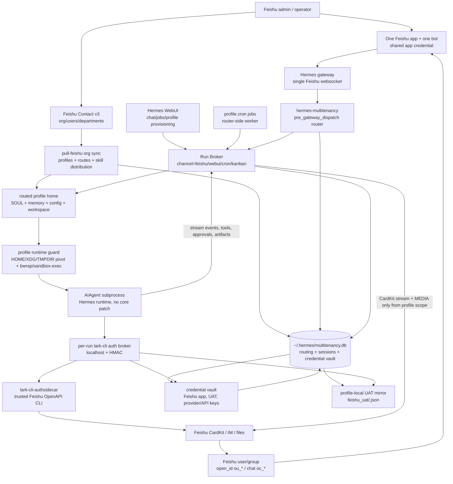

# hermes-multitenancy

> **One Feishu bot, N users, N profiles.** A [hermes-agent](https://github.com/NousResearch/hermes-agent) plugin that routes each Feishu user to their own profile (independent SOUL.md, sessions, memories, LLM credentials) — without modifying a single line of hermes-agent.

**English** | [简体中文](README.zh-CN.md)

[](#testing)
[](#how-it-stays-compatible)
[](#proof-of-end-to-end)
[](LICENSE)

---

## 😖 Why I built this (the pain)

I love hermes-agent — it's the most polished personal-agent runtime I've used. But shipping it inside a company hit one wall:

> **Hermes assumes 1 bot = 1 user.** A "profile" is a HERMES_HOME directory. Each profile spawns its own gateway process, owns its own Feishu app credentials, and runs its own websocket. So my plan to put a single bot into a 1000-person company collapsed:
>
> - **Option A** — 1000 separate hermes processes? Can't fit 1000 × 86 MB lark_oapi in memory, can't get IT to provision 1000 Feishu apps.
> - **Option B** — Single bot, single profile, all 1000 users sharing one SOUL? Then it's not "千人千面" anymore — every employee gets the same persona, no per-user memory.
> - **Option C** — Patch `feishu.py` to demux by user? Every hermes upgrade I'd have to re-patch by hand. I tried this for an afternoon and gave up.
> - **Option D** — Fork hermes-agent, maintain my own branch? I'd be carrying a permanent debt against an active upstream.

**None of those work.** I wanted hermes' rich UX (streaming, reactions, multi-turn, sessions) AND multi-tenant routing AND zero patches to hermes-agent.

This plugin is the answer: a **`pre_gateway_dispatch` hook** intercepts every Feishu message, looks up the user in a SQLite routing table, dispatches to a per-user `ProfileRuntime` that holds an independent SOUL + history + LLM client. One bot serves N users, each user feels like they have their own personal hermes agent.



**Hermes-agent: 0 lines changed.** The deployment contract is plugin + profile runtime + sidecar services, not a Hermes core fork.

---

## 🧭 Implementation map for agents

If you are an agent taking over this repo, this is the main contract:

1. **Entry point, no Hermes core patches.** `hermes_multitenancy.register(ctx)` registers a `pre_gateway_dispatch` hook. For Feishu messages the hook returns `{"action": "skip"}` and the plugin's `handle_async()` owns routing and replies.
2. **Identity uses the canonical sender.** `_resolve_sender_for_routing()` prefers the real Feishu `open_id` (`ou_*`) from the Feishu contextvar, `event.sender_open_id`, `source.open_id/user_id`, and `raw/raw_event/event`. `user_id_alt` / `union_id` is only a legacy route lookup helper, not the new session key.
3. **Routes live in SQLite.** `multitenancy_routing.open_id -> profile_name` decides which `~/.hermes/profiles/<profile>/` handles the turn. A real `ou_*` will not be absorbed by a stale `union_id`; legacy alt routes are used only when no real `ou_*` is available.
4. **Normal messages run inside the routed profile.** The router builds a profile-scoped event, writes the resolved `sender_open_id` back to the event, then dispatches to the streaming AIAgent subprocess. The child runs with that profile's `HERMES_HOME`; `agent_real._build_subprocess_env` strips the parent gateway's environment down to an explicit allowlist and pivots `HOME`/`WORKSPACE`/`XDG_*`/`TMPDIR` into `<profile>/{home,workspace,cache,config,state,data,tmp}` so token-bearing skills, MCP servers and CLIs behave like they are running as the current profile user. The runtime also sets `HERMES_PROFILE` plus Keep-compatible `KEP_PROFILE`, prepends shared `<hermes_home>/bin` so tools can be installed once while their token/state writes stay profile-local, and translates common OpenClaw/ClawHub `{baseDir}` skill templates inside the child process. Feishu UAT tokens are loaded from `<profile>/feishu_uat/<open_id>.json` (rebound at runtime by `_configure_feishu_uat_home`); the org-sync pass migrates the legacy shared `<hermes_home>/feishu_uat/<ou_*>.json` forward. See `docs/profile-isolation.md`.
5. **Default skills and group credentials materialize from runtime state.** `profile-skill-defaults.yaml`, `skill-distribution.yaml`, and `skill-bundles.yaml` express managed skills; sync installs them into profiles while skipping secret-looking files. Any available shared top-level `lark-*` skill is also installed for every profile as a managed symlink, even when it is not listed in the distribution YAML, because those skills are the official `lark-cli` guidance layer. `credential-materialization.yaml` maps encrypted vault payloads to profile-local compatibility files such as `workspace/credentials/gitlab.token`; `profiles: ["*"]` expands to active routing rows. Entries may declare `env: GITLAB_TOKEN`, in which case the routed AIAgent receives that env from the vault and registers it for terminal/code passthrough without the model reading the token file.
6. **lark-cli is an external runtime dependency.** This repo registers the `lark_cli` tool and starts a per-run localhost auth broker, but the deployment must provide an authsidecar-capable `lark-cli` binary. The default path is `<shared HERMES_HOME>/bin/lark-cli-authsidecar`; `HERMES_LARK_CLI_BIN` overrides it. Personal profiles use `user` identity only when the current `open_id` has valid UAT; group/WebUI agent profiles default to `bot`.
7. **Cron/reminder jobs are profile-scoped but router-executed.** WebUI/upstream cron tooling writes profile-local `cron/jobs.json`. The router-side worker scans active profiles, creates `RunRequest(channel="cron")`, executes through Run Broker, delivers to Feishu when requested, and mirrors context into `multitenancy_sessions`.
8. **Dangerous-command approvals cross the subprocess boundary.** The profile AIAgent registers `tools.approval` with a router-compatible gateway session key (`multitenancy:<platform>:<profile>:<chat>:<sender>`). The child also sets child-local `HERMES_SESSION_KEY` / `HERMES_GATEWAY_SESSION` / `HERMES_EXEC_ASK`, because terminal/process guards may run in worker threads that do not inherit contextvars. The child emits `approval_required` / `approval_resolved`; the parent `_stream_aiagent_subprocess()` must forward those events to the router; the router prompts Feishu; `/approve` / `/deny` writes a decision file that releases the child and resumes Hermes' native approval flow.
9. **CardKit heartbeat lives in the parent router.** The router primes the card and sends idle heartbeat status updates before the child emits tokens; the heartbeat stops once reasoning/tool/content events arrive.
10. **Memory is keyed by `(profile, canonical sender)`.** `_history_key()` does not use `sender_alt or sender`, so stale/shared alternate IDs cannot merge two users' memory.
11. **Slash commands never leak into the LLM.** `/model`, `/reasoning`, `/reload-mcp` and other registry commands use Hermes gateway handlers; skill slash rewrites into native skill invocation for the routed profile; plugin slash delegates to `hermes_cli.plugins.get_plugin_command_handler`; quick alias/exec follows config; unknown slash returns Hermes-style unknown-command.
12. **Slash handlers run with a profile context lock only when needed.** Gateway/quick/plugin commands that must interrupt a run, such as `/stop`, bypass the long profile env lock; unknown slash commands that may map to profile-local skills resolve inside the profile context.
13. **Local exec is off by default.** `quick_commands` alias remains available; `type: exec` is denied unless `multitenancy.allow_quick_exec: true` or `HERMES_MULTITENANCY_ALLOW_QUICK_EXEC=1` is set. Allowed exec inherits the routed profile's `HERMES_HOME`. Keep it off in production until profile sandboxing is enforced.
14. **Attachments and file replies stay in profile scope.** Inbound attachments still delegate to Hermes' native `_prepare_inbound_message_text`; the plugin adds a bounded fallback for locally cached tabular files (`.csv` / `.xlsx`) when upstream does not inline them. Outbound `MEDIA:<path>` replies are filtered so only paths resolving inside the routed `profile_home` are delivered. Known secret paths such as `.env`, `auth.json`, `feishu_uat/`, `credentials/`, and `tokens/` are blocked.
15. **Feishu UAT refreshes are mirrored into the credential vault.** Org sync copies refreshed shared `feishu_uat/<open_id>.json` files into each routed profile and, when a credential key is configured, writes the same payload into `multitenancy_credentials`. JSON remains a migration fallback; the DB stays the runtime credential source.
16. **Background terminal notify is not claimed as supported.** A child-local `process_registry` is invisible to the parent gateway watcher. Each child calls `agent.close()` on exit to clean such resources instead of leaving unmanaged background processes. True `terminal(background=true, notify_on_complete=true)` support should move process ownership into the parent process.
17. **Production posture.** For company deployments, prefer `HERMES_MULTITENANCY_AUTO_PROVISION=0` and keep `multitenancy.allow_quick_exec=false`. Application-layer isolation (route/session/slash/media boundaries) is handled by this plugin. Profile execution-environment sandboxing档 A — parent-env allowlist, HOME/WORKSPACE/XDG/TMPDIR pivot, `chmod 0700` on the profile tree, per-profile `feishu_uat/` and `tokens/` directories — is enabled by default; verify a deployed profile with `scripts/verify-isolation.sh`. Kernel-level containment via `sandbox-exec` / Linux `bwrap` adds filesystem containment; until it is enabled for every profile, treat档 A as defense-in-depth rather than an authorisation boundary. Full details: `docs/profile-isolation.md`.

---

## 👥 Roles

| Role | Owns |
|---|---|
| Feishu admin | Creates or reuses one internal Feishu app, enables the bot/websocket/scopes, and keeps the shared app credential out of git. Production stores it in `multitenancy_credentials` as the global Feishu app row. |
| Platform operator | Installs hermes + this plugin, keeps the gateway running, manages routing rows and profile directories. |
| End user | Authorizes once through the Feishu auth/UAT flow, then talks to the same bot. User tokens refresh offline from the shared Hermes home. |
| Agent profile owner | Maintains each profile's `SOUL.md`, `config.yaml`, `.env`, tool policy, session DB, and model credentials. |

## 🔁 App ID reuse model

You do **not** need one Feishu app per user. Reuse one Feishu app/bot for all tenants:

1. Store the shared Feishu app credential in the multitenancy credential vault (`profile_name=__global__`, `subject_id=feishu_app`, `provider=feishu`, `secret_kind=app`). Env/default Hermes config is only a migration or fallback source.
2. Route by the real Feishu sender `open_id` (`ou_*`). The router can fall back to `union_id` (`on_*`) for migration/legacy rows, but new users should be keyed by `ou_*`.
3. Per-user Feishu UAT tokens are first captured by OAuth into `~/.hermes/feishu_uat/<open_id>.json` (gateway-side, shared), then migrated to `~/.hermes/profiles/<profile>/feishu_uat/<open_id>.json` by the org-sync pass — that per-profile copy is what the AIAgent subprocess actually reads. Do not commit token files. See `docs/profile-isolation.md` §6.
4. Keep per-profile model/tool credentials under `~/.hermes/profiles/<profile>/`. The Feishu app is shared; profile persona, memory, tools and LLM credentials stay isolated.

---

## 🚀 Quick Start

Set `HERMES_HOME` first. All commands below assume one shared Hermes home, one
Feishu app, and per-user profiles under `$HERMES_HOME/profiles/`.

```bash
export HERMES_HOME="${HERMES_HOME:-$HOME/.hermes}"
mkdir -p "$HERMES_HOME/bin" "$HERMES_HOME/logs"
```

### 1. Install the plugin

Hermes can load this as a directory plugin from `$HERMES_HOME/plugins/multitenancy`.
The plugin installer should create that directory and enable `plugins.enabled`.

```bash
hermes plugins install eggyrooch-blip/hermes-multitenancy --enable
hermes plugins list
```

For a pinned checkout or local development, install from a real repository path
instead. This is the most transparent path for agents and production operators
because the loaded plugin path can be inspected directly.

```bash
git clone https://github.com/eggyrooch-blip/hermes-multitenancy /opt/hermes-multitenancy
hermes plugins install "file:///opt/hermes-multitenancy" --force --enable
python -m pip install --no-deps -e "/opt/hermes-multitenancy[test]"
```

Manual fallback, if the Hermes plugin installer is unavailable:

```bash
mkdir -p "$HERMES_HOME/plugins"
ln -sfn /opt/hermes-multitenancy "$HERMES_HOME/plugins/multitenancy"
```

Ensure the shared Hermes config enables the plugin:

```yaml
# $HERMES_HOME/config.yaml
plugins:
  enabled:
    - multitenancy
```

### 2. Install lark-cli/authsidecar

`hermes-multitenancy` registers the `lark_cli` tool and starts the per-run
credential broker, but it does **not** vendor or automatically install the
`lark-cli` binary. New environments must provide an authsidecar-capable
`lark-cli` before Feishu tools can work.

Default binary lookup order:

1. `HERMES_LARK_CLI_BIN`, when set.
2. `$HERMES_HOME/bin/lark-cli-authsidecar`.
3. A plain `lark-cli` found on `PATH` for limited checks.

Build the authsidecar binary from an official `larksuite/cli` checkout:

```bash
git clone https://github.com/larksuite/cli /opt/larksuite-cli
cd /opt/hermes-multitenancy
LARK_CLI_SOURCE_DIR=/opt/larksuite-cli \
HERMES_LARK_CLI_BIN="$HERMES_HOME/bin/lark-cli-authsidecar" \
LARK_CLI_EXPECTED_VERSION="<expected-lark-cli-version>" \
LARK_CLI_EXPECTED_SOURCE_HEAD="<expected-source-short-sha>" \
  scripts/build_lark_cli_authsidecar.sh
```

If your deployment already ships a vetted authsidecar binary, place it at the
default path or point to it explicitly:

```bash
install -m 0755 /path/to/lark-cli-authsidecar "$HERMES_HOME/bin/lark-cli-authsidecar"
export HERMES_LARK_CLI_BIN="$HERMES_HOME/bin/lark-cli-authsidecar"
```

The authsidecar never receives raw Feishu app secrets from the model. The
routed AIAgent talks to a localhost auth broker; the broker injects either the
current user's UAT or a bot tenant token from the credential vault.

### 3. Configure one shared Feishu bot

Use one Feishu app/bot for all tenants. Keep the app credential outside git.
The shared config can be a migration source, but production should import it
into `multitenancy_credentials`.

```yaml
# $HERMES_HOME/config.yaml
platforms:
  feishu:
    enabled: true
    extra:
      app_id: "${FEISHU_APP_ID}"
      app_secret: "${FEISHU_APP_SECRET}"
```

Import the app credential into the vault without printing the secret:

```bash
export HERMES_MULTITENANCY_CREDENTIAL_KEY="<32-byte-or-longer-secret-key>"
python /opt/hermes-multitenancy/scripts/lark_cli_canary_preflight.py \
  import-app-config \
  --shared-home "$HERMES_HOME" \
  --config "$HERMES_HOME/config.yaml"
```

User UAT is profile-scoped. OAuth/device-flow writes or imports a user token,
then multitenancy mirrors it to:

```text
$HERMES_HOME/profiles/<profile>/feishu_uat/<open_id>.json
multitenancy_credentials(profile=<profile>, subject=<open_id>, provider=feishu, kind=uat)
```

Never commit `.env`, `auth.json`, `feishu_uat/*.json`, `tokens/`,
`workspace/credentials/`, cookies, or raw OAuth payloads.

### 4. Sync profiles and routes

If the Feishu app has Contact read scopes, use org sync. Dry-run first:

```bash
python "$HERMES_HOME/plugins/multitenancy/sync.py" pull-feishu --dry-run
mkdir -p "$HERMES_HOME/org-snapshots"
python "$HERMES_HOME/plugins/multitenancy/sync.py" pull-feishu \
  --snapshot-out "$HERMES_HOME/org-snapshots"
```

Org sync creates or updates `$HERMES_HOME/profiles/<user_id>/`, writes
`multitenancy_routing`, updates only the managed org block in `SOUL.md`,
syncs managed skills, and runs credential materialization when configured.

Without Contact scopes, apply an explicit allowlist:

```bash
python "$HERMES_HOME/plugins/multitenancy/sync.py" apply users.json
```

`users.json` format:

```json
[
  {"user_id": "alice", "profile_name": "alice_profile", "open_id": "ou_xxx", "union_id": "on_xxx"},
  {"user_id": "bob", "profile_name": "bob_profile", "open_id": "ou_yyy", "union_id": "on_yyy"}
]
```

For company deployments, prefer strict routing after the initial rollout:

```bash
export HERMES_MULTITENANCY_AUTO_PROVISION=0
```

### 5. Run the gateway and broker surfaces

At minimum, restart the Hermes gateway so it imports the plugin. WebUI and cron
deployments normally also enable the Run Broker sidecar on localhost.

```bash
export HERMES_MULTITENANCY_RUN_BROKER_SERVER=1
export HERMES_MULTITENANCY_CRON_RUN_BROKER=1
export HERMES_MULTITENANCY_RUN_BROKER_KEY="<shared-secret-for-server-to-server-calls>"
hermes gateway restart
```

Production services should set the same environment through the service manager
instead of an interactive shell. Keep the Feishu websocket entry on the router
gateway; profile gateways, when used for API-server compatibility, should not
open their own Feishu websocket for the same bot.

### 6. Verify

Run secret-free checks before sending real traffic:

```bash
hermes plugins list
sqlite3 "$HERMES_HOME/multitenancy.db" \
  'select open_id, profile_name, active from multitenancy_routing limit 20;'

python /opt/hermes-multitenancy/scripts/lark_cli_canary_preflight.py \
  health \
  --shared-home "$HERMES_HOME" \
  --router-profile-home "$HERMES_HOME/profiles/multitenancy_router"

python /opt/hermes-multitenancy/scripts/lark_cli_canary_preflight.py \
  preflight \
  --shared-home "$HERMES_HOME" \
  --profile "<profile>" \
  --open-id "<ou_open_id>" \
  --binary "$HERMES_HOME/bin/lark-cli-authsidecar"
```

Then send two Feishu users the same prompt through the same bot. Logs should
show different canonical `ou_*` senders, different routed profile homes, and
`lark_cli_default_identity=user` only for profiles with a valid user UAT.

### 7. Automate, scope, and recover

Run full org sync periodically through cron or a systemd timer. A full sync
handles join/move/leave: new employees get profiles and routes, org changes
refresh the managed `SOUL.md` block, and missing users are soft-deleted from
routing while profile memories remain on disk.

```cron
*/30 * * * * HERMES_HOME=/opt/hermes python /opt/hermes/.hermes/plugins/multitenancy/sync.py pull-feishu --snapshot-out /opt/hermes/.hermes/org-snapshots >> /opt/hermes/.hermes/logs/multitenancy-sync.log 2>&1
```

For a department-scoped sync:

```bash
python "$HERMES_HOME/plugins/multitenancy/sync.py" pull-feishu --dept <open_department_id> --dry-run
python "$HERMES_HOME/plugins/multitenancy/sync.py" pull-feishu --dept <open_department_id>
```

If sync goes wrong, stop the timer first, inspect `pull-feishu --dry-run` and
the latest snapshot, then use `/status` from Feishu or inspect
`multitenancy_routing` locally. Unknown-user fallback profiles live at
`$HERMES_HOME/profiles/feishu_<open_id>/`.

---

## 🚢 Production deployment runbook

Use this order when an agent needs to deploy the repository:

1. Update and verify the canonical repository locally.
2. Run `uv run --extra test pytest -q` or `make test`.
3. Push the reviewed commit to GitHub.
4. On the production host, back up the current checkout, `$HERMES_HOME/config.yaml`,
   `$HERMES_HOME/.env`, `$HERMES_HOME/multitenancy.db`, service units, and the
   active profile directories. Do not print secret file contents into logs.
5. Fast-forward the production checkout only: `git pull --ff-only`.
6. Reinstall the package into the Hermes Python environment if production uses
   editable imports: `python -m pip install --no-deps -e /path/to/hermes-multitenancy`.
7. Ensure `$HERMES_HOME/plugins/multitenancy` points at the production checkout
   or was refreshed by `hermes plugins install`.
8. Ensure `$HERMES_HOME/bin/lark-cli-authsidecar` exists and is executable, or
   set `HERMES_LARK_CLI_BIN` in the service environment.
9. Restart the router gateway and any Run Broker/WebUI services.
10. Verify `health`, `preflight`, route rows, service logs, and one read-only
    `lark_cli` user-info canary before declaring the deploy usable.

Rollback is a normal forward fix or a restored checkout plus service restart.
Do not copy tokens between profiles by hand; use the credential vault and
`credential-materialization.yaml` when a compatibility file is required.

---

## ✅ Proof of end-to-end

This isn't a paper plugin. The current UAT chain has been run against a real Feishu bot with two independent Feishu users on the same bot:

| Step | Action | Verified result |
|---|---|---|
| 1 | User A → same bot → router | Routed by real `ou_*` open_id to the existing `coder` profile. |
| 2 | User B → same bot → router | Auto-provisioned and routed to a new `feishu_ou_xxx` profile, not the `coder` profile. |
| 3 | Both users send the same tool-heavy UAT case set | AIAgent subprocess runs with the correct profile home and sender open_id scope. |
| 4 | Replies stream back through Feishu CardKit / IM | Text cards and file-message paths are delivered through the Feishu adapter. |
| 5 | Full dual-account stress suite | Run with `--users <userA>,<userB> --parallel-users`; each case records independent `case_id::user` checkpoint entries. |
| 6 | Dynamic slash control plane | Dual-account `slash` suite passed `16/16`: `/model`, `/reasoning`, `/reload-mcp` use gateway handlers; skill slash rewrites into native skill invocation; plugin slash delegates to `hermes_cli.plugins.get_plugin_command_handler`; quick alias bypasses the LLM, and quick exec is explicit opt-in only; unknown slash returns Hermes-style unknown-command. |

These checks were run live through Feishu's WebSocket gateway and an OpenAI-compatible model provider. Real open_ids, tokens, chat IDs and app secrets are intentionally omitted from this repository.

---

## ✨ Features

| Feature | Status |
|---|---|
| Multi-tenant routing per Feishu user (open_id / union_id) | ✅ |
| LRU runtime pool (max 50 hot profiles, idle evict 5min) | ✅ |
| Streaming LLM via `edit_message` typewriter | ✅ |
| Reasoning-content split for thinking models | ✅ |
| Reactions (👀 → ✅ / ❌) via `adapter.on_processing_*` | ✅ |
| Multi-turn session memory (SQLite-backed, survives restart) | ✅ |
| Reply-context injection (quoted messages) | ✅ |
| Rate-limit retry (429 backoff, mirrors hermes mainstream cadence) | ✅ |
| Hermes slash command control plane | ✅ — dynamically recognizes Hermes registry commands; `/model`, `/reasoning`, `/reload-mcp` use gateway handlers; skill slash rewrites into native skill invocation; plugin slash delegates to `hermes_cli.plugins.get_plugin_command_handler`; quick_commands support alias and explicitly-enabled exec; unknown slash returns Hermes-style unknown-command and never leaks into the LLM |
| Idempotent feishu-sync reconciler (CLI + library) | ✅ |
| Python Feishu Contact org sync (`pull-feishu`) | ✅ — creates/updates profiles, SOUL managed blocks and route rows |
| Vision (image attachments) | ✅ — delegates to hermes' `gateway._prepare_inbound_message_text`, identical to mainstream |
| Audio STT (voice messages) | ✅ — same delegate, hermes' `transcribe_audio` runs on cached audio |
| Text-file inject (.txt / .md / .csv / .log / .json …) | ✅ — same delegate, content prepended to message |
| Reply context (quoted message) | ✅ — same delegate, plus our own `reply_to_text` fallback |
| Multi-user shared-session attribution | ✅ — same delegate |
| Tool use (real AIAgent loop with browser/search/shell) | ✅ — via isolated `AIAgent` subprocess bridge |
| lark-cli Feishu OpenAPI bridge | ✅ — `lark_cli` tool registration plus per-run auth broker; deployment must provide `lark-cli-authsidecar` |
| Credential vault + materialization | ✅ — stores Feishu app/UAT/provider secrets in `multitenancy_credentials`, exposes only redacted status, materializes compatibility files when configured |
| Managed skill distribution | ✅ — `profile-skill-defaults.yaml`, `skill-distribution.yaml`, and `skill-bundles.yaml` with secret guard and child-profile inheritance rules |
| Cron / reminder proactive delivery | ✅ — WebUI/broker-created jobs default to `deliver=feishu`, are stored in the routed profile cron store, and are executed/delivered by the router multi-profile worker |
| Dangerous-command approval proactive delivery | ✅ — child `approval_required`/`approval_resolved` → parent stream parser → router Feishu prompt → `/approve`/`/deny` decision file; child-local session env covers terminal worker threads; core terminal guard runs before environment creation |
| CardKit idle heartbeat | ✅ — parent router prime + heartbeat; does not depend on early child tokens |
| Background terminal `notify_on_complete` | ⚠️ not claimed — child registry is invisible to the parent gateway; child exit calls `agent.close()` to avoid orphaned background work |
| Feishu CardKit / IM file-message replies | ✅ — streaming cards plus native `MEDIA:<path>` delivery reuse, filtered to the routed profile home |

---

## 🛡️ How it stays compatible

We keep **zero patches to hermes-agent**: no edits to `feishu.py`, `gateway/run.py`, or upstream modules. The plugin loader contract (`hermes_cli/plugins.py:435 register_hook`) is the gateway entry point; the AIAgent/tool bridge also consumes a few Hermes integration surfaces and has tests around each one.

| Public API we depend on | Stability |
|---|---|
| `pre_gateway_dispatch` hook (`plugins.py:81 VALID_HOOKS`) | ⚠️ added 2026-04-21 — pin hermes-agent version |
| `BasePlatformAdapter.send / send_typing / edit_message` | ✅ abstract methods, very stable |
| `BasePlatformAdapter.on_processing_start / on_processing_complete` | ✅ |
| `MessageEvent.source.{user_id, user_id_alt, chat_id}` | ✅ stable |
| `Platform.FEISHU` enum + `ProcessingOutcome` enum | ✅ |
| `gateway.adapters[Platform.FEISHU]` dict | ✅ |
| `hermes_constants.get_hermes_home()` (read via env) | ✅ |
| `hermes_cli.commands.resolve_command / is_gateway_known_command` | ✅ — slash command recognition comes from Hermes' central registry, with a tiny fallback for tests outside Hermes |
| `SendResult.{success, message_id}` | ✅ |
| `gateway._prepare_inbound_message_text(event, source, history)` | ⚠️ private (leading underscore) — covers vision + STT + file inject + reply context in one call. Falls back to local vision-only on signature change. |
| `gateway.stream_consumer.GatewayStreamConsumer` | ⚠️ Hermes integration surface — reused for Feishu CardKit streaming when present, with text-edit fallback. |
| `gateway._deliver_media_from_response(response, event, adapter)` | ⚠️ private — reused so `MEDIA:<path>` file replies follow the native Feishu path after filtering paths to the routed profile home. No-op if unavailable. |
| `run_agent.AIAgent` | ⚠️ core runtime class — isolated in `aiagent_subprocess.py` so failures fall back to the legacy OpenAI-compatible path. |
| `tools.feishu_oapi_client.sender_open_id_scope` | ⚠️ Feishu UAT bridge — scopes token lookup to `<FEISHU_UAT_DIR>/<open_id>.json`. `agent_real._configure_feishu_uat_home` rebinds `FEISHU_UAT_DIR` to `<profile>/feishu_uat/` per subprocess so a tenant only sees its own UAT (档 A isolation). |
| `tools.vision_tools.vision_analyze_tool` (local fallback) | ✅ tool module, used only when the gateway helper is missing |

**Pin your `hermes-agent` version** (`hermes-agent==X.Y.Z`) and run `pytest tests/test_router_integration.py tests/test_vision.py` after each upgrade — the integration + pipeline tests will fail loudly on any contract drift.

---

## 🧭 Upstream strategy

This repository is intended to stay a third-party Hermes plugin, not a fork.
That keeps rollout fast and avoids adding Feishu-multitenancy-specific policy
to Hermes core. A good upstream PR to `NousResearch/hermes-agent` would be
small and generic, for example:

| Upstream candidate | Why |
|---|---|
| Expose real Feishu sender `open_id` directly on `MessageEvent.source` | Removes raw-event parsing from this plugin and helps any Feishu plugin. |
| Document `pre_gateway_dispatch` gateway hooks and deferred processing lifecycle | Makes router-style plugins easier to build safely. |
| Stabilize CardKit streaming/media delivery extension points | Lets plugins reuse native Feishu UX without touching private gateway helpers. |

The full multitenancy router should only be proposed as a bundled Hermes plugin
after those generic surfaces settle and external usage proves the behavior.

---

## 🏗️ Architecture

```
~/.hermes/plugins/multitenancy/  (installed by `hermes plugins install`)
  ├─ plugin.yaml          Hermes directory-plugin manifest
  ├─ after-install.md     post-install checklist rendered by Hermes
  ├─ __init__.py          root shim → hermes_multitenancy.register(ctx)
  ├─ sync.py              route-sync wrapper for directory-plugin installs
  └─ hermes_multitenancy/
     ├─ __init__.py       register(ctx) → ctx.register_hook(pre_gateway_dispatch, ...)
     ├─ router.py         sync hook + async dispatch + commands + lazy singletons
     ├─ runtime.py        ProfileRuntime + contextvars-isolated HERMES_HOME switch
     ├─ pool.py           LRU RuntimePool (50 hot / 5min idle / cold-start sem)
     ├─ routing.py        SQLite multitenancy_routing table (open_id → profile)
     ├─ sessions.py       SQLite multitenancy_sessions (per-user history, persistent)
     ├─ credentials.py    encrypted credential vault rows in multitenancy.db
     ├─ lark_cli_tool.py  Hermes tool registration for lark_cli / lark-cli
     ├─ lark_cli_auth_broker.py per-run localhost credential proxy for authsidecar
     ├─ run_broker.py     channel-neutral execution contract for Feishu/WebUI/cron
     ├─ webui_broker_server.py localhost HTTP/SSE sidecar for WebUI and jobs
     ├─ cron_worker.py    multi-profile cron worker and Run Broker bridge
     ├─ skill_registry.py managed/personal/unknown skill audit + install helpers
     ├─ upstream_health.py secret-free upgrade/deploy health checks
     ├─ commands.py       Hermes registry-backed slash command parser
     ├─ agent_real.py     AIAgent subprocess bridge + legacy OpenAI-compat fallback
     ├─ aiagent_subprocess.py isolated child-process entry point for AIAgent/tool loop
     └─ sync/
        ├─ feishu_hr.py   apply_users (idempotent reconciler)
        ├─ feishu_org.py  Feishu Contact v3 pull + profile/SOUL/route sync
        └─ cli.py         shared implementation for route sync
```

State lives in `~/.hermes/multitenancy.db` — a separate SQLite file from hermes' own `state.db` so writes don't contend. WAL mode is enabled.

---

## ⚙️ Configuration knobs

| `config.yaml` key | Default | Notes |
|---|---|---|
| `plugins.enabled` | (none) | Must include `multitenancy` |
| `model.default` | (your hermes default) | Per-profile model selection; use whatever provider/model your Hermes deployment already standardizes on. |
| `model.fallback` | (your hermes default) | Used by `agent_real` if primary fails |
| `multitenancy.toolsets_mode` | `merge_default` | When a profile sets `platform_toolsets.feishu`, merge it with Hermes' default Feishu toolsets so web/browser/search remain available. Set `explicit` for strict replacement. |
| `multitenancy.allow_quick_exec` | `false` | Allows `quick_commands` entries with `type: exec` over Feishu multitenancy. Keep off until the profile sandbox is enforced; allowed exec inherits the routed profile's `HERMES_HOME`. |

| Sync command / env var | Default | Notes |
|---|---|---|
| `pull-feishu --dry-run` | off | Preview planned changes without writing profiles or DB rows |
| `pull-feishu --dept <id>` | off | Sync one Feishu department subtree; out-of-scope routes are not soft-deleted by default |
| `pull-feishu --soft-delete-missing` | on for full sync, off for `--dept` | Soft-delete active routes missing from the current pull |
| `pull-feishu --no-soft-delete-missing` | off | Force missing routes to stay active, useful for pilots and incident recovery |
| `HERMES_MULTITENANCY_AUTO_PROVISION` | `1` | Auto-create `feishu_<open_id>` fallback profiles for unknown Feishu senders; set `0` for strict allowlist mode |
| `HERMES_MULTITENANCY_ALLOW_QUICK_EXEC` | unset / off | Environment override for `quick_commands` exec. Prefer config-level allowlisting plus sandboxing in production. |

| Plugin tunable (Python constants in `router.py`) | Default | Notes |
|---|---|---|
| `RuntimePool.max_loaded_runtimes` | 50 | Hot pool cap |
| `RuntimePool.idle_evict_seconds`  | 300 | Drop idle entries after 5min |
| `_SESSION_HISTORY_MAX`            | 20  | Messages kept per (profile, user) |
| Streaming throttle (content)      | 1.0s / 60 chars | Mirrors hermes mainstream cadence |
| Streaming throttle (thinking)     | 2.0s heartbeat | Reasoning preview |
| CardKit idle heartbeat            | 2.5s | Keeps the card active before the first agent event |
| Approval bridge timeout           | 300s | Override with `HERMES_MULTITENANCY_APPROVAL_TIMEOUT` |
| Rate-limit backoffs               | 0.5s → 1s → 2s | 429-only; non-429 retried once |

---

## 🎮 Slash commands

| Command | Effect |
|---|---|
| `/help`   | List available commands |
| `/status` | Show current profile + history length + run state |
| `/new` / `/reset` | Reset this user's session history (per profile) — clears both cache + SQLite |
| `/stop`   | Cancel the in-flight LLM call for this user |
| Other Hermes gateway commands | Recognized dynamically from Hermes' registry and delegated to the gateway handler when available; otherwise they return a control-plane warning instead of entering the agent prompt. |

---

## 🧪 Testing

```bash
# Default suite (no network)
uv run --extra test pytest -q

# Same command through the repo Makefile
make test

# Focused Feishu multitenancy regression suite
uv run --extra test pytest \
  tests/test_hook_dispatch.py \
  tests/test_aiagent_subprocess.py \
  tests/test_streaming_card_transport.py \
  -q

# Live LLM integration — calls your configured provider
uv run --extra test pytest tests/ -m integration -v
```

Current skills/lark-cli/UAT audit helpers live in this repository:

```bash
make skills-uat
make skills-uat-strict
```

---

## 🐛 Troubleshooting

**"plugin loaded but no replies"** — `pkill -f gateway && hermes gateway run`. Plugins are loaded at gateway startup, so any change requires a restart.

**"all bots stopped responding"** — your routing rule probably has the wrong `open_id` or `union_id`. Check the actual values that arrive from Feishu by adding a temporary `print(event.source)` in `router.on_pre_gateway_dispatch` and watching the gateway log.

**"org sync routed someone incorrectly"** — stop cron/systemd first, then run `pull-feishu --dry-run` to inspect planned changes. The user can send `/status` in Feishu to see the current profile; locally inspect `sqlite3 ~/.hermes/multitenancy.db 'select user_id, open_id, profile_name, active from multitenancy_routing;'`.

**"I need to bypass a bad route immediately"** — soft-delete the active route and let the next message auto-provision a fallback profile:

```bash
sqlite3 ~/.hermes/multitenancy.db \
  "update multitenancy_routing set active=0, deleted_at=strftime('%s','now'), updated_at=strftime('%s','now'), version=version+1 where open_id='ou_xxx' and active=1;"
```

The fallback profile is `~/.hermes/profiles/feishu_ou_xxx/`; open it with `hermes -p feishu_ou_xxx chat`.

**"user_id is `g41a5b5g`-ish, not the `ou_` I expected"** — some Feishu/Hermes paths expose a short SDK user ID on `event.source.user_id`. This plugin now resolves the real sender `open_id` from Feishu raw sender metadata/context first, and only falls back to `user_id_alt` / `union_id` for legacy rows.

**"Feishu tools work, but news/web search does not"** — the profile likely has `platform_toolsets.feishu` set to Feishu-only tools. The default `merge_default` mode now merges explicit Feishu entries with Hermes' default Feishu toolsets, preserving `web_search` / `web_extract`. If you intentionally need a small schema, set `multitenancy.toolsets_mode: explicit` or `HERMES_MULTITENANCY_TOOLSETS_MODE=explicit`.

**"feels slow, 1s per character"** — check the gateway log for model latency, Feishu rate-limit retries, and CardKit update throttling. Reasoning-capable models may stream `reasoning_content` before final text; the plugin surfaces that as progress instead of hiding it.

**"sessions lost after restart"** — verify `~/.hermes/multitenancy.db` exists and the `multitenancy_sessions` table has rows. If it's empty, check for write errors in the gateway log (`logger.debug "SessionStore.append failed"`).

---

## 🤝 Contributing

Issues and PRs welcome.

### Bug reports

When filing a bug, please include:

1. Output of `uv run --extra test pytest -q` or `make test` from your machine
2. Hermes-agent version (`pip show hermes-agent | grep Version`)
3. Plugin version (`pip show hermes-multitenancy | grep Version`)
4. Relevant gateway log lines (especially anything with `multitenancy:` prefix)

### Pull requests

1. Fork → create a branch → run `uv run --extra test pytest -q` or `make test` (must be green) → open PR.
2. **Tests are required** for behaviour changes. Keep the full default suite green.
3. **Don't mass-rename** — keep diffs small and reviewable.
4. **No `feishu.py` patches** — the whole point of this plugin is hermes-agent stays unmodified. If you find a hermes API limitation, file an upstream issue at https://github.com/NousResearch/hermes-agent and link it here.

### Helping with hermes-agent compatibility

If you upgrade `hermes-agent` and our integration tests break, please file an issue with:
- The hermes-agent version that broke us
- The pytest output
- A pointer to the upstream commit (if you can find it)

We currently require `hermes-agent>=0.14,<1.0` in `pyproject.toml`; the plugin loader contract still evolves, so we need community eyes on what changes.

### Wanted contributions (priority order)

1. **Per-profile `SessionStore`** — session rows are isolated by `(profile, canonical sender)` in the shared `multitenancy.db`; splitting into per-profile DBs is still useful scale hardening and mirrors hermes' own profile layout.
2. **Prompt caching** — Anthropic `cache_control` for the SOUL prefix. Cuts token cost ~50% on long-running chats.
3. **CI matrix** — GitHub Actions running `uv run --extra test pytest -q` against multiple `hermes-agent` versions to catch upstream contract drift early.
4. **More live UAT fixtures** — broaden destructive/write-path coverage without relying on shared production-like resources.

---

## 📜 License

MIT — see [LICENSE](LICENSE).

## 🙏 Acknowledgements

Built on top of [Nous Research's hermes-agent](https://github.com/NousResearch/hermes-agent) — without the `pre_gateway_dispatch` hook (added by [@KeiraVoss](https://github.com/) on 2026-04-21), this plugin would have required forking the entire upstream. Thank you for the hook.
