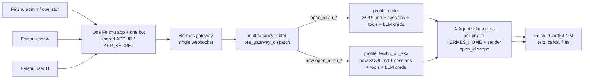

# hermes-multitenancy

> **One Feishu bot, N users, N profiles.** A [hermes-agent](https://github.com/NousResearch/hermes-agent) plugin that routes each Feishu user to their own profile (independent SOUL.md, sessions, memories, LLM credentials) — without modifying a single line of hermes-agent.

**English** | [简体中文](README.zh-CN.md)

[](#testing)
[](#how-it-stays-compatible)
[](#proof-of-end-to-end)
[](LICENSE)

---

## 😖 Why I built this (the pain)

I love hermes-agent — it's the most polished personal-agent runtime I've used. But shipping it inside a company hit one wall:

> **Hermes assumes 1 bot = 1 user.** A "profile" is a HERMES_HOME directory. Each profile spawns its own gateway process, owns its own Feishu app credentials, and runs its own websocket. So my plan to put a single bot into a 1000-person company collapsed:
>
> - **Option A** — 1000 separate hermes processes? Can't fit 1000 × 86 MB lark_oapi in memory, can't get IT to provision 1000 Feishu apps.
> - **Option B** — Single bot, single profile, all 1000 users sharing one SOUL? Then it's not "千人千面" anymore — every employee gets the same persona, no per-user memory.
> - **Option C** — Patch `feishu.py` to demux by user? Every hermes upgrade I'd have to re-patch by hand. I tried this for an afternoon and gave up.
> - **Option D** — Fork hermes-agent, maintain my own branch? I'd be carrying a permanent debt against an active upstream.

**None of those work.** I wanted hermes' rich UX (streaming, reactions, multi-turn, sessions) AND multi-tenant routing AND zero patches to hermes-agent.

This plugin is the answer: a **`pre_gateway_dispatch` hook** intercepts every Feishu message, looks up the user in a SQLite routing table, dispatches to a per-user `ProfileRuntime` that holds an independent SOUL + history + LLM client. One bot serves N users, each user feels like they have their own personal hermes agent.



**Hermes-agent: 0 lines changed.** Verified by `git status`.

---

## 👥 Roles

| Role | Owns |
|---|---|
| Feishu admin | Creates or reuses one internal Feishu app, enables the bot/websocket/scopes, and keeps the shared `FEISHU_APP_ID` / `FEISHU_APP_SECRET` out of git. |
| Platform operator | Installs hermes + this plugin, keeps the gateway running, manages routing rows and profile directories. |
| End user | Authorizes once through the Feishu auth/UAT flow, then talks to the same bot. User tokens refresh offline from the shared Hermes home. |
| Agent profile owner | Maintains each profile's `SOUL.md`, `config.yaml`, `.env`, tool policy, session DB, and model credentials. |

## 🔁 App ID reuse model

You do **not** need one Feishu app per user. Reuse one Feishu app/bot for all tenants:

1. Put the shared Feishu app credentials only in the gateway/default Hermes config or environment.
2. Route by the real Feishu sender `open_id` (`ou_*`). The router can fall back to `union_id` (`on_*`) for migration/legacy rows, but new users should be keyed by `ou_*`.
3. Keep per-user Feishu UAT tokens under `~/.hermes/feishu_uat/<open_id>.json`. Do not commit token files.
4. Keep per-profile model/tool credentials under `~/.hermes/profiles/<profile>/`. The Feishu app is shared; profile persona, memory, tools and LLM credentials stay isolated.

Discussion group: [Eggyrooch's Feishu group invite](https://applink.feishu.cn/client/chat/chatter/add_by_link?link_token=419if828-a007-453f-ad1c-31edef49520f).

---

## 🚀 Quick Start

### 1. Install the plugin

Use Hermes' plugin installer for normal installs. It clones this repository into
`~/.hermes/plugins/multitenancy`, reads the root `plugin.yaml`, and adds
`multitenancy` to `plugins.enabled` when `--enable` is supplied.

```bash
hermes plugins install eggyrooch-blip/hermes-multitenancy --enable
hermes plugins list
hermes gateway restart
```

For local development, use an editable checkout:

```bash
git clone https://github.com/eggyrooch-blip/hermes-multitenancy ~/projects/hermes-multitenancy
cd ~/projects/hermes-multitenancy
hermes plugins install "file://$PWD" --force --enable
python -m pip install --no-deps -e ".[test]"   # optional: only for running this repo's tests
hermes gateway restart
```

### 2. Enable in `config.yaml`

The installer handles this when you pass `--enable`. For manual installs,
ensure the default gateway home contains:

```yaml
# ~/.hermes/config.yaml
plugins:
  enabled:
    - multitenancy
```

### 3. Configure one shared Feishu bot

Use your existing Hermes Feishu app credentials in the default gateway home. The exact surrounding Hermes config can vary by version; the important part is that all profiles reuse the same app credentials.

```yaml
# ~/.hermes/config.yaml
platforms:
  feishu:
    enabled: true
    extra:
      app_id: "${FEISHU_APP_ID}"
      app_secret: "${FEISHU_APP_SECRET}"
```

Then run your Hermes Feishu authorization/UAT flow for each real user. Token files should land under the shared home, for example:

```text
~/.hermes/feishu_uat/ou_xxx.json
~/.hermes/feishu_uat/ou_yyy.json
```

### 4. Create profiles and add routing rules

Create one Hermes profile per tenant persona. Each profile can have its own
`SOUL.md`, `.env`, model config and tool policy:

```bash
mkdir -p ~/.hermes/profiles/alice_profile ~/.hermes/profiles/bob_profile
$EDITOR ~/.hermes/profiles/alice_profile/SOUL.md
$EDITOR ~/.hermes/profiles/bob_profile/SOUL.md
```

```bash
# Directory-plugin install path
python ~/.hermes/plugins/multitenancy/sync.py apply users.json

# Editable/pip install path, if you installed this repo as a package too
hermes-multitenancy-sync apply users.json
```

Where `users.json` is:

```json
[
  {"user_id": "alice", "profile_name": "alice_profile", "open_id": "ou_xxx", "union_id": "on_xxx"},
  {"user_id": "bob",   "profile_name": "bob_profile",   "open_id": "ou_yyy", "union_id": "on_yyy"}
]
```

Each `profile_name` should already exist as a hermes profile directory at `~/.hermes/profiles/<name>/` with its own `SOUL.md`, `config.yaml`, `auth.json` or `.env`. The plugin will route Feishu messages from `ou_xxx` to `alice_profile`'s SOUL+memory, and from `ou_yyy` to `bob_profile`.

For first-run UAT you can also leave auto-provision enabled (`HERMES_MULTITENANCY_AUTO_PROVISION=1`, the default). An unseen sender `ou_new_user` gets a deterministic profile such as `~/.hermes/profiles/feishu_ou_new_user/`, seeded from the shared Hermes config, then routed independently on the next turn.

Restart the hermes gateway. **Done.**

### 5. Verify

```bash
hermes plugins list
hermes gateway status
sqlite3 ~/.hermes/multitenancy.db 'select open_id, profile_name, active from multitenancy_routing;'
```

Send two different Feishu users the same prompt through the same bot. The
gateway log should show different sender `ou_*` values and different profile
homes.

---

## ✅ Proof of end-to-end

This isn't a paper plugin. The current UAT chain has been run against a real Feishu bot with two independent Feishu users on the same bot:

| Step | Action | Verified result |
|---|---|---|
| 1 | User A → same bot → router | Routed by real `ou_*` open_id to the existing `coder` profile. |
| 2 | User B → same bot → router | Auto-provisioned and routed to a new `feishu_ou_xxx` profile, not the `coder` profile. |
| 3 | Both users send the same tool-heavy UAT case set | AIAgent subprocess runs with the correct profile home and sender open_id scope. |
| 4 | Replies stream back through Feishu CardKit / IM | Text cards and file-message paths are delivered through the Feishu adapter. |
| 5 | Full dual-account stress suite | User A: 168/168 passed. User B: 168/168 passed. 0 failed, 0 skipped. |

These checks were run live through Feishu's WebSocket gateway and an OpenAI-compatible model provider. Real open_ids, tokens, chat IDs and app secrets are intentionally omitted from this repository.

---

## ✨ Features

| Feature | Status |
|---|---|
| Multi-tenant routing per Feishu user (open_id / union_id) | ✅ |
| LRU runtime pool (max 50 hot profiles, idle evict 5min) | ✅ |
| Streaming LLM via `edit_message` typewriter | ✅ |
| Reasoning-content split for thinking models | ✅ |
| Reactions (👀 → ✅ / ❌) via `adapter.on_processing_*` | ✅ |
| Multi-turn session memory (SQLite-backed, survives restart) | ✅ |
| Reply-context injection (quoted messages) | ✅ |
| Rate-limit retry (429 backoff, mirrors hermes mainstream cadence) | ✅ |
| Slash commands (`/help` `/status` `/stop` `/new` `/reset`) | ✅ |
| Idempotent feishu-sync reconciler (CLI + library) | ✅ |
| Vision (image attachments) | ✅ — delegates to hermes' `gateway._prepare_inbound_message_text`, identical to mainstream |
| Audio STT (voice messages) | ✅ — same delegate, hermes' `transcribe_audio` runs on cached audio |
| Text-file inject (.txt / .md / .csv / .log / .json …) | ✅ — same delegate, content prepended to message |
| Reply context (quoted message) | ✅ — same delegate, plus our own `reply_to_text` fallback |
| Multi-user shared-session attribution | ✅ — same delegate |
| Tool use (real AIAgent loop with browser/search/shell) | ✅ — via isolated `AIAgent` subprocess bridge |
| Feishu CardKit / IM file-message replies | ✅ — streaming cards plus native `MEDIA:<path>` delivery reuse |

---

## 🛡️ How it stays compatible

We keep **zero patches to hermes-agent**: no edits to `feishu.py`, `gateway/run.py`, or upstream modules. The plugin loader contract (`hermes_cli/plugins.py:435 register_hook`) is the gateway entry point; the AIAgent/tool bridge also consumes a few Hermes integration surfaces and has tests around each one.

| Public API we depend on | Stability |
|---|---|
| `pre_gateway_dispatch` hook (`plugins.py:81 VALID_HOOKS`) | ⚠️ added 2026-04-21 — pin hermes-agent version |
| `BasePlatformAdapter.send / send_typing / edit_message` | ✅ abstract methods, very stable |
| `BasePlatformAdapter.on_processing_start / on_processing_complete` | ✅ |
| `MessageEvent.source.{user_id, user_id_alt, chat_id}` | ✅ stable |
| `Platform.FEISHU` enum + `ProcessingOutcome` enum | ✅ |
| `gateway.adapters[Platform.FEISHU]` dict | ✅ |
| `hermes_constants.get_hermes_home()` (read via env) | ✅ |
| `SendResult.{success, message_id}` | ✅ |
| `gateway._prepare_inbound_message_text(event, source, history)` | ⚠️ private (leading underscore) — covers vision + STT + file inject + reply context in one call. Falls back to local vision-only on signature change. |
| `gateway.stream_consumer.GatewayStreamConsumer` | ⚠️ Hermes integration surface — reused for Feishu CardKit streaming when present, with text-edit fallback. |
| `gateway._deliver_media_from_response(response, event, adapter)` | ⚠️ private — reused so `MEDIA:<path>` file replies follow the native Feishu path. No-op if unavailable. |
| `run_agent.AIAgent` | ⚠️ core runtime class — isolated in `aiagent_subprocess.py` so failures fall back to the legacy OpenAI-compatible path. |
| `tools.feishu_oapi_client.sender_open_id_scope` | ⚠️ Feishu UAT bridge — scopes token lookup to `~/.hermes/feishu_uat/<open_id>.json`. |
| `tools.vision_tools.vision_analyze_tool` (local fallback) | ✅ tool module, used only when the gateway helper is missing |

**Pin your `hermes-agent` version** (`hermes-agent==X.Y.Z`) and run `pytest tests/test_router_integration.py tests/test_vision.py` after each upgrade — the integration + pipeline tests will fail loudly on any contract drift.

---

## 🧭 Upstream strategy

This repository is intended to stay a third-party Hermes plugin, not a fork.
That keeps rollout fast and avoids adding Feishu-multitenancy-specific policy
to Hermes core. A good upstream PR to `NousResearch/hermes-agent` would be
small and generic, for example:

| Upstream candidate | Why |
|---|---|
| Expose real Feishu sender `open_id` directly on `MessageEvent.source` | Removes raw-event parsing from this plugin and helps any Feishu plugin. |
| Document `pre_gateway_dispatch` gateway hooks and deferred processing lifecycle | Makes router-style plugins easier to build safely. |
| Stabilize CardKit streaming/media delivery extension points | Lets plugins reuse native Feishu UX without touching private gateway helpers. |

The full multitenancy router should only be proposed as a bundled Hermes plugin
after those generic surfaces settle and external usage proves the behavior.

---

## 🏗️ Architecture

```
~/.hermes/plugins/multitenancy/  (installed by `hermes plugins install`)
  ├─ plugin.yaml          Hermes directory-plugin manifest
  ├─ after-install.md     post-install checklist rendered by Hermes
  ├─ __init__.py          root shim → hermes_multitenancy.register(ctx)
  ├─ sync.py              route-sync wrapper for directory-plugin installs
  └─ hermes_multitenancy/
     ├─ __init__.py       register(ctx) → ctx.register_hook(pre_gateway_dispatch, ...)
     ├─ router.py         sync hook + async dispatch + commands + lazy singletons
     ├─ runtime.py        ProfileRuntime + contextvars-isolated HERMES_HOME switch
     ├─ pool.py           LRU RuntimePool (50 hot / 5min idle / cold-start sem)
     ├─ routing.py        SQLite multitenancy_routing table (open_id → profile)
     ├─ sessions.py       SQLite multitenancy_sessions (per-user history, persistent)
     ├─ commands.py       parse_command (/help /status /stop /new /reset)
     ├─ agent_real.py     AIAgent subprocess bridge + legacy OpenAI-compat fallback
     ├─ aiagent_subprocess.py isolated child-process entry point for AIAgent/tool loop
     └─ sync/
        ├─ feishu_hr.py   apply_users (idempotent reconciler)
        └─ cli.py         shared implementation for route sync
```

State lives in `~/.hermes/multitenancy.db` — a separate SQLite file from hermes' own `state.db` so writes don't contend. WAL mode is enabled.

---

## ⚙️ Configuration knobs

| `config.yaml` key | Default | Notes |
|---|---|---|
| `plugins.enabled` | (none) | Must include `multitenancy` |
| `model.default` | (your hermes default) | Per-profile model selection; use whatever provider/model your Hermes deployment already standardizes on. |
| `model.fallback` | (your hermes default) | Used by `agent_real` if primary fails |
| `multitenancy.toolsets_mode` | `merge_default` | When a profile sets `platform_toolsets.feishu`, merge it with Hermes' default Feishu toolsets so web/browser/search remain available. Set `explicit` for strict replacement. |

| Plugin tunable (Python constants in `router.py`) | Default | Notes |
|---|---|---|
| `RuntimePool.max_loaded_runtimes` | 50 | Hot pool cap |
| `RuntimePool.idle_evict_seconds`  | 300 | Drop idle entries after 5min |
| `_SESSION_HISTORY_MAX`            | 20  | Messages kept per (profile, user) |
| Streaming throttle (content)      | 1.0s / 60 chars | Mirrors hermes mainstream cadence |
| Streaming throttle (thinking)     | 2.0s heartbeat | Reasoning preview |
| Rate-limit backoffs               | 0.5s → 1s → 2s | 429-only; non-429 retried once |

---

## 🎮 Slash commands

| Command | Effect |
|---|---|
| `/help`   | List available commands |
| `/status` | Show current profile + history length + run state |
| `/new` / `/reset` | Reset this user's session history (per profile) — clears both cache + SQLite |
| `/stop`   | Cancel the in-flight LLM call for this user |

---

## 🧪 Testing

```bash
# Default suite (no network)
PYTHONPATH=/path/to/hermes-agent python -m pytest tests/ -q -m "not integration"

# Focused Feishu multitenancy regression suite used for this PR
PYTHONPATH=/path/to/hermes-agent python -m pytest \
  tests/test_hook_dispatch.py \
  tests/test_aiagent_subprocess.py \
  tests/test_streaming_card_transport.py \
  -q

# Live LLM integration — calls your configured provider
PYTHONPATH=. python -m pytest tests/ -m integration -v
```

---

## 🐛 Troubleshooting

**"plugin loaded but no replies"** — `pkill -f gateway && hermes gateway run`. Plugins are loaded at gateway startup, so any change requires a restart.

**"all bots stopped responding"** — your routing rule probably has the wrong `open_id` or `union_id`. Check the actual values that arrive from Feishu by adding a temporary `print(event.source)` in `router.on_pre_gateway_dispatch` and watching the gateway log.

**"user_id is `g41a5b5g`-ish, not the `ou_` I expected"** — some Feishu/Hermes paths expose a short SDK user ID on `event.source.user_id`. This plugin now resolves the real sender `open_id` from Feishu raw sender metadata/context first, and only falls back to `user_id_alt` / `union_id` for legacy rows.

**"Feishu tools work, but news/web search does not"** — the profile likely has `platform_toolsets.feishu` set to Feishu-only tools. The default `merge_default` mode now merges explicit Feishu entries with Hermes' default Feishu toolsets, preserving `web_search` / `web_extract`. If you intentionally need a small schema, set `multitenancy.toolsets_mode: explicit` or `HERMES_MULTITENANCY_TOOLSETS_MODE=explicit`.

**"feels slow, 1s per character"** — check the gateway log for model latency, Feishu rate-limit retries, and CardKit update throttling. Reasoning-capable models may stream `reasoning_content` before final text; the plugin surfaces that as progress instead of hiding it.

**"sessions lost after restart"** — verify `~/.hermes/multitenancy.db` exists and the `multitenancy_sessions` table has rows. If it's empty, check for write errors in the gateway log (`logger.debug "SessionStore.append failed"`).

---

## 🤝 Contributing

Issues and PRs welcome.

### Bug reports

When filing a bug, please include:

1. Output of `pytest tests/ -q` from your machine
2. Hermes-agent version (`pip show hermes-agent | grep Version`)
3. Plugin version (`pip show hermes-multitenancy | grep Version`)
4. Relevant gateway log lines (especially anything with `multitenancy:` prefix)

### Pull requests

1. Fork → create a branch → run `pytest tests/ -q` (must be green) → open PR.
2. **Tests are required** for behaviour changes. We hold a hard line on `pytest tests/ -q -m "not integration"` staying at 103+ green.
3. **Don't mass-rename** — keep diffs small and reviewable.
4. **No `feishu.py` patches** — the whole point of this plugin is hermes-agent stays unmodified. If you find a hermes API limitation, file an upstream issue at https://github.com/NousResearch/hermes-agent and link it here.

### Helping with hermes-agent compatibility

If you upgrade `hermes-agent` and our integration tests break, please file an issue with:
- The hermes-agent version that broke us
- The pytest output
- A pointer to the upstream commit (if you can find it)

We pin `hermes-agent>=1.0` in `pyproject.toml` but the plugin loader contract evolves — we need community eyes on what changes.

### Wanted contributions (priority order)

1. **Per-profile `SessionStore`** — currently all session rows live in one shared `multitenancy.db`. For true 1000-user scale they should split into per-profile DBs (mirrors hermes' own profile isolation).
2. **Prompt caching** — Anthropic `cache_control` for the SOUL prefix. Cuts token cost ~50% on long-running chats.
3. **CI matrix** — GitHub Actions running `pytest tests/ -q` against multiple `hermes-agent` versions to catch upstream contract drift early.
4. **More slash commands** — port hermes' `/update`, `/steer`, `/queue`, `/skill` from `gateway/run.py` into `commands.py`.

---

## 📜 License

MIT — see [LICENSE](LICENSE).

## 🙏 Acknowledgements

Built on top of [Nous Research's hermes-agent](https://github.com/NousResearch/hermes-agent) — without the `pre_gateway_dispatch` hook (added by [@KeiraVoss](https://github.com/) on 2026-04-21), this plugin would have required forking the entire upstream. Thank you for the hook.
