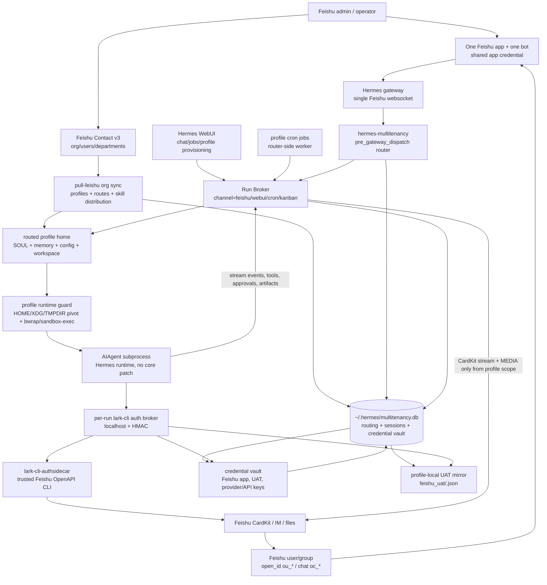

# hermes-multitenancy ☤

> **One Feishu bot. N employees. N isolated agents.** A [hermes-agent](https://github.com/NousResearch/hermes-agent) plugin that turns a single bot into a true multi-tenant platform — every user gets their own persona, memory, sessions, and LLM credentials — **without changing one line of hermes-agent**.

**English** | [简体中文](README.zh-CN.md)

<p>
<a href="#-quick-start"></a>
<a href="#️-how-it-stays-compatible"></a>
<a href="#-proof-of-end-to-end"></a>
<a href="#-testing"></a>
<a href="LICENSE"></a>
</p>

**The problem it solves:** hermes-agent is a brilliant *personal* agent runtime — but it assumes **1 bot = 1 user**. You can't drop it into a 1,000-person company without either running 1,000 processes, giving everyone the same shared persona, or forking the core and re-patching on every upgrade. This plugin makes **1 bot = N users** a deployable reality: a `pre_gateway_dispatch` hook routes each Feishu sender to their own `ProfileRuntime`, and the upstream core stays untouched.

<table>
<tr><td><b>True per-user isolation</b></td><td>Each Feishu user is routed to their own profile — independent <code>SOUL.md</code>, memory, session history, workspace, tools, and LLM credentials. Not a shared persona behind one bot. 千人千面.</td></tr>
<tr><td><b>Zero patches to hermes-agent</b></td><td>Ships as a directory plugin via the <code>pre_gateway_dispatch</code> hook. Pin the upstream version, upgrade freely, never re-patch the core. The deployment contract is plugin + sidecars, not a fork.</td></tr>
<tr><td><b>Org-driven lifecycle</b></td><td>Sync directly from the Feishu Contact directory — join / move / leave all reconcile automatically. New employees get a profile and route; departures soft-delete from routing while their memory stays on disk.</td></tr>
<tr><td><b>Privacy &amp; sandbox by construction</b></td><td>Per-profile HOME/XDG/TMPDIR pivot + subprocess env allowlist, credentials materialized through a local broker and kept out of the model, redacted streaming output, and secret-path filtering on outbound files.</td></tr>
<tr><td><b>Cost &amp; usage observability</b></td><td>Per-turn token ledger with <b>owner-based attribution</b> (a user's groups and agents all roll up to them) feeds an enterprise leaderboard. Plus a conversation-analytics CLI for demand and completion-proxy reporting.</td></tr>
<tr><td><b>Real Feishu UX, reused not rebuilt</b></td><td>CardKit streaming cards, reactions, multi-turn sessions, vision / STT / file inject, group chat, and cron delivery — all delegated to hermes-agent. Full Feishu OpenAPI reach via the <code>lark-cli</code> bridge with per-request user-vs-bot identity isolation.</td></tr>
<tr><td><b>Production-grade safety rails</b></td><td>Group <code>@everyone</code> never triggers the bot, dangerous-command approvals cross the Feishu boundary, output-length truncation degrades gracefully, and credential re-auth notifications are freshness-gated so enabling them never blasts a stale backlog.</td></tr>
</table>

### 🧭 Where it sits

- **vs vanilla [hermes-agent](https://github.com/NousResearch/hermes-agent):** hermes assumes *1 bot = 1 user* (one profile per gateway process). This plugin makes *1 bot = N users* — routing each user to their own `ProfileRuntime` — without forking the core.
- **vs a single-tenant Lark/Feishu channel plugin (e.g. [OpenClaw Lark](https://github.com/larksuite/openclaw-lark)):** those bridge *one* agent identity to Feishu. This adds per-user routing, profile isolation, and a credential vault so a *single* deployment can safely serve a whole org — each person getting their own agent, memory, and tokens.

---

## 🏛️ Architecture at a glance

A single Feishu app + one bot websocket lands on the router. The router resolves the canonical sender, looks up the profile in SQLite, and dispatches into a sandboxed per-profile subprocess. Feishu's native UX (CardKit streaming, media, approvals) is reused, not reimplemented.



**The contract in one line:** `hermes_multitenancy.register(ctx)` registers a `pre_gateway_dispatch` hook; for Feishu messages it returns `{"action": "skip"}` and the plugin's `handle_async()` owns routing and replies. **Hermes-agent: 0 lines changed.**

### Component map

```
~/.hermes/plugins/multitenancy/        (installed by `hermes plugins install`)
  ├─ plugin.yaml            Hermes directory-plugin manifest
  ├─ __init__.py            register(ctx) → pre_gateway_dispatch hook
  ├─ sync.py                route-sync wrapper for directory-plugin installs
  └─ hermes_multitenancy/
     ├─ router.py           sync hook + async dispatch + commands + lazy singletons
     ├─ runtime.py          ProfileRuntime + contextvars-isolated HERMES_HOME switch
     ├─ pool.py             LRU RuntimePool (50 hot / 5min idle / cold-start sem)
     ├─ routing.py          SQLite multitenancy_routing (open_id → profile)
     ├─ sessions.py         SQLite multitenancy_sessions (per-user persistent history)
     ├─ credentials.py      encrypted credential vault rows in multitenancy.db
     ├─ agent_real.py       AIAgent subprocess bridge + sandbox env build + fallback
     ├─ aiagent_subprocess.py  isolated child entry point for the AIAgent/tool loop
     ├─ lark_cli_tool.py    Hermes tool registration for lark_cli / lark-cli
     ├─ lark_cli_auth_broker.py  per-run localhost credential proxy for authsidecar
     ├─ run_broker.py       channel-neutral execution contract (feishu/webui/cron)
     ├─ webui_broker_server.py   localhost HTTP/SSE sidecar for WebUI and jobs
     ├─ cron_worker.py      multi-profile cron worker + Run Broker bridge
     ├─ skill_registry.py   managed/personal/unknown skill audit + install helpers
     ├─ token_usage_ledger.py    per-turn token ledger (parent-written, opt-in)
     ├─ token_usage_uploader.py  hourly owner-attributed leaderboard uploader
     ├─ analytics/          conversation-audit summary CLI (demand + completion proxy)
     ├─ commands.py         Hermes registry-backed slash command parser
     ├─ upstream_health.py  secret-free upgrade/deploy health checks
     └─ sync/
        ├─ feishu_hr.py     apply_users (idempotent reconciler)
        ├─ feishu_org.py    Feishu Contact v3 pull + profile/SOUL/route sync
        └─ cli.py           shared implementation for route sync
```

State lives in `~/.hermes/multitenancy.db` — a separate SQLite file from hermes' own `state.db` so writes don't contend. WAL mode is enabled.

<details>
<summary><b>Deep dive — the dispatch contract (for agents &amp; maintainers taking over this repo)</b></summary>

1. **Entry point, no Hermes core patches.** `hermes_multitenancy.register(ctx)` registers a `pre_gateway_dispatch` hook. For Feishu messages the hook returns `{"action": "skip"}` and the plugin's `handle_async()` owns routing and replies.
2. **Identity uses the canonical sender.** `_resolve_sender_for_routing()` prefers the real Feishu `open_id` (`ou_*`) from the Feishu contextvar, `event.sender_open_id`, `source.open_id/user_id`, and `raw/raw_event/event`. `user_id_alt` / `union_id` is only a legacy route lookup helper, not the new session key.
3. **Routes live in SQLite.** `multitenancy_routing.open_id -> profile_name` decides which `~/.hermes/profiles/<profile>/` handles the turn. A real `ou_*` will not be absorbed by a stale `union_id`; legacy alt routes are used only when no real `ou_*` is available.
4. **Normal messages run inside the routed profile.** The router builds a profile-scoped event, writes the resolved `sender_open_id` back to the event, then dispatches to the streaming AIAgent subprocess. The child runs with that profile's `HERMES_HOME`; `agent_real._build_subprocess_env` strips the parent gateway's environment down to an explicit allowlist and pivots `HOME`/`WORKSPACE`/`XDG_*`/`TMPDIR` into `<profile>/{home,workspace,cache,config,state,data,tmp}` so token-bearing skills, MCP servers and CLIs behave like they are running as the current profile user. The runtime also sets `HERMES_PROFILE` plus Keep-compatible `KEP_PROFILE`, prepends shared `<hermes_home>/bin`, and translates common OpenClaw/ClawHub `{baseDir}` skill templates inside the child process. Feishu UAT tokens are loaded from `<profile>/feishu_uat/<open_id>.json` (rebound at runtime by `_configure_feishu_uat_home`). See `docs/profile-isolation.md`.
5. **Default skills and group credentials materialize from runtime state.** `profile-skill-defaults.yaml`, `skill-distribution.yaml`, and `skill-bundles.yaml` express managed skills; sync installs them into profiles while skipping secret-looking files. Any shared top-level `lark-*` skill is also installed for every profile as a managed symlink. `credential-materialization.yaml` maps encrypted vault payloads to profile-local compatibility files; `profiles: ["*"]` expands to active routing rows; an `env:` entry passes the secret to the routed AIAgent without the model reading the token file.
6. **lark-cli is an external runtime dependency.** This repo registers the `lark_cli` tool and starts a per-run localhost auth broker, but the deployment must provide an authsidecar-capable `lark-cli` binary (default `<shared HERMES_HOME>/bin/lark-cli-authsidecar`; `HERMES_LARK_CLI_BIN` overrides). Personal profiles use `user` identity only when the current `open_id` has valid UAT; group/WebUI agent profiles default to `bot`.
7. **Cron/reminder jobs are profile-scoped but router-executed.** WebUI/upstream cron tooling writes profile-local `cron/jobs.json`. The router-side worker scans active profiles, creates `RunRequest(channel="cron")`, executes through Run Broker, delivers to Feishu when requested, and mirrors context into `multitenancy_sessions`.
8. **Dangerous-command approvals cross the subprocess boundary.** The profile AIAgent registers `tools.approval` with a router-compatible gateway session key (`multitenancy:<platform>:<profile>:<chat>:<sender>`). The child emits `approval_required` / `approval_resolved`; the parent `_stream_aiagent_subprocess()` forwards them to the router; the router prompts Feishu; `/approve` / `/deny` writes a decision file that releases the child and resumes Hermes' native approval flow.
9. **CardKit heartbeat lives in the parent router.** The router primes the card and sends idle heartbeat status updates before the child emits tokens; the heartbeat stops once reasoning/tool/content events arrive.
10. **Memory is keyed by `(profile, canonical sender)`.** `_history_key()` does not use `sender_alt or sender`, so stale/shared alternate IDs cannot merge two users' memory.
11. **Slash commands never leak into the LLM.** `/model`, `/reasoning`, `/reload-mcp` and other registry commands use Hermes gateway handlers; skill slash rewrites into native skill invocation; plugin slash delegates to `hermes_cli.plugins.get_plugin_command_handler`; unknown slash returns Hermes-style unknown-command.
12. **Group `@everyone` never triggers the bot.** Admission (`_admit`) ignores `@_all` in *any* reply mode — detected via structured mention metadata **or** raw `@_all` — so an `@所有人` broadcast can never wake every routed agent in a group.
13. **Bot sends re-check routing at send time.** A sender's freshly-created own group resolves immediately rather than being frozen to the turn's opening snapshot; bot IM sends without a broker proxy are refused regardless of declared risk, and broker deferral is gated on proxy presence.
14. **Local exec is off by default.** `quick_commands` alias remains available; `type: exec` is denied unless `multitenancy.allow_quick_exec: true` or `HERMES_MULTITENANCY_ALLOW_QUICK_EXEC=1`. Keep it off in production until profile sandboxing is enforced.
15. **Attachments and file replies stay in profile scope.** Inbound attachments delegate to Hermes' native `_prepare_inbound_message_text`, with a bounded fallback for locally cached tabular files (`.csv` / `.xlsx`). Outbound `MEDIA:<path>` replies are filtered so only paths inside the routed `profile_home` are delivered; `.env`, `auth.json`, `feishu_uat/`, `credentials/`, `tokens/` are blocked.
16. **Feishu UAT refreshes mirror into the credential vault.** Org sync copies refreshed shared `feishu_uat/<open_id>.json` into each routed profile and, when a credential key is configured, writes the same payload into `multitenancy_credentials`. JSON remains a migration fallback; the DB is the runtime credential source.
17. **Production posture.** Prefer `HERMES_MULTITENANCY_AUTO_PROVISION=0` and `multitenancy.allow_quick_exec=false`. Application-layer isolation (route/session/slash/media boundaries) is always on. Profile execution-environment isolation档 A (parent-env allowlist, HOME/WORKSPACE/XDG/TMPDIR pivot, `chmod 0700` profile tree, per-profile `feishu_uat/` + `tokens/`) is enabled by default — verify with `scripts/verify-isolation.sh`. Kernel-level containment (`sandbox-exec` / Linux `bwrap`) is additive defense-in-depth until enabled for every profile. Full details: `docs/profile-isolation.md`.

</details>

---

## 🏢 Built for the enterprise

| Concern | How this plugin handles it |
|---|---|
| **Identity & routing** | Route every turn by the canonical Feishu `open_id` (`ou_*`); legacy `union_id` is migration-only. Memory and sessions are keyed by `(profile, canonical sender)` so two users can never bleed into each other's history. |
| **App provisioning** | Reuse **one** Feishu app for the whole org — no 1-app-per-user. The shared app credential lives in the vault (`profile_name=__global__`), never in git. |
| **Org lifecycle** | `pull-feishu` reconciles the live Feishu Contact tree: joins create profiles + routes, moves refresh the managed `SOUL.md` org block, leaves soft-delete from routing while memory persists. Department-scoped sync and dry-run previews included. |
| **Secrets & credentials** | Encrypted credential vault in `multitenancy.db` exposes only redacted status. A per-run localhost broker (HMAC) injects UAT/bot tokens into `lark-cli` so **the model never sees raw Feishu app secrets**. Outbound media is filtered to the routed profile home; known secret paths are blocked. |
| **Execution isolation** | Per-profile subprocess with a stripped env allowlist + HOME/XDG/TMPDIR pivot + `chmod 0700` profile tree (档 A, on by default). Optional `bwrap`/`sandbox-exec` kernel containment. Local exec is opt-in only. |
| **Cost & chargeback** | Per-turn token ledger → hourly uploader with **owner-based attribution**: a person's DMs, their agents, and every group they invited the bot into all roll up to *them*, resolved to the enterprise email/department via the routing table. "Under-count, never mis-count" — a turn whose owner can't be resolved is dropped, never billed to the wrong person. |
| **Demand analytics** | `hermes-multitenancy-analytics summary` reads the conversation-audit log and reports usage volume, top active profiles, and completion-proxy metrics over a configurable window (markdown or JSON, with optional redacted demand samples). |
| **Group safety** | `@everyone` / `@所有人` is ignored at admission in every reply mode, so a broadcast can't wake every agent. Freshly-created groups route correctly at send time. |
| **Reliability** | Output-length truncation returns a friendly notice instead of a hard failure (streaming path included); bare model names are runtime-normalized to heal recurring provider-prefix failures; credential re-auth notifications are freshness-gated and mode-aware so enabling live sends never blasts a stale backlog. |
| **Upgrade safety** | Zero core patches + pinned `hermes-agent` version + an integration test suite that fails loudly on any contract drift. `upstream_health.py` runs secret-free health checks before declaring a deploy usable. |

### Roles

| Role | Owns |
|---|---|
| **Feishu admin** | Creates/reuses one internal Feishu app, enables the bot/websocket/scopes, keeps the shared app credential out of git (production stores it in `multitenancy_credentials` as the global Feishu app row). |
| **Platform operator** | Installs hermes + this plugin, keeps the gateway running, manages routing rows and profile directories. |
| **End user** | Authorizes once through the Feishu auth/UAT flow, then talks to the same bot; tokens refresh offline. |
| **Agent profile owner** | Maintains each profile's `SOUL.md`, `config.yaml`, `.env`, tool policy, session DB, and model credentials. |

---

## 🚀 Quick Start

Set `HERMES_HOME` first. All commands assume one shared Hermes home, one Feishu app, and per-user profiles under `$HERMES_HOME/profiles/`.

```bash
export HERMES_HOME="${HERMES_HOME:-$HOME/.hermes}"
mkdir -p "$HERMES_HOME/bin" "$HERMES_HOME/logs"
```

### 1. Install the plugin

```bash
hermes plugins install eggyrooch-blip/hermes-multitenancy --enable
hermes plugins list
```

For a pinned checkout or local development (the most transparent path for agents and operators, since the loaded plugin path is directly inspectable):

```bash
git clone https://github.com/eggyrooch-blip/hermes-multitenancy /opt/hermes-multitenancy
hermes plugins install "file:///opt/hermes-multitenancy" --force --enable
python -m pip install --no-deps -e "/opt/hermes-multitenancy[test]"
```

Manual fallback if the Hermes plugin installer is unavailable:

```bash
mkdir -p "$HERMES_HOME/plugins"
ln -sfn /opt/hermes-multitenancy "$HERMES_HOME/plugins/multitenancy"
```

Enable the plugin in the shared Hermes config:

```yaml
# $HERMES_HOME/config.yaml
plugins:
  enabled:
    - multitenancy
```

### 2. Install lark-cli / authsidecar

This plugin registers the `lark_cli` tool and starts the per-run credential broker, but it does **not** vendor the `lark-cli` binary. New environments must provide an authsidecar-capable `lark-cli` before Feishu tools work. Lookup order: `HERMES_LARK_CLI_BIN` → `$HERMES_HOME/bin/lark-cli-authsidecar` → a plain `lark-cli` on `PATH` (limited checks).

```bash
git clone https://github.com/larksuite/cli /opt/larksuite-cli
cd /opt/hermes-multitenancy
LARK_CLI_SOURCE_DIR=/opt/larksuite-cli \
HERMES_LARK_CLI_BIN="$HERMES_HOME/bin/lark-cli-authsidecar" \
LARK_CLI_EXPECTED_VERSION="<expected-lark-cli-version>" \
LARK_CLI_EXPECTED_SOURCE_HEAD="<expected-source-short-sha>" \
  scripts/build_lark_cli_authsidecar.sh
```

Or drop in a vetted binary you already ship:

```bash
install -m 0755 /path/to/lark-cli-authsidecar "$HERMES_HOME/bin/lark-cli-authsidecar"
export HERMES_LARK_CLI_BIN="$HERMES_HOME/bin/lark-cli-authsidecar"
```

The authsidecar never receives raw Feishu app secrets from the model — the routed AIAgent talks to a localhost auth broker that injects either the current user's UAT or a bot tenant token from the vault.

### 3. Configure one shared Feishu bot

Use one Feishu app/bot for all tenants; keep the app credential outside git.

```yaml
# $HERMES_HOME/config.yaml
platforms:
  feishu:
    enabled: true
    extra:
      app_id: "${FEISHU_APP_ID}"
      app_secret: "${FEISHU_APP_SECRET}"
```

Import the app credential into the vault without printing the secret:

```bash
export HERMES_MULTITENANCY_CREDENTIAL_KEY="<32-byte-or-longer-secret-key>"
python /opt/hermes-multitenancy/scripts/lark_cli_canary_preflight.py \
  import-app-config --shared-home "$HERMES_HOME" --config "$HERMES_HOME/config.yaml"
```

User UAT is profile-scoped — OAuth/device-flow writes or imports a user token, then multitenancy mirrors it to `$HERMES_HOME/profiles/<profile>/feishu_uat/<open_id>.json` and `multitenancy_credentials`. **Never commit** `.env`, `auth.json`, `feishu_uat/*.json`, `tokens/`, `workspace/credentials/`, cookies, or raw OAuth payloads.

### 4. Sync profiles and routes

With Feishu Contact read scopes, use org sync (dry-run first):

```bash
python "$HERMES_HOME/plugins/multitenancy/sync.py" pull-feishu --dry-run
mkdir -p "$HERMES_HOME/org-snapshots"
python "$HERMES_HOME/plugins/multitenancy/sync.py" pull-feishu --snapshot-out "$HERMES_HOME/org-snapshots"
```

Without Contact scopes, apply an explicit allowlist:

```bash
python "$HERMES_HOME/plugins/multitenancy/sync.py" apply users.json
```

```json
[
  {"user_id": "alice", "profile_name": "alice_profile", "open_id": "ou_xxx", "union_id": "on_xxx"},
  {"user_id": "bob", "profile_name": "bob_profile", "open_id": "ou_yyy", "union_id": "on_yyy"}
]
```

For company deployments, prefer strict routing after the initial rollout: `export HERMES_MULTITENANCY_AUTO_PROVISION=0`.

### 5. Run the gateway and broker surfaces

At minimum, restart the Hermes gateway so it imports the plugin. WebUI and cron deployments also enable the Run Broker sidecar on localhost.

```bash
export HERMES_MULTITENANCY_RUN_BROKER_SERVER=1
export HERMES_MULTITENANCY_CRON_RUN_BROKER=1
export HERMES_MULTITENANCY_RUN_BROKER_KEY="<shared-secret-for-server-to-server-calls>"
hermes gateway restart
```

Production services should set this through the service manager, not an interactive shell. Keep the Feishu websocket on the router gateway only; profile gateways must not open their own websocket for the same bot.

### 6. Verify

```bash
hermes plugins list
sqlite3 "$HERMES_HOME/multitenancy.db" \
  'select open_id, profile_name, active from multitenancy_routing limit 20;'

python /opt/hermes-multitenancy/scripts/lark_cli_canary_preflight.py health \
  --shared-home "$HERMES_HOME" --router-profile-home "$HERMES_HOME/profiles/multitenancy_router"

python /opt/hermes-multitenancy/scripts/lark_cli_canary_preflight.py preflight \
  --shared-home "$HERMES_HOME" --profile "<profile>" --open-id "<ou_open_id>" \
  --binary "$HERMES_HOME/bin/lark-cli-authsidecar"
```

Then send two Feishu users the same prompt through the same bot. Logs should show different canonical `ou_*` senders, different routed profile homes, and `lark_cli_default_identity=user` only for profiles with a valid user UAT.

### 7. Automate, scope, and recover

Run full org sync on a timer (handles join/move/leave):

```cron
*/30 * * * * HERMES_HOME=/opt/hermes python /opt/hermes/.hermes/plugins/multitenancy/sync.py pull-feishu --snapshot-out /opt/hermes/.hermes/org-snapshots >> /opt/hermes/.hermes/logs/multitenancy-sync.log 2>&1
```

Department-scoped sync:

```bash
python "$HERMES_HOME/plugins/multitenancy/sync.py" pull-feishu --dept <open_department_id> --dry-run
python "$HERMES_HOME/plugins/multitenancy/sync.py" pull-feishu --dept <open_department_id>
```

If sync goes wrong: stop the timer, inspect `pull-feishu --dry-run` and the latest snapshot, then use `/status` from Feishu or inspect `multitenancy_routing`. Unknown-user fallback profiles live at `$HERMES_HOME/profiles/feishu_<open_id>/`.

---

## 📊 Cost & usage observability

Give every employee's Hermes consumption a place on the company AI leaderboard — one person's many agents (including group chats where the bot was `@`-mentioned) all roll up to them.

**1. Per-turn token ledger** (`token_usage_ledger.py`, opt-in). Each turn appends one line — `who (open_id) / profile / platform / group-or-DM / model / in·out·total tokens` — to `/var/log/hermes/token-usage.jsonl`. The token counter lives in the sandboxed child, but the sandbox can't write the log, so the child passes usage up and the **non-sandboxed gateway parent writes the ledger**. Flip it on in the gateway process env only (one switch covers all users — do not edit per-profile `.env` files):

```bash
HERMES_TOKEN_USAGE_LEDGER_ENABLED=1
```

**2. Hourly uploader** (`token_usage_uploader.py` + systemd units in `deploy/`). Reads the ledger → attributes by **owner** → aggregates the day → resolves enterprise email/department via the routing table → POSTs to the collector with `source=hermes`.

- **Group chat** → the user who *invited* the bot (`owner_open_id`). A group the routing table can't resolve is dropped — never billed to the whole group.
- **DM** → the sender; an empty sender (e.g. a WebUI ingest service identity) falls back to the profile owner.
- **Email key** → `open_id → user_id (LDAP) → <user_id>@<HERMES_TOKEN_USAGE_EMAIL_DOMAIN>`, the unified identity key across the company so Hermes usage merges onto the same leaderboard row as the person's other tools — **no Feishu email scope required**.

> **Under-count, never mis-count.** The only rows skipped are those whose owner can't be resolved (rare) and turns that errored mid-flight. No one ever receives someone else's numbers. Full runbook: [`deploy/README-token-usage.md`](deploy/README-token-usage.md).

**Conversation demand analytics** — separate from billing, for understanding *what people ask*:

```bash
hermes-multitenancy-analytics summary --days 7                     # markdown to stdout
hermes-multitenancy-analytics summary --days 30 --format json      # machine-readable
hermes-multitenancy-analytics summary --include-profiles --include-samples  # + top profiles + redacted samples
```

It reads the conversation-audit log and reports usage volume, completion-proxy metrics, and (optionally) the top active profiles and short redacted demand samples over the selected window.

---

## 🚢 Production deployment runbook

1. Update and verify the canonical repository locally.
2. Run `uv run --extra test pytest -q` or `make test`.
3. Push the reviewed commit to GitHub.
4. On the production host, back up the current checkout, `config.yaml`, `.env`, `multitenancy.db`, service units, and active profile directories. Never print secret file contents.
5. Fast-forward the production checkout only: `git pull --ff-only`.
6. Reinstall the package if production uses editable imports: `python -m pip install --no-deps -e /path/to/hermes-multitenancy`.
7. Ensure `$HERMES_HOME/plugins/multitenancy` points at the production checkout (or was refreshed by `hermes plugins install`).
8. Ensure `$HERMES_HOME/bin/lark-cli-authsidecar` exists and is executable, or set `HERMES_LARK_CLI_BIN`.
9. Restart the router gateway and any Run Broker / WebUI services.
10. Verify `health`, `preflight`, route rows, service logs, and one read-only `lark_cli` user-info canary before declaring the deploy usable.

Rollback is a normal forward fix or a restored checkout plus service restart. Do not copy tokens between profiles by hand; use the credential vault and `credential-materialization.yaml`.

---

## ✅ Proof of end-to-end

This isn't a paper plugin. The UAT chain has been run against a real Feishu bot with two independent Feishu users on the same bot:

| Step | Action | Verified result |
|---|---|---|
| 1 | User A → same bot → router | Routed by real `ou_*` open_id to the existing `coder` profile. |
| 2 | User B → same bot → router | Auto-provisioned and routed to a new `feishu_ou_xxx` profile, not the `coder` profile. |
| 3 | Both users send the same tool-heavy UAT case set | AIAgent subprocess runs with the correct profile home and sender open_id scope. |
| 4 | Replies stream back through Feishu CardKit / IM | Text cards and file-message paths delivered through the Feishu adapter. |
| 5 | Full dual-account stress suite | Run with `--users <userA>,<userB> --parallel-users`; each case records independent `case_id::user` checkpoints. |
| 6 | Dynamic slash control plane | Dual-account `slash` suite passed `16/16` — gateway handlers, skill rewrite, plugin delegation, quick alias, opt-in exec, unknown-command handling all verified. |

These checks ran live through Feishu's WebSocket gateway and an OpenAI-compatible model provider. Real open_ids, tokens, chat IDs and app secrets are intentionally omitted from this repository.

---

## ✨ Feature matrix

| Feature | Status |
|---|---|
| Multi-tenant routing per Feishu user (open_id / union_id) | ✅ |
| LRU runtime pool (max 50 hot profiles, idle evict 5min) | ✅ |
| Streaming LLM via CardKit / `edit_message` typewriter | ✅ |
| Reasoning-content split for thinking models | ✅ |
| Reactions (👀 → ✅ / ❌) via `adapter.on_processing_*` | ✅ |
| Multi-turn session memory (SQLite-backed, survives restart) | ✅ |
| Reply-context injection (quoted messages) | ✅ |
| Rate-limit retry (429 backoff, mirrors hermes cadence) | ✅ |
| Hermes slash command control plane | ✅ — dynamic registry recognition; commands never leak into the LLM |
| Idempotent feishu-sync reconciler (CLI + library) | ✅ |
| Python Feishu Contact org sync (`pull-feishu`) | ✅ — creates/updates profiles, SOUL managed blocks, route rows |
| Vision (image attachments) | ✅ — delegates to hermes' inbound text prep |
| Audio STT (voice messages) | ✅ — same delegate, hermes' `transcribe_audio` |
| Text-file inject (.txt / .md / .csv / .log / .json …) | ✅ — same delegate |
| Tool use (real AIAgent loop with browser/search/shell) | ✅ — isolated `AIAgent` subprocess bridge |
| lark-cli Feishu OpenAPI bridge | ✅ — tool registration + per-run auth broker (deployment provides the binary) |
| Credential vault + materialization | ✅ — stores Feishu app/UAT/provider secrets; redacted status only |
| Managed skill distribution | ✅ — defaults / distribution / bundles YAML, secret guard, child inheritance |
| Cron / reminder proactive delivery | ✅ — broker-created jobs default `deliver=feishu`, router multi-profile worker |
| Dangerous-command approval delivery | ✅ — child events → parent stream → Feishu prompt → `/approve` `/deny` decision file |
| CardKit idle heartbeat | ✅ — parent router prime + heartbeat |
| **Per-turn token ledger + owner-attributed leaderboard** | ✅ — opt-in parent-written ledger, hourly uploader, routing-table email resolution |
| **Conversation demand analytics CLI** | ✅ — `hermes-multitenancy-analytics summary` over the audit log |
| **Group `@everyone` admission guard** | ✅ — `@_all` / `@所有人` ignored in any reply mode |
| **Send-time routing re-check** | ✅ — freshly-created own groups deliver immediately; no-proxy bot IM send refused |
| **Graceful output-length truncation** | ✅ — friendly notice instead of hard failure, streaming path included |
| **Runtime model-spec normalization** | ✅ — heals recurring bare-model provider-prefix failures at load |
| **Credential re-auth freshness gate** | ✅ — mode-aware dedupe; enabling live sends never blasts stale backlog |
| Feishu CardKit / IM file-message replies | ✅ — streaming cards + native `MEDIA:<path>`, filtered to routed profile home |
| Background terminal `notify_on_complete` | ⚠️ not claimed — child registry invisible to parent; child exit calls `agent.close()` |

---

## 🛡️ How it stays compatible

We keep **zero patches to hermes-agent**: no edits to `feishu.py`, `gateway/run.py`, or upstream modules. The plugin loader contract (`hermes_cli/plugins.py register_hook`) is the gateway entry point; the AIAgent/tool bridge consumes a few Hermes integration surfaces, each with tests.

| Public API we depend on | Stability |
|---|---|
| `pre_gateway_dispatch` hook (`plugins.py VALID_HOOKS`) | ⚠️ added 2026-04-21 — pin hermes-agent version |
| `BasePlatformAdapter.send / send_typing / edit_message` | ✅ abstract methods, very stable |
| `BasePlatformAdapter.on_processing_start / on_processing_complete` | ✅ |
| `MessageEvent.source.{user_id, user_id_alt, chat_id}` | ✅ stable |
| `Platform.FEISHU` enum + `ProcessingOutcome` enum | ✅ |
| `gateway.adapters[Platform.FEISHU]` dict | ✅ |
| `hermes_constants.get_hermes_home()` (read via env) | ✅ |
| `hermes_cli.commands.resolve_command / is_gateway_known_command` | ✅ — central slash registry, with a tiny test fallback |
| `SendResult.{success, message_id}` | ✅ |
| `gateway._prepare_inbound_message_text(...)` | ⚠️ private — vision + STT + file inject + reply context in one call; local vision-only fallback on signature change |
| `gateway.stream_consumer.GatewayStreamConsumer` | ⚠️ integration surface — CardKit streaming with text-edit fallback |
| `gateway._deliver_media_from_response(...)` | ⚠️ private — native `MEDIA:<path>` path after filtering to profile home; no-op if unavailable |
| `run_agent.AIAgent` | ⚠️ core runtime class — isolated in `aiagent_subprocess.py`, falls back to OpenAI-compatible path |
| `tools.feishu_oapi_client.sender_open_id_scope` | ⚠️ Feishu UAT bridge — `_configure_feishu_uat_home` rebinds `FEISHU_UAT_DIR` per subprocess |

**Pin your `hermes-agent` version** (`hermes-agent==X.Y.Z`) and run `pytest tests/test_router_integration.py tests/test_vision.py` after each upgrade — the integration tests fail loudly on contract drift. We currently require `hermes-agent>=0.14,<1.0` in `pyproject.toml`.

### Upstream strategy

This repository stays a third-party Hermes plugin, not a fork — keeping rollout fast and Feishu-multitenancy policy out of Hermes core. Good upstream PRs to `NousResearch/hermes-agent` would be small and generic: expose the real Feishu sender `open_id` on `MessageEvent.source`, document `pre_gateway_dispatch` and the deferred-processing lifecycle, and stabilize CardKit streaming/media extension points. The full router should only be proposed as a bundled plugin after those surfaces settle.

---

## ⚙️ Configuration knobs

| `config.yaml` key | Default | Notes |
|---|---|---|
| `plugins.enabled` | (none) | Must include `multitenancy` |
| `model.default` | (your hermes default) | Per-profile model; bare names are runtime-normalized to a valid provider prefix |
| `model.fallback` | (your hermes default) | Used by `agent_real` if primary fails |
| `multitenancy.toolsets_mode` | `merge_default` | Merge a profile's `platform_toolsets.feishu` with Hermes defaults so web/browser/search stay available; `explicit` for strict replacement |
| `multitenancy.allow_quick_exec` | `false` | Allow `quick_commands` `type: exec` over Feishu; keep off until the sandbox is enforced |

| Sync command / env var | Default | Notes |
|---|---|---|
| `pull-feishu --dry-run` | off | Preview planned changes without writing |
| `pull-feishu --dept <id>` | off | Sync one department subtree; out-of-scope routes not soft-deleted |
| `pull-feishu --soft-delete-missing` | on (full) / off (`--dept`) | Soft-delete active routes missing from the pull |
| `HERMES_MULTITENANCY_AUTO_PROVISION` | `1` | Auto-create `feishu_<open_id>` fallback profiles; `0` for strict allowlist |
| `HERMES_TOKEN_USAGE_LEDGER_ENABLED` | unset / off | Gateway-env switch for the per-turn token ledger (set on the parent process only) |
| `HERMES_TOKEN_USAGE_EMAIL_DOMAIN` | (required for uploader) | Domain for `<user_id>@<domain>` leaderboard identity resolution |

| Plugin tunable (`router.py` constants) | Default | Notes |
|---|---|---|
| `RuntimePool.max_loaded_runtimes` | 50 | Hot pool cap |
| `RuntimePool.idle_evict_seconds` | 300 | Drop idle entries after 5min |
| `_SESSION_HISTORY_MAX` | 20 | Messages kept per (profile, user) |
| Streaming throttle (content) | 1.0s / 60 chars | Mirrors hermes cadence |
| CardKit idle heartbeat | 2.5s | Keeps the card active before the first agent event |
| Approval bridge timeout | 300s | Override with `HERMES_MULTITENANCY_APPROVAL_TIMEOUT` |
| Rate-limit backoffs | 0.5s → 1s → 2s | 429-only; non-429 retried once |

---

## 🎮 Slash commands

| Command | Effect |
|---|---|
| `/help` | List available commands |
| `/status` | Show current profile + history length + run state |
| `/new` / `/reset` | Reset this user's session history (cache + SQLite) |
| `/stop` | Cancel the in-flight LLM call for this user |
| Other Hermes gateway commands | Recognized dynamically from Hermes' registry and delegated to the gateway handler; otherwise a control-plane warning, never the agent prompt |

---

## 🧪 Testing

```bash
uv run --extra test pytest -q          # Default suite (no network)
make test                              # Same, via Makefile

uv run --extra test pytest \           # Focused Feishu regression suite
  tests/test_hook_dispatch.py \
  tests/test_aiagent_subprocess.py \
  tests/test_streaming_card_transport.py -q

uv run --extra test pytest tests/ -m integration -v   # Live LLM integration
make skills-uat                        # skills / lark-cli / UAT audit
make skills-uat-strict
```

---

## 🐛 Troubleshooting

**"plugin loaded but no replies"** — `pkill -f gateway && hermes gateway run`. Plugins load at gateway startup; any change requires a restart.

**"all bots stopped responding"** — your routing rule probably has the wrong `open_id`/`union_id`. Add a temporary `print(event.source)` in `router.on_pre_gateway_dispatch` and watch the gateway log.

**"org sync routed someone incorrectly"** — stop cron/systemd first, run `pull-feishu --dry-run`. The user can `/status` in Feishu; locally inspect `sqlite3 ~/.hermes/multitenancy.db 'select user_id, open_id, profile_name, active from multitenancy_routing;'`.

**"I need to bypass a bad route immediately"** — soft-delete the active route and let the next message auto-provision a fallback:

```bash
sqlite3 ~/.hermes/multitenancy.db \
  "update multitenancy_routing set active=0, deleted_at=strftime('%s','now'), updated_at=strftime('%s','now'), version=version+1 where open_id='ou_xxx' and active=1;"
```

**"user_id is `g41a5b5g`-ish, not the `ou_` I expected"** — some paths expose a short SDK user ID. The plugin resolves the real sender `open_id` from raw sender metadata/context first, falling back to `user_id_alt`/`union_id` only for legacy rows.

**"Feishu tools work, but news/web search does not"** — the profile likely has `platform_toolsets.feishu` set to Feishu-only tools. Default `merge_default` mode preserves `web_search`/`web_extract`; set `explicit` only if you need a small schema.

**"the bot replied to `@所有人`"** — it shouldn't. `@_all` is ignored at admission in every reply mode; if you see otherwise, capture the raw mention payload and file an issue.

**"sessions lost after restart"** — verify `~/.hermes/multitenancy.db` exists and `multitenancy_sessions` has rows; check the gateway log for `SessionStore.append failed`.

---

## 🤝 Contributing

Issues and PRs welcome.

**Bug reports** — include: `make test` output, hermes-agent version (`pip show hermes-agent | grep Version`), plugin version, and relevant `multitenancy:`-prefixed gateway log lines.

**Pull requests** — fork → branch → green `make test` → PR. Tests required for behaviour changes. Don't mass-rename. **No `feishu.py` patches** — the whole point is that hermes-agent stays unmodified; file an upstream issue instead.

**Wanted contributions (priority order):**
1. **Per-profile `SessionStore`** — split the shared `multitenancy.db` session rows into per-profile DBs to mirror hermes' own layout.
2. **Prompt caching** — Anthropic `cache_control` for the SOUL prefix (~50% token cut on long chats).
3. **CI matrix** — GitHub Actions running the suite against multiple `hermes-agent` versions to catch contract drift early.
4. **More live UAT fixtures** — broaden write-path coverage without shared production-like resources.

---

## 📜 License

MIT — see [LICENSE](LICENSE).

## 🙏 Acknowledgements

Built on top of [Nous Research's hermes-agent](https://github.com/NousResearch/hermes-agent) — without the `pre_gateway_dispatch` hook (added by [@KeiraVoss](https://github.com/) on 2026-04-21), this plugin would have required forking the entire upstream. Thank you for the hook.
