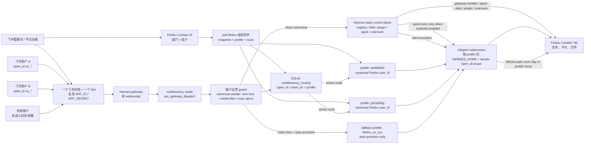

# hermes-multitenancy

> **一个飞书 Bot, N 个用户, N 套档案。** 一个 [hermes-agent](https://github.com/NousResearch/hermes-agent) 插件,把每个飞书用户路由到独立的 profile (独立的 SOUL.md, 会话, 记忆, LLM 凭证) —— 不动 hermes-agent 一行代码。

[English](README.md) | **简体中文**

[](#-测试)
[](#-为什么能保持兼容)
[](#-端到端验证)
[](LICENSE)

---

## 😖 为什么写这个插件 (痛点)

我很喜欢 hermes-agent —— 这是我用过最完整的个人 Agent 运行时。但是想把它放进公司里给所有人用的时候, 撞墙了:

> **Hermes 假设 1 个 Bot = 1 个用户。** 一个 "profile" 就是一个 HERMES_HOME 目录。每个 profile 起一个独立的 gateway 进程, 自己持有飞书 App 凭证, 自己跑一个 websocket。所以我想把一个 Bot 部署给 1000 人公司用的方案, 全军覆没:
>
> - **方案 A** —— 起 1000 个 hermes 进程? 1000 × 86 MB 的 lark_oapi 装不进内存, 也别指望 IT 给你开 1000 个飞书 App。
> - **方案 B** —— 一个 Bot, 一个 profile, 1000 人共用一份 SOUL? 那就不是 "千人千面" 了 —— 每个员工拿到的人格一样, 没有用户级记忆。
> - **方案 C** —— 改 `feishu.py` 按用户分流? 每次 hermes 升级我都得手动 re-patch。我试了一下午, 放弃了。
> - **方案 D** —— Fork hermes-agent, 自己维护一条分支? 等于背一笔永久债, 而上游还在快速演进。

**这些方案都不通。** 我想要 hermes 的丰富 UX (流式, 表情反应, 多轮, 会话) **同时** 多租户路由 **同时** 不动 hermes-agent 一行代码。

这个插件就是答案: 用一个 **`pre_gateway_dispatch` hook** 拦截每条飞书消息, 在 SQLite 路由表里查到这个用户对应哪个 profile, 然后派发到一个独立的 `ProfileRuntime` (持有独立的 SOUL + 历史 + LLM 客户端)。一个 Bot 服务 N 个用户, 每个用户感觉自己拥有一个专属的 hermes Agent。



**hermes-agent: 改动 0 行。** `git status` 可验。

---

## 🧭 给 Agent 看的实现速览

如果你是接手这个仓库的 Agent, 先读这一节就能知道主链路和配置边界:

1. **入口不改 Hermes core。** `hermes_multitenancy.register(ctx)` 注册 `pre_gateway_dispatch` hook。收到飞书消息后, hook 返回 `{"action": "skip"}`, 由插件自己的 `handle_async()` 接管后续路由和回复。
2. **身份只认 canonical sender。** `_resolve_sender_for_routing()` 优先取真实飞书 `open_id` (`ou_*`): Feishu contextvar、`event.sender_open_id`、`source.open_id/user_id`、`raw/raw_event/event` 都会查。`user_id_alt` / `union_id` 只用于旧路由查找, 不作为新 session key。
3. **路由是 SQLite 表。** `multitenancy_routing.open_id -> profile_name` 决定用户进入哪个 `~/.hermes/profiles/<profile>/`。有真实 `ou_*` 时不会被 stale `union_id` 吸收到老 profile; 没有 `ou_*` 时才 fallback 到 legacy alt route。
4. **普通消息进入 profile runtime。** router 构造 profile-scoped event, 把真实 `sender_open_id` 写回 event, 再进入 streaming AIAgent subprocess。子进程以该 profile 的 `HERMES_HOME` 运行, Feishu UAT token 仍按 `~/.hermes/feishu_uat/<open_id>.json` 查。
5. **cron/提醒任务写共享 gateway 调度存储。** AIAgent 子进程里 `agent_real._configure_cron_home()` 会临时把 `cron.jobs` 和 `tools.cronjob_tools` 绑定到共享 Hermes home (`~/.hermes/cron/jobs.json`), 而不是 `~/.hermes/profiles/<profile>/cron/jobs.json`。原因是单 gateway 的 cron ticker 只轮询共享存储; 否则 "3 分钟后提醒我" 这类任务会一直停在 `scheduled`。
6. **session 记忆按 `(profile, canonical sender)` 隔离。** `_history_key()` 不再用 `sender_alt or sender`, 避免 stale/shared alt 把两个用户记忆合并。
7. **slash 命令不漏进 LLM。** `/model`、`/reasoning`、`/reload-mcp` 等走 Hermes gateway handler; skill slash 改写为 Hermes 原生 skill invocation 后进对应 profile 的 agent; plugin slash 走 `hermes_cli.plugins.get_plugin_command_handler`; unknown slash 返回 Hermes 风格 unknown-command。
8. **slash handler 有 profile 上下文锁。** gateway/plugin handler 在 `_profile_gateway_context()` 内运行, 串行切换 `HERMES_HOME` 和 gateway session key, 防止并发 slash 串租户。
9. **本机 exec 默认关闭。** `quick_commands` 的 alias 仍可用; `type: exec` 默认禁用。只有 `multitenancy.allow_quick_exec: true` 或 `HERMES_MULTITENANCY_ALLOW_QUICK_EXEC=1` 后才允许, 且 exec 继承当前 profile 的 `HERMES_HOME`。生产建议等 profile 沙箱落地后再开。
10. **附件/文件回复限制在 profile 内。** 入站附件仍委托 Hermes 原生 `_prepare_inbound_message_text`; 出站 `MEDIA:<path>` 会先过滤, 只有解析后位于当前 `profile_home` 内的路径才会交给 Feishu adapter 投递。
11. **生产推荐策略。** 公司/生产环境建议 `HERMES_MULTITENANCY_AUTO_PROVISION=0` 做白名单路由, `multitenancy.allow_quick_exec=false`, 再叠加 profile 沙箱。沙箱负责 OS 级隔离; 本插件负责路由/session/slash/附件这些应用层边界。

---

## 👥 角色说明

| 角色 | 负责内容 |
|---|---|
| 飞书管理员 | 创建或复用一个内部飞书应用, 开启 Bot / websocket / 权限范围, 并保证共享 `FEISHU_APP_ID` / `FEISHU_APP_SECRET` 不进 git。 |
| 平台运维 | 安装 hermes + 本插件, 运行 gateway, 维护路由表和 profile 目录。 |
| 飞书用户 | 通过飞书授权/UAT 流程认证一次, 之后只和同一个 Bot 对话。用户 token 从共享 Hermes home 离线刷新。 |
| Agent profile 负责人 | 维护每个 profile 的 `SOUL.md`, `config.yaml`, `.env`, 工具策略、会话库和模型凭证。 |

## 🔁 App ID 复用模型

你不需要给每个用户建一个飞书应用。所有租户复用同一个飞书应用/Bot:

1. 共享飞书应用凭证只放在 gateway/default Hermes 配置或环境变量里。
2. 新路由优先使用真实飞书发送者 `open_id` (`ou_*`)。为了迁移旧数据, router 仍可 fallback 到 `union_id` (`on_*`)。
3. 每个用户的飞书 UAT token 放在 `~/.hermes/feishu_uat/<open_id>.json`, 不要提交 token 文件。
4. 每个 profile 的模型/工具凭证放在 `~/.hermes/profiles/<profile>/`。飞书应用共享, 但人格、记忆、工具和 LLM 凭证隔离。

讨论群组: [Eggyrooch 邀请你加入飞书群](https://applink.feishu.cn/client/chat/chatter/add_by_link?link_token=419if828-a007-453f-ad1c-31edef49520f)。

---

## 🚀 快速上手

### 1. 安装插件

正常安装请使用 Hermes 自带插件安装器。它会把本仓库 clone 到
`~/.hermes/plugins/multitenancy`, 读取根目录 `plugin.yaml`, 并在传入
`--enable` 时自动写入 `plugins.enabled`。

```bash
hermes plugins install eggyrooch-blip/hermes-multitenancy --enable
hermes plugins list
hermes gateway restart
```

本地开发再使用 editable checkout:

```bash
git clone https://github.com/eggyrooch-blip/hermes-multitenancy ~/projects/hermes-multitenancy
cd ~/projects/hermes-multitenancy
hermes plugins install "file://$PWD" --force --enable
python -m pip install --no-deps -e ".[test]"   # 可选: 只用于跑本仓库测试
hermes gateway restart
```

### 2. 在 `config.yaml` 启用

传入 `--enable` 时安装器会自动完成。手动安装时, 确保默认 gateway home 有:

```yaml
# ~/.hermes/config.yaml
plugins:
  enabled:
    - multitenancy
```

### 3. 配置一个共享飞书 Bot

在默认 gateway home 里使用你已有的 Hermes 飞书应用凭证。不同 Hermes 版本的外层配置可能略有差异, 关键是所有 profile 复用同一组应用凭证。

```yaml
# ~/.hermes/config.yaml
platforms:
  feishu:
    enabled: true
    extra:
      app_id: "${FEISHU_APP_ID}"
      app_secret: "${FEISHU_APP_SECRET}"
```

然后让每个真实用户各自跑一次 Hermes 飞书授权/UAT 流程。token 文件应落在共享 home 下, 例如:

```text
~/.hermes/feishu_uat/ou_xxx.json
~/.hermes/feishu_uat/ou_yyy.json
```

### 4. 同步飞书组织到 profile + 路由

如果你的飞书应用有通讯录读取权限, 推荐直接用 Python org sync:

```bash
# 先预览, 不写 profile / DB
python ~/.hermes/plugins/multitenancy/sync.py pull-feishu --dry-run

# 确认无误后正式同步, 同时保存组织快照
mkdir -p ~/.hermes/org-snapshots
python ~/.hermes/plugins/multitenancy/sync.py pull-feishu \
  --snapshot-out ~/.hermes/org-snapshots
```

同步会复用当前 `HERMES_HOME` 里的 Hermes 飞书配置 (`config.yaml` / `.env` / 环境变量), 拉取 Feishu Contact v3 部门和用户, 用 Feishu `user_id` 作为业务主键创建 `~/.hermes/profiles/<user_id>/`, 并写入 `multitenancy_routing`。`SOUL.md` 只更新带标记的组织托管区块, 不覆盖人工内容。

如果你还没有通讯录权限, 或只想手工维护白名单, 仍可使用原来的 JSON 路由同步:

```bash
# directory-plugin 安装路径
python ~/.hermes/plugins/multitenancy/sync.py apply users.json

# 如果你额外以 editable/pip package 安装了本仓库, 也可以用:
hermes-multitenancy-sync apply users.json
```

`users.json` 格式:

```json
[
  {"user_id": "alice", "profile_name": "alice_profile", "open_id": "ou_xxx", "union_id": "on_xxx"},
  {"user_id": "bob",   "profile_name": "bob_profile",   "open_id": "ou_yyy", "union_id": "on_yyy"}
]
```

每个 `profile_name` 必须事先存在于 `~/.hermes/profiles/<name>/` 下, 自带 `SOUL.md` / `config.yaml` / `auth.json` 或 `.env`。插件会把 `ou_xxx` 路由到 `alice_profile` 的 SOUL+memory, 把 `ou_yyy` 路由到 `bob_profile`。

第一次 UAT 也可以保留自动建档开关 (`HERMES_MULTITENANCY_AUTO_PROVISION=1`, 默认开启)。未见过的发送者 `ou_new_user` 会得到一个确定性的兜底 profile, 例如 `~/.hermes/profiles/feishu_ou_new_user/`, 由共享 Hermes 配置初始化。后续 org sync 学到真实 Feishu `user_id` 后, 会把路由接管到 canonical `user_id` profile。

重启 hermes gateway。**搞定。**

### 5. 验证

```bash
hermes plugins list
hermes gateway status
sqlite3 ~/.hermes/multitenancy.db 'select open_id, profile_name, active from multitenancy_routing;'
```

让两个不同飞书用户通过同一个 Bot 发送同一句提示。gateway 日志应该能看到
不同的 sender `ou_*` 和不同的 profile home。

### 6. 自动同步、按需同步和兜底

首次同步后, 建议用 cron 或 systemd timer 定期全量同步。全量同步会处理入转调离: 新员工创建 profile + 路由, 转岗更新 `SOUL.md` 的组织托管区块, 离职/移出通讯录的用户软删除路由 (`active=0`), 但保留 profile、记忆和会话。

```cron
*/30 * * * * HERMES_HOME=/Users/kite/.hermes /usr/bin/python3 /Users/kite/.hermes/plugins/multitenancy/sync.py pull-feishu --snapshot-out /Users/kite/.hermes/org-snapshots >> /Users/kite/.hermes/logs/multitenancy-sync.log 2>&1
```

不是所有人都需要组织同步时, 用部门范围或白名单模式:

```bash
# 只同步一个部门子树; 默认不会软删除范围外已有路由
python ~/.hermes/plugins/multitenancy/sync.py pull-feishu --dept <open_department_id> --dry-run
python ~/.hermes/plugins/multitenancy/sync.py pull-feishu --dept <open_department_id>

# 严格白名单: 关闭未知用户自动建档, 只让 apply users.json / scoped sync 写路由
export HERMES_MULTITENANCY_AUTO_PROVISION=0
```

如果同步出现纰漏, 先停定时任务, 用 `--dry-run` 和最新 snapshot 排查。用户在飞书发 `/status` 可看到当前 profile; 本机可用 `hermes -p <profile_name> chat` 进入对应 profile。未知用户兜底 profile 路径是 `~/.hermes/profiles/feishu_<open_id>/`。

---

## ✅ 端到端验证

这不是 paper plugin。当前 UAT 链路已经用真实飞书 Bot 跑过两个独立飞书用户, 且两个用户使用同一个 Bot:

| 步骤 | 操作 | 实测结果 |
|---|---|---|
| 1 | 用户 A → 同一个 Bot → router | 按真实 `ou_*` open_id 路由到已有 `coder` profile。 |
| 2 | 用户 B → 同一个 Bot → router | 自动建档并路由到新的 `feishu_ou_xxx` profile, 不会落到 `coder`。 |
| 3 | 两个用户发送同一套工具压测案例 | AIAgent subprocess 使用正确的 profile home 和 sender open_id scope。 |
| 4 | 回复经 Feishu CardKit / IM 返回 | 文本卡片和文件消息路径都复用 Feishu adapter 发送。 |
| 5 | 双账号完整压测 | 使用 `--users <用户A>,<用户B> --parallel-users` 运行; 每个用例会记录独立的 `case_id::user` checkpoint。 |
| 6 | 动态 slash 控制面 | 双账号 `slash` suite `16/16` 通过: `/model`、`/reasoning`、`/reload-mcp` 走 gateway handler; skill slash 改写为原生 skill invocation; plugin slash 走 `hermes_cli.plugins.get_plugin_command_handler`; quick alias 不进 LLM, quick exec 只允许显式开启; unknown slash 返回 Hermes 风格 unknown-command。 |

以上全部跑在真实飞书 WebSocket gateway + OpenAI 兼容模型 provider 上。真实 open_id、token、chat ID、app secret 均不会进入本仓库。

---

## ✨ 功能矩阵

| 功能 | 状态 |
|---|---|
| 按飞书 user (open_id / union_id) 多租户路由 | ✅ |
| LRU 运行时池 (最多 50 个热 profile, 5 分钟空闲淘汰) | ✅ |
| 流式 LLM 输出 (`edit_message` 打字机效果) | ✅ |
| thinking/reasoning 模型的推理内容分流 | ✅ |
| 表情反应 (👀 → ✅ / ❌) via `adapter.on_processing_*` | ✅ |
| 多轮会话记忆 (SQLite 持久化, 跨重启) | ✅ |
| 引用上下文注入 (回复消息) | ✅ |
| 限流退避 (429 backoff, 与 hermes 主线节奏一致) | ✅ |
| Hermes 斜杠命令控制面 | ✅ —— 动态识别 Hermes registry 命令; `/model`、`/reasoning`、`/reload-mcp` 等走 gateway handler; skill slash 改写为 Hermes 原生 skill invocation; plugin slash 走 `hermes_cli.plugins.get_plugin_command_handler`; quick_commands 支持 alias 和显式开启的 exec; unknown slash 返回 Hermes 风格 unknown-command, 不漏进 LLM |
| 幂等 feishu-sync 同步器 (CLI + 库) | ✅ |
| Python 飞书通讯录组织同步 (`pull-feishu`) | ✅ —— 自动创建/更新 profile、SOUL 托管区块和路由表 |
| 图像识别 (图片附件) | ✅ —— 委托给 hermes 的 `gateway._prepare_inbound_message_text`, 行为与主线一致 |
| 语音 STT (语音消息) | ✅ —— 同一委托, hermes 的 `transcribe_audio` 处理已缓存音频 |
| 文本文件注入 (.txt / .md / .csv / .log / .json …) | ✅ —— 同一委托, 内容前置到消息中 |
| 引用上下文 (回复消息) | ✅ —— 同一委托, 加上我们自己的 `reply_to_text` 兜底 |
| 多用户共享会话归属 | ✅ —— 同一委托 |
| 工具调用 (真正的 AIAgent loop, 浏览器/搜索/shell) | ✅ —— 通过隔离的 `AIAgent` subprocess bridge |
| Feishu CardKit / IM 文件消息回复 | ✅ —— 流式卡片 + 原生 `MEDIA:<path>` 投递复用, 但只允许发送当前 profile 目录内文件 |

---

## 🛡️ 为什么能保持兼容

我们保持 **hermes-agent 零 patch**: 不改 `feishu.py` / `gateway/run.py` / 上游模块。插件加载契约 (`hermes_cli/plugins.py:435 register_hook`) 是 gateway 入口; AIAgent/tool bridge 还会消费少量 Hermes 集成面, 每个点都有回归测试覆盖。

| 我们依赖的公开 API | 稳定性 |
|---|---|
| `pre_gateway_dispatch` hook (`plugins.py:81 VALID_HOOKS`) | ⚠️ 2026-04-21 新增 —— 锁定 hermes-agent 版本 |
| `BasePlatformAdapter.send / send_typing / edit_message` | ✅ 抽象方法, 非常稳定 |
| `BasePlatformAdapter.on_processing_start / on_processing_complete` | ✅ |
| `MessageEvent.source.{user_id, user_id_alt, chat_id}` | ✅ 稳定 |
| `Platform.FEISHU` 枚举 + `ProcessingOutcome` 枚举 | ✅ |
| `gateway.adapters[Platform.FEISHU]` 字典 | ✅ |
| `hermes_constants.get_hermes_home()` (走环境变量读) | ✅ |
| `hermes_cli.commands.resolve_command / is_gateway_known_command` | ✅ —— 斜杠命令识别来自 Hermes 中心 registry, 脱离 Hermes 跑单测时才使用极薄 fallback |
| `SendResult.{success, message_id}` | ✅ |
| `gateway._prepare_inbound_message_text(event, source, history)` | ⚠️ 私有 (下划线开头) —— 一次调用覆盖图像 + 语音 + 文件注入 + 引用上下文。签名变了会自动降级到本地图像-only。 |
| `gateway.stream_consumer.GatewayStreamConsumer` | ⚠️ Hermes 集成面 —— 存在时复用 Feishu CardKit 流式卡片, 不存在则回落到文本 edit。 |
| `gateway._deliver_media_from_response(response, event, adapter)` | ⚠️ 私有 —— 过滤到当前路由 profile 目录后, 复用原生 Feishu `MEDIA:<path>` 文件投递路径。不可用时 no-op。 |
| `run_agent.AIAgent` | ⚠️ 核心运行时类 —— 隔离在 `aiagent_subprocess.py`, 出错时回落到旧 OpenAI-compatible path。 |
| `tools.feishu_oapi_client.sender_open_id_scope` | ⚠️ Feishu UAT bridge —— 把 token 查找限定到 `~/.hermes/feishu_uat/<open_id>.json`。 |
| `tools.vision_tools.vision_analyze_tool` (本地兜底) | ✅ 工具模块, 仅在 gateway 助手缺失时使用 |

**锁定 `hermes-agent` 版本** (`hermes-agent==X.Y.Z`), 每次升级跑 `pytest tests/test_router_integration.py tests/test_vision.py` —— 集成 + 管线测试会在契约漂移时大声失败。

---

## 🧭 上游策略

这个仓库更适合先保持为第三方 Hermes 插件, 而不是 fork 或直接塞进 core。
这样发布节奏更快, 也不会把飞书多租户的业务策略硬编码进 Hermes 主仓。
更适合提交到 `NousResearch/hermes-agent` 的 PR 应该小而通用, 例如:

| 上游候选 PR | 价值 |
|---|---|
| 在 `MessageEvent.source` 上稳定暴露真实飞书 sender `open_id` | 去掉本插件里的 raw-event 解析, 也帮助其他飞书插件。 |
| 文档化 `pre_gateway_dispatch` gateway hook 和 deferred processing lifecycle | 让 router 类插件更容易安全实现。 |
| 稳定 CardKit streaming / media delivery 扩展点 | 让插件复用原生飞书 UX, 不必碰私有 gateway helper。 |

完整 multitenancy router 建议等这些通用扩展面稳定、外部使用验证充分之后,
再考虑作为 Hermes bundled plugin 提案。

---

## 🏗️ 架构

```
~/.hermes/plugins/multitenancy/  (由 `hermes plugins install` 安装)
  ├─ plugin.yaml          Hermes directory-plugin manifest
  ├─ after-install.md     Hermes 安装后展示的检查清单
  ├─ __init__.py          根 shim → hermes_multitenancy.register(ctx)
  ├─ sync.py              directory-plugin 安装时使用的路由同步 wrapper
  └─ hermes_multitenancy/
     ├─ __init__.py       register(ctx) → ctx.register_hook(pre_gateway_dispatch, ...)
     ├─ router.py         同步 hook + 异步派发 + 命令 + 懒加载单例
     ├─ runtime.py        ProfileRuntime + contextvars 隔离的 HERMES_HOME 切换
     ├─ pool.py           LRU RuntimePool (50 热 / 5 分钟空闲 / 冷启信号量)
     ├─ routing.py        SQLite multitenancy_routing 表 (open_id → profile)
     ├─ sessions.py       SQLite multitenancy_sessions (按用户历史, 持久化)
     ├─ commands.py       基于 Hermes registry 的斜杠命令解析
     ├─ agent_real.py     AIAgent subprocess bridge + 旧 OpenAI 兼容 fallback
     ├─ aiagent_subprocess.py 隔离子进程入口, 跑 AIAgent/tool loop
     └─ sync/
        ├─ feishu_hr.py   apply_users (幂等同步器)
        ├─ feishu_org.py  Feishu Contact v3 拉取 + profile/SOUL/route 同步
        └─ cli.py         路由同步的共享实现
```

状态存在 `~/.hermes/multitenancy.db` —— 与 hermes 自己的 `state.db` 分开, 写入互不争用。开启 WAL 模式。

---

## ⚙️ 配置项

| `config.yaml` key | 默认值 | 说明 |
|---|---|---|
| `plugins.enabled` | (无) | 必须包含 `multitenancy` |
| `model.default` | (你的 hermes 默认) | 按 profile 配置模型; 使用你自己的 Hermes 部署已经标准化的 provider/model。 |
| `model.fallback` | (你的 hermes 默认) | 主模型失败时 `agent_real` 用这个 |
| `multitenancy.toolsets_mode` | `merge_default` | profile 里写了 `platform_toolsets.feishu` 时, 默认与 Hermes Feishu 默认工具集合并, 保留 web/browser/search 等通用能力。设为 `explicit` 可恢复严格替换。 |
| `multitenancy.allow_quick_exec` | `false` | 允许 Feishu 多租户里的 `quick_commands` 使用 `type: exec`。生产环境请保持关闭, 直到 profile 沙箱已经强制生效; 开启后的 exec 会继承当前路由 profile 的 `HERMES_HOME`。 |

| 同步命令 / 环境变量 | 默认值 | 说明 |
|---|---|---|
| `pull-feishu --dry-run` | off | 只打印计划变更, 不写 profile / DB |
| `pull-feishu --dept <id>` | off | 只同步一个飞书部门子树; 默认不软删除范围外路由 |
| `pull-feishu --soft-delete-missing` | full sync 开, `--dept` 关 | 软删除本次同步结果里缺失的 active 路由 |
| `pull-feishu --no-soft-delete-missing` | off | 强制不软删除缺失路由, 适合 pilot 或排障 |
| `HERMES_MULTITENANCY_AUTO_PROVISION` | `1` | 未知飞书用户首次发消息时自动创建 `feishu_<open_id>` 兜底 profile; 设为 `0` 可改成严格白名单 |
| `HERMES_MULTITENANCY_ALLOW_QUICK_EXEC` | 未设置 / off | `quick_commands` exec 的环境变量开关。生产建议优先用配置白名单并配合沙箱。 |

| 插件可调项 (`router.py` 里的 Python 常量) | 默认值 | 说明 |
|---|---|---|
| `RuntimePool.max_loaded_runtimes` | 50 | 热池上限 |
| `RuntimePool.idle_evict_seconds`  | 300 | 5 分钟空闲淘汰 |
| `_SESSION_HISTORY_MAX`            | 20  | 每 (profile, user) 保留的消息数 |
| 流式节流 (content)                | 1.0s / 60 字 | 与 hermes 主线一致 |
| 流式节流 (thinking)               | 2.0s 心跳 | 推理预览 |
| 限流退避                          | 0.5s → 1s → 2s | 仅 429; 非 429 重试一次 |

---

## 🎮 斜杠命令

| 命令 | 效果 |
|---|---|
| `/help`   | 列出可用命令 |
| `/status` | 显示当前 profile + 历史长度 + 运行状态 |
| `/new` / `/reset` | 重置当前用户的会话历史 (按 profile 隔离) —— 同时清缓存 + SQLite |
| `/stop`   | 取消当前用户进行中的 LLM 调用 |
| 其他 Hermes gateway 命令 | 从 Hermes registry 动态识别, 有 gateway handler 时透传给原 handler; 否则返回控制面提示, 不进入 agent prompt。 |

---

## 🧪 测试

```bash
# 默认套件 (无网络)
PYTHONPATH=/path/to/hermes-agent python -m pytest tests/ -q -m "not integration"

# 本 PR 使用的飞书多租户重点回归套件
PYTHONPATH=/path/to/hermes-agent python -m pytest \
  tests/test_hook_dispatch.py \
  tests/test_aiagent_subprocess.py \
  tests/test_streaming_card_transport.py \
  -q

# 真实 LLM 集成 —— 调你配置的 provider
PYTHONPATH=. python -m pytest tests/ -m integration -v
```

完整双账号飞书 UAT 在 Hermes UAT worktree 中运行, 不在插件包内:

```bash
python scripts/stress_test_feishu_pipeline.py \
  --suite full \
  --users 用户A,美元本袁 \
  --parallel-users \
  --chat-id "$HERMES_FEISHU_TEST_CHAT_ID" \
  --fixtures .uat/fixtures/dual-users.local.json \
  --allow-destructive \
  --strict-identity \
  --route-mode multitenant \
  --require-card-final \
  --checkpoint ~/.hermes/uat/checkpoints/full-dual-20260505.jsonl
```

---

## 🐛 故障排查

**"插件加载了但没回复"** —— `pkill -f gateway && hermes gateway run`。插件在 gateway 启动时加载, 任何改动都需要重启。

**"所有 Bot 都不响应了"** —— 路由规则的 `open_id` 或 `union_id` 大概率写错了。在 `router.on_pre_gateway_dispatch` 里临时 `print(event.source)` 看飞书实际发过来的值, 对一下日志。

**"组织同步后有人路由错了"** —— 先停 cron/systemd 定时同步, 跑 `pull-feishu --dry-run` 看计划变更。用户在飞书发 `/status` 能看到当前 profile; 本机用 `sqlite3 ~/.hermes/multitenancy.db 'select user_id, open_id, profile_name, active from multitenancy_routing;'` 对路由。

**"需要紧急绕过错误路由"** —— 可以软停该用户 active 路由, 然后让用户再发一条消息触发 auto-provision 兜底:

```bash
sqlite3 ~/.hermes/multitenancy.db \
  "update multitenancy_routing set active=0, deleted_at=strftime('%s','now'), updated_at=strftime('%s','now'), version=version+1 where open_id='ou_xxx' and active=1;"
```

兜底 profile 位于 `~/.hermes/profiles/feishu_ou_xxx/`, 可用 `hermes -p feishu_ou_xxx chat` 进入。

**"user_id 是 `g41a5b5g` 这种, 不是我以为的 `ou_`"** —— 某些 Feishu/Hermes 路径会把短 SDK user id 放在 `event.source.user_id`。本插件现在优先从飞书 raw sender metadata/context 解析真实发送者 `open_id`, 只有迁移旧数据时才 fallback 到 `user_id_alt` / `union_id`。

**"飞书工具能用, 但查新闻/网页搜索不行"** —— 多半是 profile 的 `platform_toolsets.feishu` 只列了飞书工具。默认 `merge_default` 会把显式飞书工具与 Hermes Feishu 默认工具集合并, 因而保留 `web_search` / `web_extract`。如果你确实要压低 schema, 设置 `multitenancy.toolsets_mode: explicit` 或环境变量 `HERMES_MULTITENANCY_TOOLSETS_MODE=explicit`。

**"感觉很卡, 1 秒一个字"** —— 先看 gateway 日志里的模型延迟、飞书限流重试和 CardKit 更新节流。支持 reasoning 的模型可能先吐 `reasoning_content` 再吐最终文本; 插件会把这部分显示成进度, 而不是让用户以为卡死。

**"重启后会话丢了"** —— 检查 `~/.hermes/multitenancy.db` 是否存在, `multitenancy_sessions` 表有没有行。如果是空的, 看 gateway 日志有没有写入错误 (`logger.debug "SessionStore.append failed"`)。

---

## 🤝 贡献

欢迎 Issue 和 PR。

### Bug 报告

提 Bug 时请附:

1. 你机器上 `pytest tests/ -q` 的输出
2. hermes-agent 版本 (`pip show hermes-agent | grep Version`)
3. 插件版本 (`pip show hermes-multitenancy | grep Version`)
4. 相关 gateway 日志 (尤其是 `multitenancy:` 前缀的)

### Pull Request

1. Fork → 起分支 → 跑 `pytest tests/ -q` (必须全绿) → 开 PR
2. **行为变更必须有测试。** 我们卡死 `pytest tests/ -q -m "not integration"` 必须 128+ 全绿。
3. **不要大批量重命名** —— 保持 diff 小且可审。
4. **不要 patch `feishu.py`** —— 这个插件存在的全部意义就是 hermes-agent 不被改动。如果你撞到 hermes API 限制, 去上游 https://github.com/NousResearch/hermes-agent 提 issue, 然后在这里链过来。

### 帮我们盯住 hermes-agent 兼容性

如果你升级 `hermes-agent` 后我们的集成测试挂了, 请提 issue 附上:
- 让我们挂掉的 hermes-agent 版本号
- pytest 输出
- 一条上游 commit 的指针 (能找到的话)

我们在 `pyproject.toml` 锁了 `hermes-agent>=1.0`, 但插件加载契约还在演进 —— 需要社区一起盯变化。

### 想要的贡献 (按优先级)

1. **按 profile 拆 `SessionStore`** —— 当前会话行按 `(profile, canonical sender)` 在共享 `multitenancy.db` 中隔离; 按 profile 拆库仍是规模化加固项, 也更贴近 hermes 自己的 profile 布局。
2. **Prompt 缓存** —— Anthropic `cache_control` 给 SOUL 前缀加缓存。长期对话 token 成本砍 ~50%。
3. **CI 矩阵** —— GitHub Actions 在多个 `hermes-agent` 版本上跑 `pytest tests/ -q`, 提早发现上游契约漂移。
4. **更多 live UAT fixture** —— 扩大写操作/破坏性路径覆盖,但不依赖共享生产类资源。

---

## 📜 License

MIT —— 见 [LICENSE](LICENSE)。

## 🙏 致谢

构建在 [Nous Research 的 hermes-agent](https://github.com/NousResearch/hermes-agent) 之上 —— 没有 `pre_gateway_dispatch` hook (由 [@KeiraVoss](https://github.com/) 在 2026-04-21 加入), 这个插件就只能 fork 整个上游了。感谢这个 hook。
