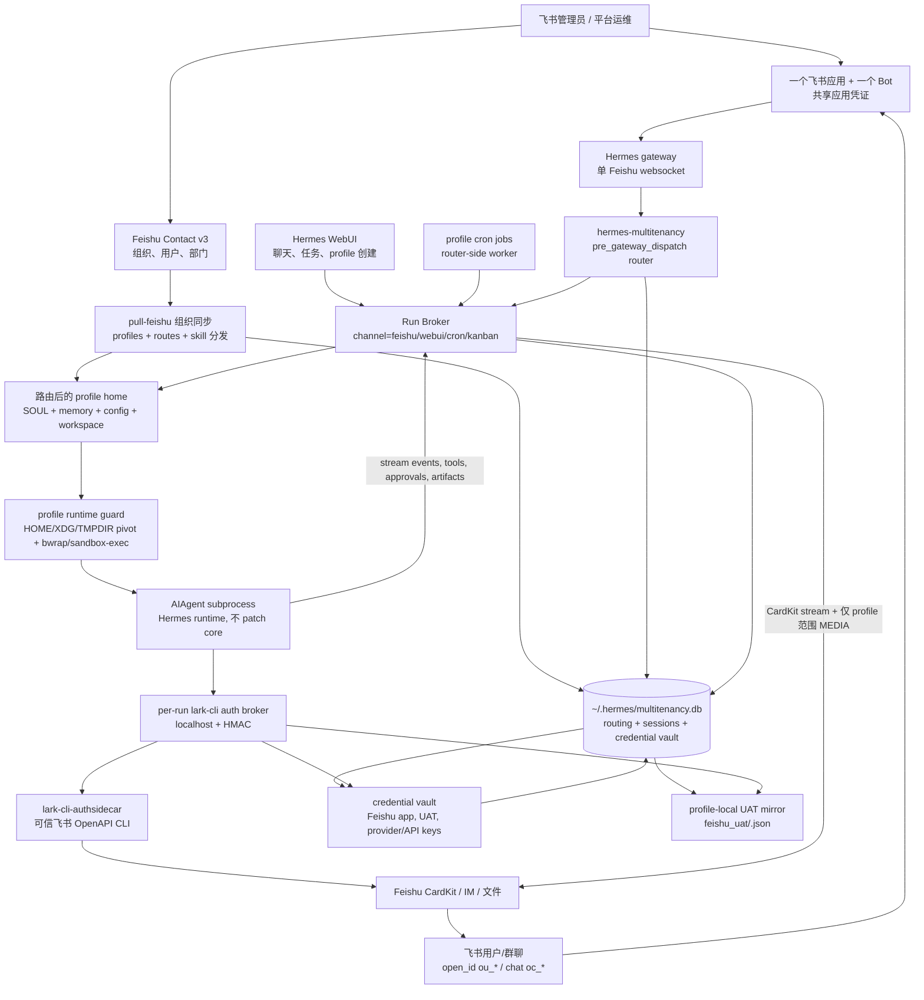

# hermes-multitenancy

> **一个飞书 Bot, N 个用户, N 套档案。** 一个 [hermes-agent](https://github.com/NousResearch/hermes-agent) 插件,把每个飞书用户路由到独立的 profile (独立的 SOUL.md, 会话, 记忆, LLM 凭证) —— 不动 hermes-agent 一行代码。

[English](README.md) | **简体中文**

[](#-测试)
[](#-为什么能保持兼容)
[](#-端到端验证)
[](LICENSE)

---

## 😖 为什么写这个插件 (痛点)

我很喜欢 hermes-agent —— 这是我用过最完整的个人 Agent 运行时。但是想把它放进公司里给所有人用的时候, 撞墙了:

> **Hermes 假设 1 个 Bot = 1 个用户。** 一个 "profile" 就是一个 HERMES_HOME 目录。每个 profile 起一个独立的 gateway 进程, 自己持有飞书 App 凭证, 自己跑一个 websocket。所以我想把一个 Bot 部署给 1000 人公司用的方案, 全军覆没:
>
> - **方案 A** —— 起 1000 个 hermes 进程? 1000 × 86 MB 的 lark_oapi 装不进内存, 也别指望 IT 给你开 1000 个飞书 App。
> - **方案 B** —— 一个 Bot, 一个 profile, 1000 人共用一份 SOUL? 那就不是 "千人千面" 了 —— 每个员工拿到的人格一样, 没有用户级记忆。
> - **方案 C** —— 改 `feishu.py` 按用户分流? 每次 hermes 升级我都得手动 re-patch。我试了一下午, 放弃了。
> - **方案 D** —— Fork hermes-agent, 自己维护一条分支? 等于背一笔永久债, 而上游还在快速演进。

**这些方案都不通。** 我想要 hermes 的丰富 UX (流式, 表情反应, 多轮, 会话) **同时** 多租户路由 **同时** 不动 hermes-agent 一行代码。

这个插件就是答案: 用一个 **`pre_gateway_dispatch` hook** 拦截每条飞书消息, 在 SQLite 路由表里查到这个用户对应哪个 profile, 然后派发到一个独立的 `ProfileRuntime` (持有独立的 SOUL + 历史 + LLM 客户端)。一个 Bot 服务 N 个用户, 每个用户感觉自己拥有一个专属的 hermes Agent。



**hermes-agent: 改动 0 行。** 部署契约是 plugin + profile runtime + sidecar 服务, 不是 Hermes core fork。

---

## 🧭 给 Agent 看的实现速览

如果你是接手这个仓库的 Agent, 先读这一节就能知道主链路和配置边界:

1. **入口不改 Hermes core。** `hermes_multitenancy.register(ctx)` 注册 `pre_gateway_dispatch` hook。收到飞书消息后, hook 返回 `{"action": "skip"}`, 由插件自己的 `handle_async()` 接管后续路由和回复。
2. **身份只认 canonical sender。** `_resolve_sender_for_routing()` 优先取真实飞书 `open_id` (`ou_*`): Feishu contextvar、`event.sender_open_id`、`source.open_id/user_id`、`raw/raw_event/event` 都会查。`user_id_alt` / `union_id` 只用于旧路由查找, 不作为新 session key。
3. **路由是 SQLite 表。** `multitenancy_routing.open_id -> profile_name` 决定用户进入哪个 `~/.hermes/profiles/<profile>/`。有真实 `ou_*` 时不会被 stale `union_id` 吸收到老 profile; 没有 `ou_*` 时才 fallback 到 legacy alt route。
4. **普通消息进入 profile runtime。** router 构造 profile-scoped event, 把真实 `sender_open_id` 写回 event, 再进入 streaming AIAgent subprocess。子进程以该 profile 的 `HERMES_HOME` 运行；`agent_real._build_subprocess_env` 只继承显式 allowlist, 并把 `HOME`、`WORKSPACE`、`XDG_*`、`TMPDIR` 都 pivot 到当前 profile, 让 token-bearing skills/MCP/CLI 像在独立用户环境里运行。
5. **默认 skill 与群/组织凭证从运行态分发。** `profile-skill-defaults.yaml`、`skill-distribution.yaml`、`skill-bundles.yaml` 描述托管 skill；sync 安装到 profile 时会跳过 secret-looking 文件。`credential-materialization.yaml` 把 vault 里的加密 payload 写成 profile-local 兼容文件, 例如 `workspace/credentials/gitlab.token`；`profiles: ["*"]` 会展开为 active routing rows。entry 也可以声明 `env: GITLAB_TOKEN`, AIAgent 会从 vault 注入 env 并注册 terminal/code passthrough, 不需要模型读取 token 文件。
6. **lark-cli 是外部运行时依赖。** 本仓注册 `lark_cli` tool 并启动 per-run localhost auth broker, 但部署环境必须自己提供带 authsidecar 能力的 `lark-cli` 二进制。默认路径是 `<shared HERMES_HOME>/bin/lark-cli-authsidecar`; `HERMES_LARK_CLI_BIN` 可覆盖。个人 profile 只有当前 `open_id` 有有效 UAT 时才默认 `user` identity；个人 profile 的 IM 历史/群列表/收藏/消息搜索读取不允许降级到 bot/app identity。群聊/WebUI agent profile 默认 `bot`，但群聊 profile 的 IM 历史读取只允许当前 `group_profile.json.chat_id`，不能枚举或读取 bot 所在其它群。
7. **cron/提醒任务是 profile-scoped, 但由 router 执行。** WebUI/upstream cron tooling 写入 profile-local `cron/jobs.json`。router-side worker 扫描 active profiles, 构造 `RunRequest(channel="cron")`, 通过 Run Broker 执行, 按需投递飞书, 并把上下文 mirror 到 `multitenancy_sessions`。
8. **危险命令审批跨子进程 bridge。** profile AIAgent 会用 router 兼容的 gateway session key (`multitenancy:<platform>:<profile>:<chat>:<sender>`) 注册 `tools.approval` notify。子进程同时设置 child-local `HERMES_SESSION_KEY` / `HERMES_GATEWAY_SESSION` / `HERMES_EXEC_ASK`, 因为 terminal/process guard 可能跑在不继承 contextvars 的 worker 线程里。子进程发 `approval_required` / `approval_resolved` stream event; 父进程 `_stream_aiagent_subprocess()` 必须原样转发这些事件给 router, router 给飞书发审批提示; 用户回 `/approve` / `/deny` 后, router 写 decision file, 子进程解除阻塞并继续原生 Hermes approval flow。
9. **CardKit heartbeat 在父 router 内维持。** token 前空窗不依赖子进程主动发消息; `_stream_into_feishu*()` 会先 prime 卡片, 再用 idle heartbeat 更新状态, 等子进程出现 reasoning/tool/content 事件后停止 heartbeat。
10. **session 记忆按 `(profile, canonical sender)` 隔离。** `_history_key()` 不再用 `sender_alt or sender`, 避免 stale/shared alt 把两个用户记忆合并。
11. **slash 命令不漏进 LLM。** `/model`、`/reasoning`、`/reload-mcp` 等走 Hermes gateway handler; skill slash 改写为 Hermes 原生 skill invocation 后进对应 profile 的 agent; plugin slash 走 `hermes_cli.plugins.get_plugin_command_handler`; quick alias/exec 按配置处理; unknown slash 返回 Hermes 风格 unknown-command。
12. **slash handler 只在必要时持有 profile 上下文锁。** `/stop` 这类必须打断当前任务的 gateway/quick/plugin 命令会绕开长 profile env lock；可能映射到 profile-local skill 的 unknown slash 才进入 profile context 解析。
13. **本机 exec 默认关闭。** `quick_commands` 的 alias 仍可用; `type: exec` 默认禁用。只有 `multitenancy.allow_quick_exec: true` 或 `HERMES_MULTITENANCY_ALLOW_QUICK_EXEC=1` 后才允许, 且 exec 继承当前 profile 的 `HERMES_HOME`。生产建议等 profile 沙箱落地后再开。
14. **附件/文件回复限制在 profile 内。** 入站附件仍委托 Hermes 原生 `_prepare_inbound_message_text`; 出站 `MEDIA:<path>` 会先过滤, 只有解析后位于当前 `profile_home` 内的路径才会交给 Feishu adapter 投递。`.env`、`auth.json`、`feishu_uat/`、`credentials/`、`tokens/` 等敏感路径会被拦截。
15. **Feishu UAT refresh 会 mirror 到 credential vault。** Org sync 会把刷新后的 shared `feishu_uat/<open_id>.json` 复制进 routed profile；配置 credential key 后, 同一 payload 也会写入 `multitenancy_credentials`。JSON 只是迁移兼容路径, DB 才是运行期 credential source。
16. **后台 terminal notify 不是父 gateway 能直接接管的路径。** AIAgent 在子进程内运行, child-local `process_registry` 不会被父 gateway watcher 看到; 当前实现会在每次子进程结束时调用 `agent.close()` 清理这类资源, 避免留下无人管理的后台进程。需要真正支持 `terminal(background=true, notify_on_complete=true)` 时, 应改为父进程托管 process registry, 不能只在 profile 子进程里启用。
17. **生产推荐策略。** 公司/生产环境建议 `HERMES_MULTITENANCY_AUTO_PROVISION=0` 做白名单路由, `multitenancy.allow_quick_exec=false`, 再叠加 profile 沙箱。沙箱负责 OS 级隔离; 本插件负责路由/session/slash/附件这些应用层边界。

---

## 👥 角色说明

| 角色 | 负责内容 |
|---|---|
| 飞书管理员 | 创建或复用一个内部飞书应用, 开启 Bot / websocket / 权限范围, 并保证共享应用凭证不进 git。生产把它作为 `__global__/feishu_app/feishu/app` 存进 credential vault。 |
| 平台运维 | 安装 hermes + 本插件, 运行 gateway, 维护路由表和 profile 目录。 |
| 飞书用户 | 通过飞书授权/UAT 流程认证一次, 之后只和同一个 Bot 对话。用户 token 从共享 Hermes home 离线刷新。 |
| Agent profile 负责人 | 维护每个 profile 的 `SOUL.md`, `config.yaml`, `.env`, 工具策略、会话库和模型凭证。 |

## 🔁 App ID 复用模型

你不需要给每个用户建一个飞书应用。所有租户复用同一个飞书应用/Bot:

1. 共享飞书应用凭证存进 multitenancy credential vault (`profile_name=__global__`, `subject_id=feishu_app`, `provider=feishu`, `secret_kind=app`)。环境变量/default Hermes config 只作为迁移或 fallback 来源。
2. 新路由优先使用真实飞书发送者 `open_id` (`ou_*`)。为了迁移旧数据, router 仍可 fallback 到 `union_id` (`on_*`)。
3. 用户 UAT 先由 OAuth 写入共享 `~/.hermes/feishu_uat/<open_id>.json`, 再由 org sync 迁移到 `~/.hermes/profiles/<profile>/feishu_uat/<open_id>.json`；AIAgent subprocess 实际读取 profile-local mirror。不要提交 token 文件。
4. 每个 profile 的模型/工具凭证放在 `~/.hermes/profiles/<profile>/` 或 credential vault。飞书应用共享, 但人格、记忆、工具和 LLM 凭证隔离。

---

## 🚀 快速上手

先设定共享 `HERMES_HOME`。下面所有命令都假设一个共享 Hermes home、一个飞书应用、每个用户一个 `$HERMES_HOME/profiles/<profile>/`。

```bash
export HERMES_HOME="${HERMES_HOME:-$HOME/.hermes}"
mkdir -p "$HERMES_HOME/bin" "$HERMES_HOME/logs"
```

### 1. 安装插件

Hermes 会从 `$HERMES_HOME/plugins/multitenancy` 加载 directory plugin。正常安装请先使用 Hermes 插件安装器；它应当创建插件目录并写入 `plugins.enabled`。

```bash
hermes plugins install eggyrooch-blip/hermes-multitenancy --enable
hermes plugins list
```

如果需要固定 checkout 或方便 agent/生产排查, 用真实仓库路径安装更透明:

```bash
git clone https://github.com/eggyrooch-blip/hermes-multitenancy /opt/hermes-multitenancy
hermes plugins install "file:///opt/hermes-multitenancy" --force --enable
python -m pip install --no-deps -e "/opt/hermes-multitenancy[test]"
```

如果 Hermes 插件安装器不可用, 可手动把插件路径指过去:

```bash
mkdir -p "$HERMES_HOME/plugins"
ln -sfn /opt/hermes-multitenancy "$HERMES_HOME/plugins/multitenancy"
```

确保共享 Hermes config 启用插件:

```yaml
# $HERMES_HOME/config.yaml
plugins:
  enabled:
    - multitenancy
```

### 2. 安装 lark-cli/authsidecar

`hermes-multitenancy` 会注册 `lark_cli` tool 并启动 per-run credential broker, 但它**不会**自带或自动安装 `lark-cli` 二进制。新环境必须先提供带 authsidecar 能力的 `lark-cli`, 飞书长尾 OpenAPI 工具才可用。

默认二进制查找顺序:

1. 设置了 `HERMES_LARK_CLI_BIN` 时使用它。
2. 否则使用 `$HERMES_HOME/bin/lark-cli-authsidecar`。
3. 部分检查会 fallback 到 `PATH` 里的普通 `lark-cli`。

从官方 `larksuite/cli` checkout 构建 authsidecar:

```bash
git clone https://github.com/larksuite/cli /opt/larksuite-cli
cd /opt/hermes-multitenancy
LARK_CLI_SOURCE_DIR=/opt/larksuite-cli \
HERMES_LARK_CLI_BIN="$HERMES_HOME/bin/lark-cli-authsidecar" \
LARK_CLI_EXPECTED_VERSION="<expected-lark-cli-version>" \
LARK_CLI_EXPECTED_SOURCE_HEAD="<expected-source-short-sha>" \
  scripts/build_lark_cli_authsidecar.sh
```

如果生产环境已经有审计过的 authsidecar 二进制, 放到默认路径或显式指定:

```bash
install -m 0755 /path/to/lark-cli-authsidecar "$HERMES_HOME/bin/lark-cli-authsidecar"
export HERMES_LARK_CLI_BIN="$HERMES_HOME/bin/lark-cli-authsidecar"
```

authsidecar 不从模型侧接收飞书 app secret。AIAgent 只连接 localhost auth broker；broker 从 credential vault 注入当前用户 UAT 或 bot tenant token。

### 3. 配置一个共享飞书 Bot

所有租户复用一个飞书应用/Bot。应用凭证不要进 git。共享 config 可以作为迁移来源, 生产应导入 `multitenancy_credentials`。

```yaml
# $HERMES_HOME/config.yaml
platforms:
  feishu:
    enabled: true
    extra:
      app_id: "${FEISHU_APP_ID}"
      app_secret: "${FEISHU_APP_SECRET}"
```

把 app credential 导入 vault；命令输出不会打印 secret:

```bash
export HERMES_MULTITENANCY_CREDENTIAL_KEY="<32-byte-or-longer-secret-key>"
python /opt/hermes-multitenancy/scripts/lark_cli_canary_preflight.py \
  import-app-config \
  --shared-home "$HERMES_HOME" \
  --config "$HERMES_HOME/config.yaml"
```

用户 UAT 是 profile-scoped。OAuth/device-flow 写入或导入用户 token 后, multitenancy 会 mirror 到:

```text
$HERMES_HOME/profiles/<profile>/feishu_uat/<open_id>.json
multitenancy_credentials(profile=<profile>, subject=<open_id>, provider=feishu, kind=uat)
```

不要提交 `.env`、`auth.json`、`feishu_uat/*.json`、`tokens/`、`workspace/credentials/`、cookie 或 OAuth payload 原文。

### 4. 同步 profile 和路由

如果飞书应用有通讯录读取权限, 用 org sync。先 dry-run:

```bash
python "$HERMES_HOME/plugins/multitenancy/sync.py" pull-feishu --dry-run
mkdir -p "$HERMES_HOME/org-snapshots"
python "$HERMES_HOME/plugins/multitenancy/sync.py" pull-feishu \
  --snapshot-out "$HERMES_HOME/org-snapshots"
```

Org sync 会创建/更新 `$HERMES_HOME/profiles/<user_id>/`, 写入 `multitenancy_routing`, 只更新 `SOUL.md` 的托管组织区块, 同步 managed skills, 并在配置存在时执行 credential materialization。

没有通讯录权限时, 使用显式白名单:

```bash
python "$HERMES_HOME/plugins/multitenancy/sync.py" apply users.json
```

`users.json` 格式:

```json
[
  {"user_id": "alice", "profile_name": "alice_profile", "open_id": "ou_xxx", "union_id": "on_xxx"},
  {"user_id": "bob", "profile_name": "bob_profile", "open_id": "ou_yyy", "union_id": "on_yyy"}
]
```

公司部署在初始 rollout 之后建议启用严格路由:

```bash
export HERMES_MULTITENANCY_AUTO_PROVISION=0
```

### 5. 启动 gateway 和 broker 面

至少要重启 Hermes gateway, 让它重新 import 插件。WebUI 和 cron 部署通常还会启用 localhost Run Broker sidecar。

```bash
export HERMES_MULTITENANCY_RUN_BROKER_SERVER=1
export HERMES_MULTITENANCY_CRON_RUN_BROKER=1
export HERMES_MULTITENANCY_RUN_BROKER_KEY="<shared-secret-for-server-to-server-calls>"
hermes gateway restart
```

生产服务应通过 service manager 设置这些环境变量, 不要依赖交互式 shell。Feishu websocket 入口应只保留 router gateway；profile gateway 若为了 API-server 兼容而存在, 不应再为同一个 Bot 打开自己的 Feishu websocket。

### 6. 验证

真实流量前先跑 secret-free 检查:

```bash
hermes plugins list
sqlite3 "$HERMES_HOME/multitenancy.db" \
  'select open_id, profile_name, active from multitenancy_routing limit 20;'

python /opt/hermes-multitenancy/scripts/lark_cli_canary_preflight.py \
  health \
  --shared-home "$HERMES_HOME" \
  --router-profile-home "$HERMES_HOME/profiles/multitenancy_router"

python /opt/hermes-multitenancy/scripts/lark_cli_canary_preflight.py \
  preflight \
  --shared-home "$HERMES_HOME" \
  --profile "<profile>" \
  --open-id "<ou_open_id>" \
  --binary "$HERMES_HOME/bin/lark-cli-authsidecar"
```

然后让两个不同飞书用户通过同一个 Bot 发送同一句提示。日志应显示不同 canonical `ou_*` sender、不同 routed profile home；只有拥有有效用户 UAT 的 profile 才应显示 `lark_cli_default_identity=user`。

### 7. 自动同步、按需同步和恢复

首次同步后, 用 cron 或 systemd timer 定期全量同步。全量同步处理入转调离: 新员工创建 profile + 路由, 组织变化刷新 `SOUL.md` 托管区块, 缺失用户软删除路由, 但保留 profile 记忆。

```cron
*/30 * * * * HERMES_HOME=/opt/hermes python /opt/hermes/.hermes/plugins/multitenancy/sync.py pull-feishu --snapshot-out /opt/hermes/.hermes/org-snapshots >> /opt/hermes/.hermes/logs/multitenancy-sync.log 2>&1
```

部门范围同步:

```bash
python "$HERMES_HOME/plugins/multitenancy/sync.py" pull-feishu --dept <open_department_id> --dry-run
python "$HERMES_HOME/plugins/multitenancy/sync.py" pull-feishu --dept <open_department_id>
```

如果同步出错, 先停 timer, 再检查 `pull-feishu --dry-run` 和最新 snapshot。用户可在飞书发 `/status`; 本机可查 `multitenancy_routing`。未知用户 fallback profile 位于 `$HERMES_HOME/profiles/feishu_<open_id>/`。

---

## 🚢 生产部署 runbook

Agent 部署这个仓库时按这个顺序走:

1. 在本地 canonical 仓库完成修改和验证。
2. 跑 `uv run --extra test pytest -q` 或 `make test`。
3. 把 review 后的 commit 推到 GitHub。
4. 在生产主机备份当前 checkout、`$HERMES_HOME/config.yaml`、`$HERMES_HOME/.env`、`$HERMES_HOME/multitenancy.db`、service unit 和 active profile 目录。不要把 secret 文件内容打进日志。
5. 生产 checkout 只做 fast-forward: `git pull --ff-only`。
6. 如果生产通过 editable import 使用本仓, 在 Hermes Python 环境里执行 `python -m pip install --no-deps -e /path/to/hermes-multitenancy`。
7. 确认 `$HERMES_HOME/plugins/multitenancy` 指向生产 checkout, 或已由 `hermes plugins install` 刷新。
8. 确认 `$HERMES_HOME/bin/lark-cli-authsidecar` 存在且可执行, 或在 service 环境里设置 `HERMES_LARK_CLI_BIN`。
9. 重启 router gateway 和相关 Run Broker/WebUI 服务。
10. 跑 `health`、`preflight`、route row 检查、service log 检查和一个只读 `lark_cli` user-info canary, 再宣称部署可用。

回滚应使用正常 forward fix 或恢复 checkout 后重启服务。不要手工在 profile 间复制 token；需要兼容文件时用 credential vault 和 `credential-materialization.yaml`。

---

## ✅ 端到端验证

这不是 paper plugin。当前 UAT 链路已经用真实飞书 Bot 跑过两个独立飞书用户, 且两个用户使用同一个 Bot:

| 步骤 | 操作 | 实测结果 |
|---|---|---|
| 1 | 用户 A → 同一个 Bot → router | 按真实 `ou_*` open_id 路由到已有 `coder` profile。 |
| 2 | 用户 B → 同一个 Bot → router | 自动建档并路由到新的 `feishu_ou_xxx` profile, 不会落到 `coder`。 |
| 3 | 两个用户发送同一套工具压测案例 | AIAgent subprocess 使用正确的 profile home 和 sender open_id scope。 |
| 4 | 回复经 Feishu CardKit / IM 返回 | 文本卡片和文件消息路径都复用 Feishu adapter 发送。 |
| 5 | 双账号完整压测 | 使用 `--users <用户A>,<用户B> --parallel-users` 运行; 每个用例会记录独立的 `case_id::user` checkpoint。 |
| 6 | 动态 slash 控制面 | 双账号 `slash` suite `16/16` 通过: `/model`、`/reasoning`、`/reload-mcp` 走 gateway handler; skill slash 改写为原生 skill invocation; plugin slash 走 `hermes_cli.plugins.get_plugin_command_handler`; quick alias 不进 LLM, quick exec 只允许显式开启; unknown slash 返回 Hermes 风格 unknown-command。 |

以上全部跑在真实飞书 WebSocket gateway + OpenAI 兼容模型 provider 上。真实 open_id、token、chat ID、app secret 均不会进入本仓库。

---

## ✨ 功能矩阵

| 功能 | 状态 |
|---|---|
| 按飞书 user (open_id / union_id) 多租户路由 | ✅ |
| LRU 运行时池 (最多 50 个热 profile, 5 分钟空闲淘汰) | ✅ |
| 流式 LLM 输出 (`edit_message` 打字机效果) | ✅ |
| thinking/reasoning 模型的推理内容分流 | ✅ |
| 表情反应 (👀 → ✅ / ❌) via `adapter.on_processing_*` | ✅ |
| 多轮会话记忆 (SQLite 持久化, 跨重启) | ✅ |
| 引用上下文注入 (回复消息) | ✅ |
| 限流退避 (429 backoff, 与 hermes 主线节奏一致) | ✅ |
| Hermes 斜杠命令控制面 | ✅ —— 动态识别 Hermes registry 命令; `/model`、`/reasoning`、`/reload-mcp` 等走 gateway handler; skill slash 改写为 Hermes 原生 skill invocation; plugin slash 走 `hermes_cli.plugins.get_plugin_command_handler`; quick_commands 支持 alias 和显式开启的 exec; unknown slash 返回 Hermes 风格 unknown-command, 不漏进 LLM |
| 幂等 feishu-sync 同步器 (CLI + 库) | ✅ |
| Python 飞书通讯录组织同步 (`pull-feishu`) | ✅ —— 自动创建/更新 profile、SOUL 托管区块和路由表 |
| 图像识别 (图片附件) | ✅ —— 委托给 hermes 的 `gateway._prepare_inbound_message_text`, 行为与主线一致 |
| 语音 STT (语音消息) | ✅ —— 同一委托, hermes 的 `transcribe_audio` 处理已缓存音频 |
| 文本文件注入 (.txt / .md / .csv / .log / .json …) | ✅ —— 同一委托, 内容前置到消息中 |
| 引用上下文 (回复消息) | ✅ —— 同一委托, 加上我们自己的 `reply_to_text` 兜底 |
| 多用户共享会话归属 | ✅ —— 同一委托 |
| 工具调用 (真正的 AIAgent loop, 浏览器/搜索/shell) | ✅ —— 通过隔离的 `AIAgent` subprocess bridge |
| lark-cli 飞书 OpenAPI bridge | ✅ —— 注册 `lark_cli` tool 并启动 per-run auth broker；部署环境必须提供 `lark-cli-authsidecar` |
| Credential vault + materialization | ✅ —— Feishu app/UAT/provider secrets 存在 `multitenancy_credentials`, 对外只暴露 redacted status, 按配置 materialize 兼容文件 |
| Managed skill distribution | ✅ —— 支持 `profile-skill-defaults.yaml`、`skill-distribution.yaml`、`skill-bundles.yaml`, 带 secret guard 和子 profile 继承规则 |
| Cron / reminder 主动回调 | ✅ —— WebUI/broker 创建的 job 默认 `deliver=feishu`, 存在 routed profile cron store, 由 router multi-profile worker 执行/投递 |
| 危险命令 approval 主动回调 | ✅ —— 子进程 `approval_required`/`approval_resolved` → parent stream parser → router 飞书提示 → `/approve`/`/deny` 写回 decision file; child-local session env 覆盖 terminal worker 线程; core terminal guard 先于 environment 创建 |
| CardKit idle heartbeat | ✅ —— 父 router prime + heartbeat, 不依赖子进程先吐 token |
| Background terminal `notify_on_complete` | ⚠️ 不宣称支持 —— 子进程 registry 父 gateway 不可见; 子进程结束时执行 `agent.close()` 清理, 防止孤儿后台任务 |
| Feishu CardKit / IM 文件消息回复 | ✅ —— 流式卡片 + 原生 `MEDIA:<path>` 投递复用, 但只允许发送当前 profile 目录内文件 |

---

## 🛡️ 为什么能保持兼容

我们保持 **hermes-agent 零 patch**: 不改 `feishu.py` / `gateway/run.py` / 上游模块。插件加载契约 (`hermes_cli/plugins.py:435 register_hook`) 是 gateway 入口; AIAgent/tool bridge 还会消费少量 Hermes 集成面, 每个点都有回归测试覆盖。

| 我们依赖的公开 API | 稳定性 |
|---|---|
| `pre_gateway_dispatch` hook (`plugins.py:81 VALID_HOOKS`) | ⚠️ 2026-04-21 新增 —— 锁定 hermes-agent 版本 |
| `BasePlatformAdapter.send / send_typing / edit_message` | ✅ 抽象方法, 非常稳定 |
| `BasePlatformAdapter.on_processing_start / on_processing_complete` | ✅ |
| `MessageEvent.source.{user_id, user_id_alt, chat_id}` | ✅ 稳定 |
| `Platform.FEISHU` 枚举 + `ProcessingOutcome` 枚举 | ✅ |
| `gateway.adapters[Platform.FEISHU]` 字典 | ✅ |
| `hermes_constants.get_hermes_home()` (走环境变量读) | ✅ |
| `hermes_cli.commands.resolve_command / is_gateway_known_command` | ✅ —— 斜杠命令识别来自 Hermes 中心 registry, 脱离 Hermes 跑单测时才使用极薄 fallback |
| `SendResult.{success, message_id}` | ✅ |
| `gateway._prepare_inbound_message_text(event, source, history)` | ⚠️ 私有 (下划线开头) —— 一次调用覆盖图像 + 语音 + 文件注入 + 引用上下文。签名变了会自动降级到本地图像-only。 |
| `gateway.stream_consumer.GatewayStreamConsumer` | ⚠️ Hermes 集成面 —— 存在时复用 Feishu CardKit 流式卡片, 不存在则回落到文本 edit。 |
| `gateway._deliver_media_from_response(response, event, adapter)` | ⚠️ 私有 —— 过滤到当前路由 profile 目录后, 复用原生 Feishu `MEDIA:<path>` 文件投递路径。不可用时 no-op。 |
| `run_agent.AIAgent` | ⚠️ 核心运行时类 —— 隔离在 `aiagent_subprocess.py`, 出错时回落到旧 OpenAI-compatible path。 |
| `tools.feishu_oapi_client.sender_open_id_scope` | ⚠️ Feishu UAT bridge —— 把 token 查找限定到 `~/.hermes/feishu_uat/<open_id>.json`。 |
| `tools.vision_tools.vision_analyze_tool` (本地兜底) | ✅ 工具模块, 仅在 gateway 助手缺失时使用 |

**锁定 `hermes-agent` 版本** (`hermes-agent==X.Y.Z`), 每次升级跑 `pytest tests/test_router_integration.py tests/test_vision.py` —— 集成 + 管线测试会在契约漂移时大声失败。

---

## 🧭 上游策略

这个仓库更适合先保持为第三方 Hermes 插件, 而不是 fork 或直接塞进 core。
这样发布节奏更快, 也不会把飞书多租户的业务策略硬编码进 Hermes 主仓。
更适合提交到 `NousResearch/hermes-agent` 的 PR 应该小而通用, 例如:

| 上游候选 PR | 价值 |
|---|---|
| 在 `MessageEvent.source` 上稳定暴露真实飞书 sender `open_id` | 去掉本插件里的 raw-event 解析, 也帮助其他飞书插件。 |
| 文档化 `pre_gateway_dispatch` gateway hook 和 deferred processing lifecycle | 让 router 类插件更容易安全实现。 |
| 稳定 CardKit streaming / media delivery 扩展点 | 让插件复用原生飞书 UX, 不必碰私有 gateway helper。 |

完整 multitenancy router 建议等这些通用扩展面稳定、外部使用验证充分之后,
再考虑作为 Hermes bundled plugin 提案。

---

## 🏗️ 架构

```
~/.hermes/plugins/multitenancy/  (由 `hermes plugins install` 安装)
  ├─ plugin.yaml          Hermes directory-plugin manifest
  ├─ after-install.md     Hermes 安装后展示的检查清单
  ├─ __init__.py          根 shim → hermes_multitenancy.register(ctx)
  ├─ sync.py              directory-plugin 安装时使用的路由同步 wrapper
  └─ hermes_multitenancy/
     ├─ __init__.py       register(ctx) → ctx.register_hook(pre_gateway_dispatch, ...)
     ├─ router.py         同步 hook + 异步派发 + 命令 + 懒加载单例
     ├─ runtime.py        ProfileRuntime + contextvars 隔离的 HERMES_HOME 切换
     ├─ pool.py           LRU RuntimePool (50 热 / 5 分钟空闲 / 冷启信号量)
     ├─ routing.py        SQLite multitenancy_routing 表 (open_id → profile)
     ├─ sessions.py       SQLite multitenancy_sessions (按用户历史, 持久化)
     ├─ credentials.py    multitenancy.db 中的加密 credential vault 行
     ├─ lark_cli_tool.py  Hermes tool registration for lark_cli / lark-cli
     ├─ lark_cli_auth_broker.py per-run localhost credential proxy for authsidecar
     ├─ run_broker.py     Feishu/WebUI/cron 共用的 channel-neutral execution contract
     ├─ webui_broker_server.py WebUI 和 jobs 使用的 localhost HTTP/SSE sidecar
     ├─ cron_worker.py    multi-profile cron worker 和 Run Broker bridge
     ├─ skill_registry.py managed/personal/unknown skill audit + install helpers
     ├─ upstream_health.py secret-free 升级/部署健康检查
     ├─ commands.py       基于 Hermes registry 的斜杠命令解析
     ├─ agent_real.py     AIAgent subprocess bridge + 旧 OpenAI 兼容 fallback
     ├─ aiagent_subprocess.py 隔离子进程入口, 跑 AIAgent/tool loop
     └─ sync/
        ├─ feishu_hr.py   apply_users (幂等同步器)
        ├─ feishu_org.py  Feishu Contact v3 拉取 + profile/SOUL/route 同步
        └─ cli.py         路由同步的共享实现
```

状态存在 `~/.hermes/multitenancy.db` —— 与 hermes 自己的 `state.db` 分开, 写入互不争用。开启 WAL 模式。

---

## ⚙️ 配置项

| `config.yaml` key | 默认值 | 说明 |
|---|---|---|
| `plugins.enabled` | (无) | 必须包含 `multitenancy` |
| `model.default` | (你的 hermes 默认) | 按 profile 配置模型; 使用你自己的 Hermes 部署已经标准化的 provider/model。 |
| `model.fallback` | (你的 hermes 默认) | 主模型失败时 `agent_real` 用这个 |
| `multitenancy.toolsets_mode` | `merge_default` | profile 里写了 `platform_toolsets.feishu` 时, 默认与 Hermes Feishu 默认工具集合并, 保留 web/browser/search 等通用能力。设为 `explicit` 可恢复严格替换。 |
| `multitenancy.allow_quick_exec` | `false` | 允许 Feishu 多租户里的 `quick_commands` 使用 `type: exec`。生产环境请保持关闭, 直到 profile 沙箱已经强制生效; 开启后的 exec 会继承当前路由 profile 的 `HERMES_HOME`。 |

| 同步命令 / 环境变量 | 默认值 | 说明 |
|---|---|---|
| `pull-feishu --dry-run` | off | 只打印计划变更, 不写 profile / DB |
| `pull-feishu --dept <id>` | off | 只同步一个飞书部门子树; 默认不软删除范围外路由 |
| `pull-feishu --soft-delete-missing` | full sync 开, `--dept` 关 | 软删除本次同步结果里缺失的 active 路由 |
| `pull-feishu --no-soft-delete-missing` | off | 强制不软删除缺失路由, 适合 pilot 或排障 |
| `HERMES_MULTITENANCY_AUTO_PROVISION` | `1` | 未知飞书用户首次发消息时自动创建 `feishu_<open_id>` 兜底 profile; 设为 `0` 可改成严格白名单 |
| `HERMES_MULTITENANCY_ALLOW_QUICK_EXEC` | 未设置 / off | `quick_commands` exec 的环境变量开关。生产建议优先用配置白名单并配合沙箱。 |

| 插件可调项 (`router.py` 里的 Python 常量) | 默认值 | 说明 |
|---|---|---|
| `RuntimePool.max_loaded_runtimes` | 50 | 热池上限 |
| `RuntimePool.idle_evict_seconds`  | 300 | 5 分钟空闲淘汰 |
| `_SESSION_HISTORY_MAX`            | 20  | 每 (profile, user) 保留的消息数 |
| 流式节流 (content)                | 1.0s / 60 字 | 与 hermes 主线一致 |
| 流式节流 (thinking)               | 2.0s 心跳 | 推理预览 |
| CardKit idle heartbeat            | 2.5s | token 前保持卡片活动, 首个 agent event 后停止 |
| 审批 bridge timeout                | 300s | 可用 `HERMES_MULTITENANCY_APPROVAL_TIMEOUT` 临时覆盖 |
| 限流退避                          | 0.5s → 1s → 2s | 仅 429; 非 429 重试一次 |

---

## 🎮 斜杠命令

| 命令 | 效果 |
|---|---|
| `/help`   | 列出可用命令 |
| `/status` | 显示当前 profile + 历史长度 + 运行状态 |
| `/new` / `/reset` | 重置当前用户的会话历史 (按 profile 隔离) —— 同时清缓存 + SQLite |
| `/stop`   | 取消当前用户进行中的 LLM 调用 |
| 其他 Hermes gateway 命令 | 从 Hermes registry 动态识别, 有 gateway handler 时透传给原 handler; 否则返回控制面提示, 不进入 agent prompt。 |

---

## 🧪 测试

```bash
# 默认套件 (无网络)
uv run --extra test pytest -q

# 通过 Makefile 跑同一套默认测试
make test

# 飞书多租户重点回归套件
uv run --extra test pytest \
  tests/test_hook_dispatch.py \
  tests/test_aiagent_subprocess.py \
  tests/test_streaming_card_transport.py \
  -q

# 真实 LLM 集成 —— 调你配置的 provider
uv run --extra test pytest tests/ -m integration -v
```

当前 skills/lark-cli/UAT 审计 helper 在本仓:

```bash
make skills-uat
make skills-uat-strict
```

---

## 🐛 故障排查

**"插件加载了但没回复"** —— `pkill -f gateway && hermes gateway run`。插件在 gateway 启动时加载, 任何改动都需要重启。

**"所有 Bot 都不响应了"** —— 路由规则的 `open_id` 或 `union_id` 大概率写错了。在 `router.on_pre_gateway_dispatch` 里临时 `print(event.source)` 看飞书实际发过来的值, 对一下日志。

**"组织同步后有人路由错了"** —— 先停 cron/systemd 定时同步, 跑 `pull-feishu --dry-run` 看计划变更。用户在飞书发 `/status` 能看到当前 profile; 本机用 `sqlite3 ~/.hermes/multitenancy.db 'select user_id, open_id, profile_name, active from multitenancy_routing;'` 对路由。

**"需要紧急绕过错误路由"** —— 可以软停该用户 active 路由, 然后让用户再发一条消息触发 auto-provision 兜底:

```bash
sqlite3 ~/.hermes/multitenancy.db \
  "update multitenancy_routing set active=0, deleted_at=strftime('%s','now'), updated_at=strftime('%s','now'), version=version+1 where open_id='ou_xxx' and active=1;"
```

兜底 profile 位于 `~/.hermes/profiles/feishu_ou_xxx/`, 可用 `hermes -p feishu_ou_xxx chat` 进入。

**"user_id 是 `g41a5b5g` 这种, 不是我以为的 `ou_`"** —— 某些 Feishu/Hermes 路径会把短 SDK user id 放在 `event.source.user_id`。本插件现在优先从飞书 raw sender metadata/context 解析真实发送者 `open_id`, 只有迁移旧数据时才 fallback 到 `user_id_alt` / `union_id`。

**"飞书工具能用, 但查新闻/网页搜索不行"** —— 多半是 profile 的 `platform_toolsets.feishu` 只列了飞书工具。默认 `merge_default` 会把显式飞书工具与 Hermes Feishu 默认工具集合并, 因而保留 `web_search` / `web_extract`。如果你确实要压低 schema, 设置 `multitenancy.toolsets_mode: explicit` 或环境变量 `HERMES_MULTITENANCY_TOOLSETS_MODE=explicit`。

**"感觉很卡, 1 秒一个字"** —— 先看 gateway 日志里的模型延迟、飞书限流重试和 CardKit 更新节流。支持 reasoning 的模型可能先吐 `reasoning_content` 再吐最终文本; 插件会把这部分显示成进度, 而不是让用户以为卡死。

**"重启后会话丢了"** —— 检查 `~/.hermes/multitenancy.db` 是否存在, `multitenancy_sessions` 表有没有行。如果是空的, 看 gateway 日志有没有写入错误 (`logger.debug "SessionStore.append failed"`)。

---

## 🤝 贡献

欢迎 Issue 和 PR。

### Bug 报告

提 Bug 时请附:

1. 你机器上 `uv run --extra test pytest -q` 或 `make test` 的输出
2. hermes-agent 版本 (`pip show hermes-agent | grep Version`)
3. 插件版本 (`pip show hermes-multitenancy | grep Version`)
4. 相关 gateway 日志 (尤其是 `multitenancy:` 前缀的)

### Pull Request

1. Fork → 起分支 → 跑 `uv run --extra test pytest -q` 或 `make test` (必须全绿) → 开 PR
2. **行为变更必须有测试。** 默认完整测试套件必须保持绿色。
3. **不要大批量重命名** —— 保持 diff 小且可审。
4. **不要 patch `feishu.py`** —— 这个插件存在的全部意义就是 hermes-agent 不被改动。如果你撞到 hermes API 限制, 去上游 https://github.com/NousResearch/hermes-agent 提 issue, 然后在这里链过来。

### 帮我们盯住 hermes-agent 兼容性

如果你升级 `hermes-agent` 后我们的集成测试挂了, 请提 issue 附上:
- 让我们挂掉的 hermes-agent 版本号
- pytest 输出
- 一条上游 commit 的指针 (能找到的话)

当前 `pyproject.toml` 要求 `hermes-agent>=0.14,<1.0`; 插件加载契约仍在演进 —— 需要社区一起盯变化。

### 想要的贡献 (按优先级)

1. **按 profile 拆 `SessionStore`** —— 当前会话行按 `(profile, canonical sender)` 在共享 `multitenancy.db` 中隔离; 按 profile 拆库仍是规模化加固项, 也更贴近 hermes 自己的 profile 布局。
2. **Prompt 缓存** —— Anthropic `cache_control` 给 SOUL 前缀加缓存。长期对话 token 成本砍 ~50%。
3. **CI 矩阵** —— GitHub Actions 在多个 `hermes-agent` 版本上跑 `uv run --extra test pytest -q`, 提早发现上游契约漂移。
4. **更多 live UAT fixture** —— 扩大写操作/破坏性路径覆盖,但不依赖共享生产类资源。

---

## 📜 License

MIT —— 见 [LICENSE](LICENSE)。

## 🙏 致谢

构建在 [Nous Research 的 hermes-agent](https://github.com/NousResearch/hermes-agent) 之上 —— 没有 `pre_gateway_dispatch` hook (由 [@KeiraVoss](https://github.com/) 在 2026-04-21 加入), 这个插件就只能 fork 整个上游了。感谢这个 hook。
