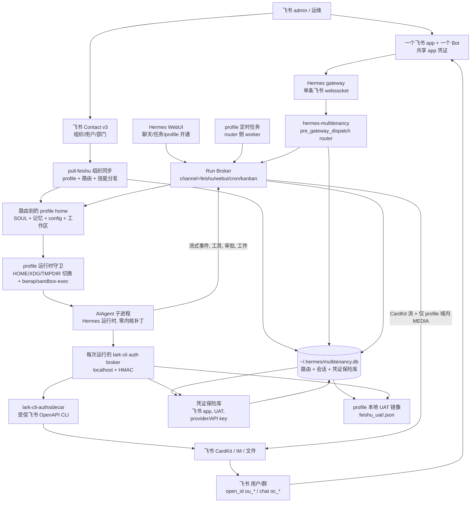

# hermes-multitenancy ☤

> **一个飞书 Bot，N 个员工，N 个互相隔离的智能体。** 一个 [hermes-agent](https://github.com/NousResearch/hermes-agent) 插件，把单个 Bot 变成真正的多租户平台 —— 每个用户拥有自己的人格、记忆、会话和 LLM 凭证 —— **不动 hermes-agent 一行代码**。

[English](README.md) | **简体中文**

<p>
<a href="#-快速上手"></a>
<a href="#️-为什么能保持兼容"></a>
<a href="#-端到端验证"></a>
<a href="#-测试"></a>
<a href="LICENSE"></a>
</p>

**它解决的问题：** hermes-agent 是个出色的*个人*智能体运行时 —— 但它假设 **1 个 Bot = 1 个用户**。你没法把它直接搬进一个 1000 人的公司：要么跑 1000 个进程，要么所有人共用同一个人格，要么 fork 内核、每次升级都重打补丁。这个插件把 **1 个 Bot = N 个用户** 变成可部署的现实：一个 `pre_gateway_dispatch` 钩子把每个飞书发送者路由到属于自己的 `ProfileRuntime`，上游内核保持原封不动。

<table>
<tr><td><b>真正的按人隔离</b></td><td>每个飞书用户被路由到自己的 profile —— 独立的 <code>SOUL.md</code>、记忆、会话历史、工作区、工具和 LLM 凭证。不是一个 Bot 背后的共享人格。千人千面。</td></tr>
<tr><td><b>对 hermes-agent 零补丁</b></td><td>以目录插件形式通过 <code>pre_gateway_dispatch</code> 钩子加载。锁定上游版本，自由升级，永不重打补丁。部署契约是「插件 + 边车」，不是 fork。</td></tr>
<tr><td><b>组织驱动的生命周期</b></td><td>直接从飞书通讯录同步 —— 入职 / 调岗 / 离职 全部自动对账。新员工自动获得 profile 和路由；离职者从路由软删除，记忆仍留在磁盘上。</td></tr>
<tr><td><b>隐私与沙箱内建</b></td><td>每 profile 的 HOME/XDG/TMPDIR 切换 + 子进程环境白名单，凭证经本地 broker 物化、绝不进模型，流式输出脱敏，出站文件按 secret 路径过滤。</td></tr>
<tr><td><b>成本与用量可观测</b></td><td>逐回合 token 台账 + <b>按 owner 归属</b>（一个人的群和智能体全部累加到本人）汇入企业排行榜。另有会话分析 CLI 输出需求与完成率代理指标。</td></tr>
<tr><td><b>复用而非重造飞书 UX</b></td><td>CardKit 流式卡片、表情回应、多轮会话、视觉 / 语音转写 / 文件注入、群聊、定时投递 —— 全部委托给 hermes-agent。经 <code>lark-cli</code> 桥接打通完整飞书 OpenAPI，每次请求做 user/bot 身份隔离。</td></tr>
<tr><td><b>生产级安全护栏</b></td><td>群里 <code>@所有人</code> 绝不触发 Bot，危险命令审批跨飞书边界传递，超长输出优雅降级，凭证重授权 marker 永不触发后台主动私信轰炸。</td></tr>
</table>

### 🧭 它的定位

- **对比原版 [hermes-agent](https://github.com/NousResearch/hermes-agent)：** hermes 假设 *1 Bot = 1 用户*（每个 gateway 进程一个 profile）。本插件让 *1 Bot = N 用户* —— 把每个用户路由到各自的 `ProfileRuntime` —— 且不 fork 内核。
- **对比单租户 Lark/飞书渠道插件（如 [OpenClaw Lark](https://github.com/larksuite/openclaw-lark)）：** 那些把*一个*智能体身份桥接到飞书。本插件加上按人路由、profile 隔离和凭证保险库，使*单一*部署就能安全服务整个组织 —— 每个人拥有自己的智能体、记忆和 token。

---

## 🏛️ 架构一览

单个飞书 app + 一条 Bot websocket 落到 router。router 解析规范化发送者、在 SQLite 里查 profile、派发到沙箱化的每 profile 子进程。飞书原生 UX（CardKit 流式、媒体、审批）被复用而非重写。



**一句话契约：** `hermes_multitenancy.register(ctx)` 注册一个 `pre_gateway_dispatch` 钩子；对飞书消息返回 `{"action": "skip"}`，由插件的 `handle_async()` 接管路由与回复。**hermes-agent：0 行改动。**

### 组件地图

```
~/.hermes/plugins/multitenancy/        (由 `hermes plugins install` 安装)
  ├─ plugin.yaml            Hermes 目录插件清单
  ├─ __init__.py            register(ctx) → pre_gateway_dispatch 钩子
  ├─ sync.py                目录插件安装用的路由同步 wrapper
  └─ hermes_multitenancy/
     ├─ router.py           同步钩子 + 异步派发 + 命令 + 懒加载单例
     ├─ runtime.py          ProfileRuntime + contextvars 隔离的 HERMES_HOME 切换
     ├─ pool.py             LRU RuntimePool (50 热 / 5min 空闲 / 冷启动信号量)
     ├─ routing.py          SQLite multitenancy_routing (open_id → profile)
     ├─ sessions.py         SQLite multitenancy_sessions (每用户持久化历史)
     ├─ credentials.py      multitenancy.db 里的加密凭证保险库行
     ├─ agent_real.py       AIAgent 子进程桥 + 沙箱 env 构建 + 兜底
     ├─ aiagent_subprocess.py  AIAgent/工具循环的隔离子进程入口
     ├─ lark_cli_tool.py    lark_cli / lark-cli 的 Hermes 工具注册
     ├─ lark_cli_auth_broker.py  authsidecar 用的每次运行 localhost 凭证代理
     ├─ run_broker.py       渠道无关的执行契约 (feishu/webui/cron)
     ├─ webui_broker_server.py   WebUI 和任务用的 localhost HTTP/SSE 边车
     ├─ cron_worker.py      多 profile 定时 worker + Run Broker 桥
     ├─ skill_registry.py   托管/个人/未知技能审计 + 安装助手
     ├─ token_usage_ledger.py    逐回合 token 台账 (父进程写, 默认关)
     ├─ token_usage_uploader.py  每小时按 owner 归属的排行榜上传器
     ├─ analytics/          会话审计汇总 CLI (需求 + 完成率代理)
     ├─ commands.py         Hermes registry 支撑的斜杠命令解析器
     ├─ upstream_health.py  无密钥的升级/部署健康检查
     └─ sync/
        ├─ feishu_hr.py     apply_users (幂等对账器)
        ├─ feishu_org.py    飞书 Contact v3 拉取 + profile/SOUL/路由同步
        └─ cli.py           路由同步的共享实现
```

状态存在 `~/.hermes/multitenancy.db` —— 与 hermes 自己的 `state.db` 分开的 SQLite 文件，写入不争用。已开 WAL 模式。

<details>
<summary><b>深入 —— 派发契约（给接手本仓的 agent 与维护者）</b></summary>

1. **入口，零 Hermes 内核补丁。** `hermes_multitenancy.register(ctx)` 注册 `pre_gateway_dispatch` 钩子。飞书消息返回 `{"action": "skip"}`，由插件 `handle_async()` 接管路由与回复。
2. **身份用规范化发送者。** `_resolve_sender_for_routing()` 优先取真实飞书 `open_id`（`ou_*`，来自飞书 contextvar、`event.sender_open_id`、`source.open_id/user_id`、`raw/raw_event/event`）。`user_id_alt`/`union_id` 只是旧路由查找辅助，不是新的会话键。
3. **路由存在 SQLite。** `multitenancy_routing.open_id -> profile_name` 决定哪个 `~/.hermes/profiles/<profile>/` 处理本回合。真实 `ou_*` 不会被陈旧的 `union_id` 吸收；旧 alt 路由仅在没有真实 `ou_*` 时使用。
4. **普通消息在路由到的 profile 内运行。** router 构造 profile 域事件、把解析出的 `sender_open_id` 写回事件，再派发到流式 AIAgent 子进程。子进程以该 profile 的 `HERMES_HOME` 运行；`agent_real._build_subprocess_env` 把父 gateway 环境裁剪到显式白名单，并把 `HOME`/`WORKSPACE`/`XDG_*`/`TMPDIR` 切到 `<profile>/{home,workspace,cache,config,state,data,tmp}`，使带 token 的技能、MCP server 和 CLI 表现得像以当前 profile 用户身份运行。运行时还设置 `HERMES_PROFILE` 与 Keep 兼容的 `KEP_PROFILE`，前置共享 `<hermes_home>/bin`，并在子进程内翻译常见 OpenClaw/ClawHub `{baseDir}` 技能模板。飞书 UAT token 从 `<profile>/feishu_uat/<open_id>.json` 读取（运行时由 `_configure_feishu_uat_home` 重绑）。见 `docs/profile-isolation.md`。
5. **默认技能与群凭证从运行时状态物化。** `profile-skill-defaults.yaml`、`skill-distribution.yaml`、`skill-bundles.yaml` 表达托管技能；同步把它们装进 profile，同时跳过疑似 secret 的文件。任何共享顶层 `lark-*` 技能也作为托管软链装给每个 profile。`credential-materialization.yaml` 把加密保险库载荷映射为 profile 本地兼容文件；`profiles: ["*"]` 展开为活跃路由行；`env:` 条目把 secret 传给路由 AIAgent 而不让模型读 token 文件。
6. **lark-cli 是外部运行时依赖。** 本仓注册 `lark_cli` 工具并启动每次运行的 localhost auth broker，但部署必须自带 authsidecar 能力的 `lark-cli` 二进制（默认 `<shared HERMES_HOME>/bin/lark-cli-authsidecar`；`HERMES_LARK_CLI_BIN` 覆盖）。个人 profile 仅当当前 `open_id` 有有效 UAT 时用 `user` 身份；群/WebUI 智能体 profile 默认 `bot`。
7. **定时/提醒任务 profile 域、router 执行。** WebUI/上游定时工具写 profile 本地 `cron/jobs.json`。router 侧 worker 扫描活跃 profile、建 `RunRequest(channel="cron")`、经 Run Broker 执行、按需投递飞书、并把上下文镜像进 `multitenancy_sessions`。profile 侧 native `cronjob` 工具触发的手动 run 也会被截到 router Run Broker 排队，包括 Hermes core 在 `run/run_now/trigger` 分支直接调用 `_execute_job_now(...)` 的立即执行路径。
8. **custom provider 模型 selector 会为辅助调用归一化。** Profile 配置可以保存 `custom:<name>/<model>` 这类 Hermes selector，但 OpenAI-compatible endpoint 需要收到裸 `<model>`。`_run_with_aiagent()` 会把主模型拆成 `provider` 和 `model_only`，并在本次 run 周期内同步给 Hermes core `agent.auxiliary_client.set_runtime_main(...)`。这样 title/compression/search 等 auto-routed 辅助调用不会重新读取完整 selector 并把它当 wire model 发送；cleanup 在 `finally` 执行。
9. **危险命令审批跨子进程边界。** profile AIAgent 用 router 兼容的 gateway 会话键（`multitenancy:<platform>:<profile>:<chat>:<sender>`）注册 `tools.approval`。子进程发出 `approval_required`/`approval_resolved`；父 `_stream_aiagent_subprocess()` 转发给 router；router 在飞书提示；`/approve`/`/deny` 写决策文件释放子进程并恢复 Hermes 原生审批流。
10. **CardKit 心跳在父 router。** router 先打底卡片、在子进程出 token 前发空闲心跳状态更新；一旦推理/工具/内容事件到来，心跳停止。
11. **记忆按 `(profile, 规范化发送者)` 键。** `_history_key()` 不用 `sender_alt or sender`，故陈旧/共享 alt ID 不会把两个用户的记忆合并。
12. **斜杠命令绝不泄进 LLM。** `/model`、`/reasoning`、`/reload-mcp` 等 registry 命令走 Hermes gateway 处理器；技能斜杠重写为原生技能调用；插件斜杠委托给 `hermes_cli.plugins.get_plugin_command_handler`；未知斜杠返回 Hermes 风格 unknown-command。
13. **托管插件资产由 Run Broker 复制、登记和服务。** 专家 manifest 可以声明本地图片头像，例如 `experts[].avatar: ./avatars/expert.png`。Ingest 会校验该路径必须是仓库相对路径、文件存在且扩展名为受支持图片格式，然后复制到 `<shared-home>/.hermes-plugin-assets/<plugin_id>/`，文件名带内容哈希。托管 manifest 只保存 broker URL 和 `assets` 登记表；WebUI 通过 `/api/run-broker/plugin-assets/<plugin_id>/<asset_name>`（通常经 BFF 代理）加载图片，所以浏览器 payload 不暴露原插件 checkout 路径。资产读取也会解析调用者 profile/部门，并且必须匹配该调用者可见 `/experts` 目录中的头像 URL；路径穿越、未登记文件和隐藏 profile 的资产都会被拒绝。
14. **群 `@所有人` 绝不触发 Bot。** 准入（`_admit`）在*任何*回复模式都忽略 `@_all` —— 经结构化 mention 元数据**或**裸 `@_all` 检测 —— 故一条 `@所有人` 广播绝不会唤醒群里每个路由智能体。
15. **Bot 发送在发送时复查路由。** 发送者刚建的自己的群当场解析，而非冻结在回合开头的快照；无 broker 代理的 Bot IM 发送无视声明 risk 一律拒绝，broker 延迟（defer）以代理在场为门控。
16. **本地 exec 默认关。** `quick_commands` 别名仍可用；`type: exec` 除非 `multitenancy.allow_quick_exec: true` 或 `HERMES_MULTITENANCY_ALLOW_QUICK_EXEC=1` 否则拒绝。生产环境在 profile 沙箱强制前保持关闭。
17. **附件与文件回复留在 profile 域。** 入站附件委托给 Hermes 原生 `_prepare_inbound_message_text`，并对本地缓存的表格文件（`.csv`/`.xlsx`）加有界兜底。出站 `MEDIA:<path>` 回复被过滤，只投递解析到路由 `profile_home` 内的路径；`.env`、`auth.json`、`feishu_uat/`、`credentials/`、`tokens/` 被拦。
18. **飞书 UAT 刷新镜像进凭证保险库。** 组织同步把刷新后的共享 `feishu_uat/<open_id>.json` 拷进每个路由 profile，并在配置了凭证 key 时把同一载荷写进 `multitenancy_credentials`。JSON 是迁移兜底；DB 才是运行时凭证源。
19. **生产姿态。** 优先 `HERMES_MULTITENANCY_AUTO_PROVISION=0` 和 `multitenancy.allow_quick_exec=false`。应用层隔离（路由/会话/斜杠/媒体边界）始终开。profile 执行环境隔离档 A（父 env 白名单、HOME/WORKSPACE/XDG/TMPDIR 切换、profile 树 `chmod 0700`、每 profile 的 `feishu_uat/` + `tokens/`）默认开 —— 用 `scripts/verify-isolation.sh` 验证。内核级容器化（`sandbox-exec`/Linux `bwrap`）是叠加的纵深防御，在每个 profile 都启用之前，档 A 当纵深防御而非授权边界看。完整细节：`docs/profile-isolation.md`。

</details>

---

## 🏢 为企业而建

| 关注点 | 本插件怎么处理 |
|---|---|
| **身份与路由** | 每回合按规范化飞书 `open_id`（`ou_*`）路由；旧 `union_id` 仅迁移用。记忆与会话按 `(profile, 规范化发送者)` 键，两个用户绝不会互相串台。 |
| **App 开通** | 整个组织复用**一个**飞书 app —— 不需要一人一 app。共享 app 凭证存在保险库（`profile_name=__global__`），绝不进 git。 |
| **组织生命周期** | `pull-feishu` 对账活跃飞书通讯录：入职建 profile + 路由，调岗刷新托管 `SOUL.md` 组织块，离职从路由软删除但记忆保留。含部门维度同步与 dry-run 预览。 |
| **密钥与凭证** | `multitenancy.db` 里的加密凭证保险库只暴露脱敏状态。每次运行的 localhost broker（HMAC）把 UAT/bot token 注入 `lark-cli`，**模型绝不看到飞书 app 原始密钥**。出站媒体过滤到路由 profile home；已知 secret 路径被拦。 |
| **执行隔离** | 每 profile 子进程，裁剪 env 白名单 + HOME/XDG/TMPDIR 切换 + profile 树 `chmod 0700`（档 A，默认开）。可选 `bwrap`/`sandbox-exec` 内核容器化。本地 exec 仅显式开启。 |
| **成本与分摊** | 逐回合 token 台账 → 每小时上传器，**按 owner 归属**：一个人的 DM、他的智能体、以及每个他拉 Bot 进的群，全部累加到*他本人*，经路由表解析成企业邮箱/部门。「漏记不误记」—— 解析不到归属的回合丢弃，绝不算到错误的人头上。 |
| **需求分析** | `hermes-multitenancy-analytics summary` 读会话审计日志，在可配置窗口内输出用量、活跃 profile Top、完成率代理指标（markdown 或 JSON，可选脱敏需求样本）。 |
| **群安全** | `@所有人` 在任何回复模式都在准入处忽略，故广播不会唤醒每个智能体。刚建的群在发送时正确路由。 |
| **可靠性** | 超长输出返回友好提示而非硬失败（含流式路径）；裸模型名在运行时归一化以根治反复的 provider 前缀失败；凭证重授权 marker 只作为诊断/任务阻断状态，后台扫描永不主动群发授权私信，也不会把本地刷新基础设施错误当成用户授权失效。 |
| **升级安全** | 零内核补丁 + 锁定 `hermes-agent` 版本 + 一套集成测试在契约漂移时大声失败。`upstream_health.py` 在宣告部署可用前跑无密钥健康检查。 |

### 角色

| 角色 | 负责 |
|---|---|
| **飞书 admin** | 创建/复用一个企业自建飞书 app，开 Bot/websocket/scope，把共享 app 凭证挡在 git 外（生产存在 `multitenancy_credentials` 的全局飞书 app 行）。 |
| **平台运维** | 安装 hermes + 本插件，保持 gateway 运行，管理路由行与 profile 目录。 |
| **终端用户** | 经飞书 auth/UAT 流授权一次，之后对同一个 Bot 说话；token 离线刷新。 |
| **智能体 profile owner** | 维护每个 profile 的 `SOUL.md`、`config.yaml`、`.env`、工具策略、会话 DB 和模型凭证。 |

---

## 🚀 快速上手

先设 `HERMES_HOME`。下面所有命令假设一个共享 Hermes home、一个飞书 app、`$HERMES_HOME/profiles/` 下每用户一个 profile。

```bash
export HERMES_HOME="${HERMES_HOME:-$HOME/.hermes}"
mkdir -p "$HERMES_HOME/bin" "$HERMES_HOME/logs"
```

### 1. 安装插件

```bash
hermes plugins install eggyrooch-blip/hermes-multitenancy --enable
hermes plugins list
```

锁定版本或本地开发（对 agent 和运维最透明，因为加载的插件路径可直接检查）：

```bash
git clone https://github.com/eggyrooch-blip/hermes-multitenancy /opt/hermes-multitenancy
hermes plugins install "file:///opt/hermes-multitenancy" --force --enable
python -m pip install --no-deps -e "/opt/hermes-multitenancy[test]"
```

Hermes 插件安装器不可用时的手动兜底：

```bash
mkdir -p "$HERMES_HOME/plugins"
ln -sfn /opt/hermes-multitenancy "$HERMES_HOME/plugins/multitenancy"
```

在共享 Hermes config 里启用插件：

```yaml
# $HERMES_HOME/config.yaml
plugins:
  enabled:
    - multitenancy
```

### 2. 安装 lark-cli / authsidecar

本插件注册 `lark_cli` 工具并启动每次运行的凭证 broker，但**不**自带 `lark-cli` 二进制。新环境必须先提供 authsidecar 能力的 `lark-cli`，飞书工具才能工作。查找顺序：`HERMES_LARK_CLI_BIN` → `$HERMES_HOME/bin/lark-cli-authsidecar` → `PATH` 上的普通 `lark-cli`（受限检查）。

```bash
git clone https://github.com/larksuite/cli /opt/larksuite-cli
cd /opt/hermes-multitenancy
LARK_CLI_SOURCE_DIR=/opt/larksuite-cli \
HERMES_LARK_CLI_BIN="$HERMES_HOME/bin/lark-cli-authsidecar" \
LARK_CLI_EXPECTED_VERSION="<expected-lark-cli-version>" \
LARK_CLI_EXPECTED_SOURCE_HEAD="<expected-source-short-sha>" \
  scripts/build_lark_cli_authsidecar.sh
```

或放入你已审过的二进制：

```bash
install -m 0755 /path/to/lark-cli-authsidecar "$HERMES_HOME/bin/lark-cli-authsidecar"
export HERMES_LARK_CLI_BIN="$HERMES_HOME/bin/lark-cli-authsidecar"
```

authsidecar 绝不从模型收到飞书 app 原始密钥 —— 路由 AIAgent 与一个 localhost auth broker 对话，由 broker 注入当前用户的 UAT 或保险库里的 bot 租户 token。

### 3. 配置一个共享飞书 Bot

整个组织用一个飞书 app/bot；app 凭证挡在 git 外。

```yaml
# $HERMES_HOME/config.yaml
platforms:
  feishu:
    enabled: true
    extra:
      app_id: "${FEISHU_APP_ID}"
      app_secret: "${FEISHU_APP_SECRET}"
```

把 app 凭证导入保险库且不打印密钥：

```bash
export HERMES_MULTITENANCY_CREDENTIAL_KEY="<32-byte-or-longer-secret-key>"
python /opt/hermes-multitenancy/scripts/lark_cli_canary_preflight.py \
  import-app-config --shared-home "$HERMES_HOME" --config "$HERMES_HOME/config.yaml"
```

用户 UAT 是 profile 域的 —— OAuth/设备流写入或导入用户 token，再由 multitenancy 镜像到 `$HERMES_HOME/profiles/<profile>/feishu_uat/<open_id>.json` 和 `multitenancy_credentials`。**绝不提交** `.env`、`auth.json`、`feishu_uat/*.json`、`tokens/`、`workspace/credentials/`、cookie、原始 OAuth 载荷。

状态和 canary 面是无 secret 输出的：当凭证保险库 key 不可用时，可以把当前 profile 的本地 UAT JSON 作为 lark-cli 连接器可用性的 fallback。运行时解密和写 vault 仍必须有 `HERMES_MULTITENANCY_CREDENTIAL_KEY` / `HERMES_CREDENTIAL_KEY`；这个 fallback 只用于让 `multitenancy_credential_status`、Connector Registry 和 canary 正确报告 authsidecar broker 可用，不暴露 token 字段。

### 凭证重授权 marker

`.needs_reauth` 是任务阻断状态，不是泛化的刷新错误日志，也不是主动私信触发器。refresh token 过期、refresh token 缺失、缺少 `offline_access` 这类本地 payload 已经确定不可用的问题可以立即写 marker。access token 已过期但 refresh token 仍有效属于可刷新状态，不能新建或保留重授权 marker。`refresh_rejected` 只有在刷新层解析到飞书明确返回 invalid/revoked refresh token，并把 marker 标成 authoritative 时才允许阻断任务。本地基础设施错误（例如缺凭证加密 key）、网络错误、未解析的 HTTP 错误只能写入非用户可见的 `.refresh_diagnostic` sidecar 和日志，不能提示用户执行 `/feishu_auth`，也不能让 cron 把 profile 判成 `needs_auth`。清理历史非权威 `refresh_rejected` marker 前，会把其 detail 保留为 `.refresh_diagnostic`。

已知 gotcha：2026-06-23 生产曾因本地凭证加密 key 缺失，把一批仍有可用 Feishu UAT 的用户写成新鲜 `refresh_rejected` marker。根因是 proactive refresh worker 曾把所有刷新异常都当作用户可操作的重授权状态。守卫规则是：后台 marker 扫描永不发送飞书私信；只有真实任务被阻断时，才在任务结果里被动提示 `/feishu_auth`；未知 code 或基础设施错误必须只进入 diagnostic。

### 4. 同步 profile 和路由

有飞书 Contact 读 scope 时用组织同步（先 dry-run）：

```bash
python "$HERMES_HOME/plugins/multitenancy/sync.py" pull-feishu --dry-run
mkdir -p "$HERMES_HOME/org-snapshots"
python "$HERMES_HOME/plugins/multitenancy/sync.py" pull-feishu --snapshot-out "$HERMES_HOME/org-snapshots"
```

没有 Contact scope 时，用显式 allowlist：

```bash
python "$HERMES_HOME/plugins/multitenancy/sync.py" apply users.json
```

```json
[
  {"user_id": "alice", "profile_name": "alice_profile", "open_id": "ou_xxx", "union_id": "on_xxx"},
  {"user_id": "bob", "profile_name": "bob_profile", "open_id": "ou_yyy", "union_id": "on_yyy"}
]
```

企业部署在首轮 rollout 后优先严格路由：`export HERMES_MULTITENANCY_AUTO_PROVISION=0`。

### 5. 启动 gateway 和 broker 面

至少重启 Hermes gateway 以导入插件。WebUI 和定时部署通常还在 localhost 启用 Run Broker 边车。

```bash
export HERMES_MULTITENANCY_RUN_BROKER_SERVER=1
export HERMES_MULTITENANCY_CRON_RUN_BROKER=1
export HERMES_MULTITENANCY_RUN_BROKER_KEY="<shared-secret-for-server-to-server-calls>"
hermes gateway restart
```

生产服务应通过服务管理器设置这些环境，而非交互式 shell。飞书 websocket 入口只保留在 router gateway；profile gateway 不得为同一 Bot 自开 websocket。

### 6. 验证

```bash
hermes plugins list
sqlite3 "$HERMES_HOME/multitenancy.db" \
  'select open_id, profile_name, active from multitenancy_routing limit 20;'

python /opt/hermes-multitenancy/scripts/lark_cli_canary_preflight.py health \
  --shared-home "$HERMES_HOME" --router-profile-home "$HERMES_HOME/profiles/multitenancy_router"

python /opt/hermes-multitenancy/scripts/lark_cli_canary_preflight.py preflight \
  --shared-home "$HERMES_HOME" --profile "<profile>" --open-id "<ou_open_id>" \
  --binary "$HERMES_HOME/bin/lark-cli-authsidecar"
```

然后让两个飞书用户对同一个 Bot 发同一条 prompt。日志应显示不同的规范化 `ou_*` 发送者、不同的路由 profile home，且仅在有有效用户 UAT 的 profile 上 `lark_cli_default_identity=user`。

### 7. 自动同步、按需同步和恢复

用定时器跑全量组织同步（处理入职/调岗/离职）：

```cron
*/30 * * * * HERMES_HOME=/opt/hermes python /opt/hermes/.hermes/plugins/multitenancy/sync.py pull-feishu --snapshot-out /opt/hermes/.hermes/org-snapshots >> /opt/hermes/.hermes/logs/multitenancy-sync.log 2>&1
```

部门维度同步：

```bash
python "$HERMES_HOME/plugins/multitenancy/sync.py" pull-feishu --dept <open_department_id> --dry-run
python "$HERMES_HOME/plugins/multitenancy/sync.py" pull-feishu --dept <open_department_id>
```

同步出问题时：先停定时器，检查 `pull-feishu --dry-run` 和最新 snapshot，再从飞书发 `/status` 或检查 `multitenancy_routing`。未知用户兜底 profile 在 `$HERMES_HOME/profiles/feishu_<open_id>/`。

---

## 📊 成本与用量可观测

让每个员工的 Hermes 消耗在公司 AI 排行榜上有一席 —— 一个人的多个智能体（含群里 `@bot` 触发的）全部累加到本人。

**1. 逐回合 token 台账**（`token_usage_ledger.py`，默认关）。每回合把 `谁(open_id) / profile / 平台 / 群或单聊 / 模型 / in·out·total token` 追加一行到 `/var/log/hermes/token-usage.jsonl`。token 计数器在沙箱子进程里，但沙箱不能写日志，所以子进程把 usage 透传给上层，由**非沙箱的 gateway 父进程写台账**。开关只设在 gateway 进程自己的环境里（一处覆盖全员 —— 别去逐个改 profile `.env`）：

```bash
HERMES_TOKEN_USAGE_LEDGER_ENABLED=1
```

**2. 每小时上传器**（`token_usage_uploader.py` + `deploy/` 里的 systemd 单元）。读台账 → 按 **owner** 归属 → 聚合当天 → 经路由表解析企业邮箱/部门 → POST 到收集端，`source=hermes`。

- **群聊** → *拉群*的人（`owner_open_id`）。路由表查不到的群直接丢弃 —— 绝不安给全群。
- **单聊/DM** → 发送人本人；sender 为空（如 WebUI ingest 服务身份）退用 profile owner。
- **邮箱键** → `open_id → user_id（LDAP）→ <user_id>@<HERMES_TOKEN_USAGE_EMAIL_DOMAIN>`，全公司统一身份键，使 Hermes 用量与该人其它工具合并到同一排行榜行 —— **不需要飞书 email scope**。

> **漏记不误记。** 唯一跳过的是查不到归属的行（极少）和中途报错的回合。没人会拿到别人的数字。完整 RUNBOOK：[`deploy/README-token-usage.md`](deploy/README-token-usage.md)。

**会话需求分析** —— 与计费分开，用于理解*大家在问什么*：

```bash
hermes-multitenancy-analytics summary --days 7                     # markdown 到 stdout
hermes-multitenancy-analytics summary --days 30 --format json      # 机器可读
hermes-multitenancy-analytics summary --include-profiles --include-samples  # + 活跃 profile + 脱敏样本
```

它读会话审计日志，在所选窗口输出用量、完成率代理指标，以及（可选）活跃 profile Top 和短的脱敏需求样本。

---

## 🔑 Ingest API key 管理

`/api/run-broker/ingest` 支持把外部调用方的 Bearer token 绑定到 owner 模式或固定 profile/agent。不要手工编辑生产 key 文件；用 CLI 生成、查看、轮换和吊销，默认输出只显示脱敏 token：

```bash
hermes-multitenancy-ingest grant \
  --keys-file "$HERMES_INGEST_KEYS_FILE" \
  --owner <owner_open_id> \
  --profile <bound_profile> \
  --agent <external_agent_id> \
  --name "<display_name>" \
  --show-token

hermes-multitenancy-ingest list --keys-file "$HERMES_INGEST_KEYS_FILE"
hermes-multitenancy-ingest rotate --keys-file "$HERMES_INGEST_KEYS_FILE" --profile <bound_profile> --agent <external_agent_id> --show-token
hermes-multitenancy-ingest revoke --keys-file "$HERMES_INGEST_KEYS_FILE" --profile <bound_profile> --agent <external_agent_id>
hermes-multitenancy-ingest smoke --base-url <run_broker_base_url> --token <bearer_token>
```

`grant` / `rotate` 默认会生成新 token 但只打印 masked 值；只有显式 `--show-token` 才会把完整 token 打到 stdout，便于一次性发给调用方。key 文件会以 `0600` 保存，格式为 `{"keys":[...]}`，可直接作为 `HERMES_INGEST_KEYS_FILE` 被 gateway runtime 读取。

### 异步轮询 ingest

慢任务不要长时间占住一次同步 HTTP 请求，否则会撞上同步 `HERMES_INGEST_TIMEOUT`。改用异步提交 + 轮询：

```bash
curl -X POST "$RUN_BROKER_BASE_URL/api/run-broker/ingest/async" \
  -H "Authorization: Bearer <bearer_token>" \
  -H "Content-Type: application/json" \
  -d '{"agent":"<agent-name-or-id>","content":"...","idempotency_key":"optional-stable-key"}'
# -> {"ok":true,"status":"accepted","run_id":"ing_...","profile":"...","poll_url":"/api/run-broker/ingest/runs/ing_...","duplicate":false}

curl "$RUN_BROKER_BASE_URL/api/run-broker/ingest/runs/ing_..." \
  -H "Authorization: Bearer <bearer_token>"
# -> {"ok":true,"status":"succeeded","run_id":"ing_...","profile":"...","result":"...","duplicate":false}
```

异步接口复用同步 ingest 的鉴权、owner/profile 绑定、`agent`、`skill`、`model`、`metadata`、`interactive` 和幂等语义。Ingest run 由服务端统一按可能使用 host tools 处理，调用方不能降低 sandbox admission 要求。同一个 Bearer scope + 同一个有效幂等键重复提交会返回同一个 `run_id`，不会重复派发 agent。轮询也要求同一个 Bearer scope；另一把有效 key 不能读取结果。运行边界由 `HERMES_INGEST_ASYNC_TIMEOUT`（默认 `1800` 秒）、`HERMES_INGEST_ASYNC_TTL`（默认 `3600` 秒）和 `HERMES_INGEST_ASYNC_CAP`（默认进程内 `256` 条记录）控制。

### Per-run ingest secrets

同步和异步 ingest 请求都支持可选 `secrets` 对象，用来传本次 run 临时使用的 JWT、Bearer token、API key、Cookie 或 Basic auth 值。不要把原始凭证写进 `content`、`metadata` 或幂等键；`content` 只放模型可见的业务指令。

```json
{
  "agent": "<agent-name-or-id>",
  "content": "查询 2026-06-01 到 2026-06-22 的对账数据。",
  "secrets": {
    "cms_bearer": {
      "type": "bearer_token",
      "value": "<完整 token>"
    }
  },
  "idempotency_key": "reconcile-20260623-001"
}
```

Secret name 必须匹配 `[A-Za-z0-9_.-]{1,64}`。支持的 `type` 是 `bearer_token`、`api_key`、`cookie`、`basic`、`opaque`。单个 value 最大 16 KiB，单次请求 secrets 总量最大 64 KiB。

模型只会看到 secret 的 name、type 和 usage hint。真实值写入 profile-scoped per-run 目录下的 `0600` 文件，并通过 `HERMES_INGEST_SECRET_DIR` 和 `HERMES_INGEST_SECRET_MANIFEST` 暴露给工具运行时。例如工具可以读取 `$HERMES_INGEST_SECRET_DIR/cms_bearer` 来构造 `Authorization: Bearer ...`。原始值不会复制到 `RunRequest.content`、调用方 metadata、raw event metadata、poll result 或 exact-result 文本；终端结果会按 exact secret value 脱敏。

Secret 生命周期绑定 run：同步 run 结束立即清理，异步 run 进入终态后按 `HERMES_INGEST_ASYNC_TTL` 清理。幂等逻辑包含服务端 secret 指纹：同一个 Bearer scope、同一个 agent/profile、同一个 `idempotency_key` 且 secret 指纹相同会复用原 run；secret 指纹不同返回 `409 secret_mismatch`，不会静默复用带错误凭证的 run。

---

## 🚢 生产部署 runbook

1. 本地更新并验证规范仓。
2. 跑 `uv run --extra test pytest -q` 或 `make test`。
3. 把审过的 commit 推上 GitHub。
4. 在生产宿主上备份当前 checkout、`config.yaml`、`.env`、`multitenancy.db`、service 单元、活跃 profile 目录。绝不打印 secret 文件内容。
5. 只快进生产 checkout：`git pull --ff-only`。
6. 若生产用 editable 导入则重装包：`python -m pip install --no-deps -e /path/to/hermes-multitenancy`。
7. 确保 `$HERMES_HOME/plugins/multitenancy` 指向生产 checkout（或被 `hermes plugins install` 刷新）。
8. 确保 `$HERMES_HOME/bin/lark-cli-authsidecar` 存在且可执行，或设 `HERMES_LARK_CLI_BIN`。
9. 重启 router gateway 和任何 Run Broker / WebUI 服务。
10. 在宣告部署可用前验证 `health`、`preflight`、路由行、服务日志，以及一次只读 `lark_cli` 用户信息 canary。

回滚是正常的向前修复或恢复 checkout 加重启服务。别手工在 profile 间拷 token；需要兼容文件时用凭证保险库和 `credential-materialization.yaml`。

---

## ✅ 端到端验证

这不是纸面插件。当前 UAT 链已对真实飞书 Bot、同一个 Bot 上的两个独立飞书用户跑过：

| 步骤 | 动作 | 验证结果 |
|---|---|---|
| 1 | 用户 A → 同一 Bot → router | 按真实 `ou_*` open_id 路由到已有 `coder` profile。 |
| 2 | 用户 B → 同一 Bot → router | 自动开通并路由到新的 `feishu_ou_xxx` profile，不是 `coder`。 |
| 3 | 两个用户发同一套重工具 UAT 用例 | AIAgent 子进程以正确的 profile home 和 sender open_id 域运行。 |
| 4 | 回复经飞书 CardKit / IM 流回 | 文本卡片与文件消息路径经飞书 adapter 投递。 |
| 5 | 完整双账号压测套件 | 用 `--users <userA>,<userB> --parallel-users` 跑；每个用例记录独立 `case_id::user` 检查点。 |
| 6 | 动态斜杠控制面 | 双账号 `slash` 套件 `16/16` 通过 —— gateway 处理器、技能重写、插件委托、quick 别名、显式开启 exec、unknown-command 处理全部验过。 |

这些检查经飞书 WebSocket gateway 和一个 OpenAI 兼容模型 provider 实跑。真实 open_id、token、chat ID 和 app 密钥刻意不入本仓。

---

## ✨ 功能矩阵

| 功能 | 状态 |
|---|---|
| 按飞书用户多租户路由 (open_id / union_id) | ✅ |
| LRU 运行时池 (最多 50 热 profile, 空闲 5min 淘汰) | ✅ |
| CardKit / `edit_message` 打字机式流式 LLM | ✅ |
| 思考模型的 reasoning-content 拆分 | ✅ |
| 表情回应 (👀 → ✅ / ❌) 经 `adapter.on_processing_*` | ✅ |
| 多轮会话记忆 (SQLite 支撑, 重启存活) | ✅ |
| 引用上下文注入 (引用消息) | ✅ |
| 限流重试 (429 退避, 对齐 hermes 节奏) | ✅ |
| Hermes 斜杠命令控制面 | ✅ —— 动态 registry 识别；命令绝不泄进 LLM |
| 幂等 feishu-sync 对账器 (CLI + 库) | ✅ |
| Python 飞书 Contact 组织同步 (`pull-feishu`) | ✅ —— 建/更新 profile、SOUL 托管块、路由行 |
| 视觉 (图片附件) | ✅ —— 委托 hermes 入站文本准备 |
| 语音转写 STT (语音消息) | ✅ —— 同委托, hermes `transcribe_audio` |
| 文本文件注入 (.txt / .md / .csv / .log / .json …) | ✅ —— 同委托 |
| 工具使用 (带浏览器/搜索/shell 的真 AIAgent 循环) | ✅ —— 隔离 `AIAgent` 子进程桥 |
| lark-cli 飞书 OpenAPI 桥 | ✅ —— 工具注册 + 每次运行 auth broker (部署自带二进制) |
| 凭证保险库 + 物化 | ✅ —— 存飞书 app/UAT/provider 密钥；只暴露脱敏状态 |
| 托管技能分发 | ✅ —— defaults / distribution / bundles YAML, secret 守卫, 子继承 |
| 定时 / 提醒主动投递 | ✅ —— broker 建的任务默认 `deliver=feishu`, router 多 profile worker |
| 危险命令审批投递 | ✅ —— 子事件 → 父流 → 飞书提示 → `/approve` `/deny` 决策文件 |
| CardKit 空闲心跳 | ✅ —— 父 router 打底 + 心跳 |
| **逐回合 token 台账 + 按 owner 归属的排行榜** | ✅ —— 默认关、父写台账、每小时上传器、路由表邮箱解析 |
| **会话需求分析 CLI** | ✅ —— `hermes-multitenancy-analytics summary` 跑审计日志 |
| **群 `@所有人` 准入守卫** | ✅ —— 任何回复模式都忽略 `@_all` / `@所有人` |
| **发送时路由复查** | ✅ —— 刚建的自己的群当场可投递；无代理 Bot IM 发送被拒 |
| **超长输出优雅截断** | ✅ —— 友好提示而非硬失败，含流式路径 |
| **运行时模型 spec 归一化** | ✅ —— 加载时根治反复的裸模型 provider 前缀失败 |
| **凭证重认证新鲜度门控** | ✅ —— mode-aware 去重；开启实发绝不轰炸陈旧积压 |
| 飞书 CardKit / IM 文件消息回复 | ✅ —— 流式卡片 + 原生 `MEDIA:<path>`, 过滤到路由 profile home |
| 后台 terminal `notify_on_complete` | ⚠️ 不声称支持 —— 子注册表对父不可见；子退出调 `agent.close()` |

---

## 🛡️ 为什么能保持兼容

我们对 hermes-agent **零补丁**：不动 `feishu.py`、`gateway/run.py` 或任何上游模块。插件加载契约（`hermes_cli/plugins.py register_hook`）是 gateway 入口；AIAgent/工具桥消费少数 Hermes 集成面，每个都有测试。

| 我们依赖的公开 API | 稳定性 |
|---|---|
| `pre_gateway_dispatch` 钩子 (`plugins.py VALID_HOOKS`) | ⚠️ 2026-04-21 新增 —— 锁定 hermes-agent 版本 |
| `BasePlatformAdapter.send / send_typing / edit_message` | ✅ 抽象方法, 很稳 |
| `BasePlatformAdapter.on_processing_start / on_processing_complete` | ✅ |
| `MessageEvent.source.{user_id, user_id_alt, chat_id}` | ✅ 稳定 |
| `Platform.FEISHU` 枚举 + `ProcessingOutcome` 枚举 | ✅ |
| `gateway.adapters[Platform.FEISHU]` dict | ✅ |
| `hermes_constants.get_hermes_home()` (经 env 读) | ✅ |
| `hermes_cli.commands.resolve_command / is_gateway_known_command` | ✅ —— 中央斜杠 registry, 带一个测试用小兜底 |
| `SendResult.{success, message_id}` | ✅ |
| `gateway._prepare_inbound_message_text(...)` | ⚠️ private —— 视觉 + STT + 文件注入 + 引用上下文一次调用；签名变化时退本地仅视觉 |
| `gateway.stream_consumer.GatewayStreamConsumer` | ⚠️ 集成面 —— CardKit 流式, 带 text-edit 兜底 |
| `gateway._deliver_media_from_response(...)` | ⚠️ private —— 过滤到 profile home 后走原生 `MEDIA:<path>`; 不可用则 no-op |
| `run_agent.AIAgent` | ⚠️ 核心运行时类 —— 隔离在 `aiagent_subprocess.py`, 失败退 OpenAI 兼容路径 |
| `tools.feishu_oapi_client.sender_open_id_scope` | ⚠️ 飞书 UAT 桥 —— `_configure_feishu_uat_home` 每子进程重绑 `FEISHU_UAT_DIR` |

**锁定你的 `hermes-agent` 版本**（`hermes-agent==X.Y.Z`），每次升级后跑 `pytest tests/test_router_integration.py tests/test_vision.py` —— 集成测试在契约漂移时大声失败。我们当前在 `pyproject.toml` 要求 `hermes-agent>=0.14,<1.0`。

### 上游策略

本仓保持第三方 Hermes 插件，不 fork —— 让 rollout 快、把飞书多租户策略挡在 Hermes 核心外。给 `NousResearch/hermes-agent` 的好上游 PR 应小而通用：把真实飞书发送者 `open_id` 直接暴露在 `MessageEvent.source` 上、文档化 `pre_gateway_dispatch` 与延迟处理生命周期、稳定 CardKit 流式/媒体扩展点。完整 router 应在这些面稳定后才作为捆绑插件提议。

---

## ⚙️ 配置项

| `config.yaml` key | 默认 | 说明 |
|---|---|---|
| `plugins.enabled` | (无) | 必须含 `multitenancy` |
| `model.default` | (你的 hermes 默认) | 每 profile 模型；裸名在运行时归一化到合法 provider 前缀 |
| `model.fallback` | (你的 hermes 默认) | `agent_real` 在主模型失败时用 |
| `multitenancy.toolsets_mode` | `merge_default` | 把 profile 的 `platform_toolsets.feishu` 与 Hermes 默认合并以保留 web/browser/search；`explicit` 为严格替换 |
| `multitenancy.allow_quick_exec` | `false` | 允许飞书上 `quick_commands` 的 `type: exec`；沙箱强制前保持关 |

| 同步命令 / 环境变量 | 默认 | 说明 |
|---|---|---|
| `pull-feishu --dry-run` | off | 预览计划变更而不写入 |
| `pull-feishu --dept <id>` | off | 同步一个部门子树；范围外路由不软删除 |
| `pull-feishu --soft-delete-missing` | 全量 on / `--dept` off | 软删除本次拉取里缺失的活跃路由 |
| `HERMES_MULTITENANCY_AUTO_PROVISION` | `1` | 为未知发送者自动建 `feishu_<open_id>` 兜底 profile；`0` 为严格 allowlist |
| `HERMES_TOKEN_USAGE_LEDGER_ENABLED` | 未设 / off | 逐回合 token 台账的 gateway-env 开关（只设在父进程上）|
| `HERMES_TOKEN_USAGE_EMAIL_DOMAIN` | (上传器必填) | `<user_id>@<域名>` 排行榜身份解析的域名 |

| 插件可调项 (`router.py` 常量) | 默认 | 说明 |
|---|---|---|
| `RuntimePool.max_loaded_runtimes` | 50 | 热池上限 |
| `RuntimePool.idle_evict_seconds` | 300 | 5min 后淘汰空闲项 |
| `_SESSION_HISTORY_MAX` | 20 | 每 (profile, user) 保留消息数 |
| 流式节流 (内容) | 1.0s / 60 字符 | 对齐 hermes 节奏 |
| CardKit 空闲心跳 | 2.5s | 首个智能体事件前保持卡片活跃 |
| 审批桥超时 | 300s | 用 `HERMES_MULTITENANCY_APPROVAL_TIMEOUT` 覆盖 |
| 限流退避 | 0.5s → 1s → 2s | 仅 429；非 429 重试一次 |

---

## 🎮 斜杠命令

| 命令 | 效果 |
|---|---|
| `/help` | 列出可用命令 |
| `/status` | 显示当前 profile + 历史长度 + 运行状态 |
| `/new` / `/reset` | 重置本用户会话历史 (缓存 + SQLite) |
| `/stop` | 取消本用户进行中的 LLM 调用 |
| 其它 Hermes gateway 命令 | 从 Hermes registry 动态识别并委托给 gateway 处理器；否则给控制面警告，绝不进智能体 prompt |

---

## 🧪 测试

```bash
uv run --extra test pytest -q          # 默认套件 (无网络)
make test                              # 同上, 经 Makefile

uv run --extra test pytest \           # 飞书多租户重点回归套件
  tests/test_hook_dispatch.py \
  tests/test_aiagent_subprocess.py \
  tests/test_streaming_card_transport.py -q

uv run --extra test pytest tests/ -m integration -v   # 真实 LLM 集成
make skills-uat                        # 技能 / lark-cli / UAT 审计
make skills-uat-strict
```

---

## 🐛 故障排查

**「插件加载了但没回复」** —— `pkill -f gateway && hermes gateway run`。插件在 gateway 启动时加载；任何改动都需要重启。

**「所有 Bot 都不回了」** —— 路由规则的 `open_id`/`union_id` 大概率错了。在 `router.on_pre_gateway_dispatch` 临时加 `print(event.source)` 看飞书来的真实值，盯 gateway 日志。

**「组织同步把某人路由错了」** —— 先停 cron/systemd，跑 `pull-feishu --dry-run`。用户可在飞书发 `/status`；本地查 `sqlite3 ~/.hermes/multitenancy.db 'select user_id, open_id, profile_name, active from multitenancy_routing;'`。

**「我要立刻绕过一条坏路由」** —— 软删除活跃路由，让下条消息自动开通兜底 profile：

```bash
sqlite3 ~/.hermes/multitenancy.db \
  "update multitenancy_routing set active=0, deleted_at=strftime('%s','now'), updated_at=strftime('%s','now'), version=version+1 where open_id='ou_xxx' and active=1;"
```

**「user_id 是 `g41a5b5g` 那种, 不是我期望的 `ou_`」** —— 某些路径暴露短 SDK 用户 ID。插件先从 raw sender 元数据/上下文解析真实 `open_id`，仅对旧行退回 `user_id_alt`/`union_id`。

**「飞书工具能用, 但新闻/网搜不行」** —— 该 profile 可能把 `platform_toolsets.feishu` 设成了仅飞书工具。默认 `merge_default` 模式保留 `web_search`/`web_extract`；只有确需小 schema 时才设 `explicit`。

**「Bot 回了 `@所有人`」** —— 不应该。`@_all` 在任何回复模式都在准入处被忽略；若仍出现，抓 raw mention 载荷并提 issue。

**「重启后会话丢了」** —— 确认 `~/.hermes/multitenancy.db` 存在且 `multitenancy_sessions` 有行；查 gateway 日志的 `SessionStore.append failed`。

---

## 🤝 贡献

欢迎 issue 和 PR。

**Bug 报告** —— 请附：`make test` 输出、hermes-agent 版本（`pip show hermes-agent | grep Version`）、插件版本、相关 `multitenancy:` 前缀 gateway 日志行。

**Pull Request** —— fork → 分支 → `make test` 绿 → PR。行为变更必须带测试。别批量改名。**不打 `feishu.py` 补丁** —— 本插件的全部意义就是 hermes-agent 不被改动；遇到 hermes API 限制请提上游 issue。

**想要的贡献（按优先级）：**
1. **每 profile `SessionStore`** —— 把共享 `multitenancy.db` 的会话行拆成每 profile DB，对齐 hermes 自己的布局。
2. **Prompt 缓存** —— 对 SOUL 前缀用 Anthropic `cache_control`（长会话省 ~50% token）。
3. **CI 矩阵** —— GitHub Actions 对多个 `hermes-agent` 版本跑套件，尽早抓契约漂移。
4. **更多实时 UAT fixture** —— 在不依赖类生产共享资源的前提下扩展写路径覆盖。

---

## 📜 License

MIT —— 见 [LICENSE](LICENSE)。

## 🙏 致谢

构建于 [Nous Research 的 hermes-agent](https://github.com/NousResearch/hermes-agent) 之上 —— 没有 `pre_gateway_dispatch` 钩子（由 [@KeiraVoss](https://github.com/) 于 2026-04-21 加入），本插件就得 fork 整个上游。谢谢这个钩子。
