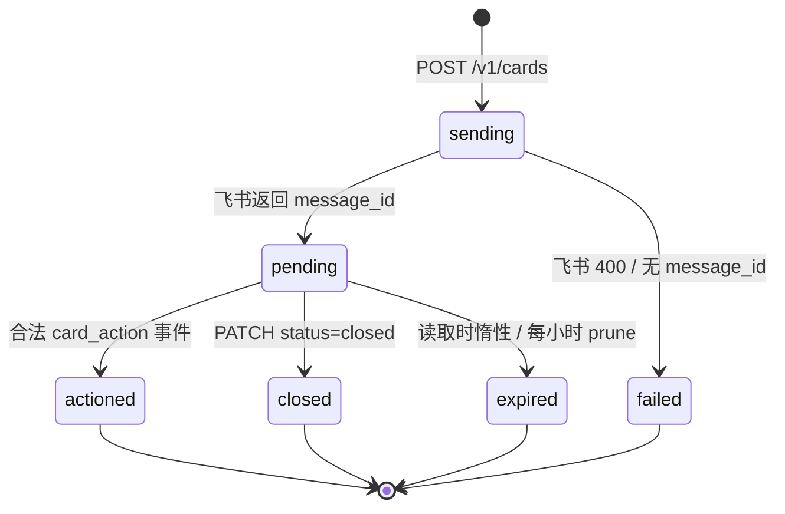

# 飞书 Bot Relay 客户端接口契约

> Hermes agent relay · 本地 HTTP 服务 · 默认 `127.0.0.1:8770`（`HERMES_AGENT_RELAY_HOST` / `HERMES_AGENT_RELAY_PORT`）`agent_relay.py:583-584`
> 所有路由都在 `/v1` 前缀下，没有无版本别名；路径不匹配返回 aiohttp 自带的 HTML 404，不是 JSON 错误信封 `agent_relay.py:549-559`

---

## 0. 三条踩了查不出来的坑

> [!warning] 这三条都是「HTTP 全 2xx、日志无异常、用户无感知」的静默失败。写客户端前先读完。

**坑 1 — 不传 `reply_window_seconds` 不是「默认窗口」，是永远收不到回复。**
默认值是 `0`，`reply_expires_at` 落库为 NULL；匹配条件是 `reply_expires_at > now`，NULL 比较在 SQLite 里恒为假。消息发送成功、201 正常、`GET .../replies` 永远返回 `{"replies": []}`。`agent_relay.py:225` `agent_relay.py:236` `agent_relay_store.py:388`

**坑 2 — 同一 token 同时开两个窗口 ⇒ 所有「不带引用」的回复被丢弃。**
服务端不阻止开第二个窗口（POST 照样 201）。无引用回复要求「该 actor 名下恰好一个未过期已发送消息」，`len(rows) != 1` 即失败。此时用户会收到飞书文本提醒「检测到多个等待中的本地会话，请引用对应卡片后回复。」，但客户端侧 HTTP 上毫无痕迹。`agent_relay_store.py:386-392` `agent_relay.py:87-91` `agent_relay_feishu.py:209-213`

**坑 3 — 回复丢弃在绝大多数情况下无任何通知。**
零个开放窗口 / 引用了错误消息 / 引用了已过期消息 / 空文本 / 非 p2p / 非 text 类型 —— 全部静默丢弃，只写一行脱敏审计日志，用户在飞书里看不到任何反馈。`ambiguous` 在 `parent_message_id` 非空时被强制置 False，所以「引用了但没匹配上」和「根本没窗口」对外完全无法区分。`agent_relay.py:77-79,92-98` `agent_relay_store.py:391-392` `agent_relay_feishu.py:279-280`

推论：客户端必须轮询 `GET /v1/messages/{id}/replies`，并把「空」解释为「用户可能回复过但被丢了」，而不是「用户没回复」。

---

## 1. 认证与登记

### 1.1 Token 格式与鉴权

| 项 | 契约 | 出处 |
|---|---|---|
| 请求头 | `Authorization: Bearer <token>`，`Bearer ` 七字符**大小写敏感**字面前缀 | `agent_relay.py:152-155` |
| Token 形态 | `hm-relay-<token_id>.<secret>`，必须以 `hm-relay-` 开头且含 `.` | `agent_relay_store.py:262-265` |
| 校验 | `scrypt(n=2**14, r=8, p=1)`，salt = `token_id`，比对 `relay_tokens.token_hash`，且行 `status='active'` | `agent_relay_store.py:110-113,261-272` |
| 失败 | 一律 `401 {"error":{"code":"unauthorized","message":"invalid or revoked token"}}` | `agent_relay.py:344-345` |

坑：`bearer x`（小写）、裸 token、截断 token、已吊销 token —— 四种情况返回体完全一致，无 403、无 404，无法区分。

### 1.2 登记流程（拿 token）

| 步骤 | 端点 | 认证 | 返回 |
|---|---|---|---|
| 1 | `POST /v1/enroll/sessions` | 无（也无 body） | `201 {"enroll_id":"en_...","authorize_url":"https://accounts.feishu.cn/open-apis/authen/v1/authorize?...","expires_in":600,"status":"pending"}` `agent_relay.py:157-158` `agent_relay_store.py:162-167` |
| 2 | 用户在浏览器打开 `authorize_url` | — | 服务端 `GET /v1/enroll/callback` 承接 |
| 3 | `GET /v1/enroll/sessions/{enroll_id}` 轮询 | 无 | 见下 |

轮询返回一律 HTTP 200：

| status | 含义 |
|---|---|
| `pending` / `authorizing` | 未完成，继续轮询 |
| `completed` | **仅此一次**返回 `{"status":"completed","token":...,"token_id":...,"user_name":...}`，随后行置 `claimed` 且密封 payload 被 NULL 化 `agent_relay_store.py:240-259` |
| `claimed` | 已被领取过，token 永远拿不回来了，只能重新登记 |
| `failed` / `expired` | 失败 / 创建满 600s 过期 |

未知 `enroll_id` → `404 {"error":{"code":"not_found","message":"enrollment not found"}}` `agent_relay.py:184-190`

### 1.3 身份与吊销

`GET /v1/whoami` → `{"token_id","user_name","identity_fingerprint","issued_at","status"}`。飞书 `open_id`（actor_id）**永不经 HTTP 暴露**；`identity_fingerprint` 是 `sha256(actor_id)` 的前 12 个 hex 字符，只能当不可逆的不透明键用。`agent_relay.py:196-198` `agent_relay_store.py:212`

`POST /v1/tokens/{token_id}/revoke` → `200 {"token_id":...,"status":"revoked"}`。
坑：**不幂等**。第二次调用返回 401（token 已死，鉴权先失败），不是 200 也不是 404；响应丢包后的重试无法区分成功与失败。`agent_relay.py:299-309` `agent_relay_store.py:666-672`
坑：吊销会连带废掉该 token 名下所有开放回复窗 —— 候选 token 集只取 `status='active'`。`agent_relay_store.py:352`

---

## 2. 消息通道 `/v1/messages`

### 2.1 `POST /v1/messages`

请求体必须是 JSON object。

| 字段 | 必填 | 约束 | 失败码 |
|---|---|---|---|
| `type` | 是 | `"text"` \| `"card"` | 400 `invalid_message` |
| `content` | 是 | JSON **object**（不是字符串），序列化后 ≤ 30720 字节 | 400 `invalid_message` / 400 `content_too_large` |
| `idempotency_key` | 是 | strip 后非空 | 400 `invalid_message` |
| `reply_window_seconds` | 否 | int，`0` 或 `300..1800` | 400 `invalid_reply_window` |

`agent_relay.py:213-229`

**收件人字段一律禁止**：请求体任意嵌套深度的 dict **KEY**（大小写不敏感）命中 `{target, recipient, open_id, user_id, email, employee_id, profile, profile_name, agent}` 之一 → `400 identity_field_forbidden`。收件人恒为 token 绑定的 actor。`agent_relay.py:28-30,46-54,210-212,248`
坑：只查 KEY 不查 VALUE，但一个合法卡片里若含 `open_id` 键（如飞书 at 元素）整个请求被拒。

**大小限制**：`len(json.dumps(content, ensure_ascii=False).encode("utf-8")) > 30*1024` → 400 `content_too_large`；中文 3 字节/字。整个 HTTP body 另有 aiohttp 硬顶 `30720+4096`，超过给 aiohttp 自己的 **413 非 JSON body**。`agent_relay.py:23,218-219,546`

**`type: "card"` 的结构校验**：跑 `_card_with_actions(content, [], "", "")` 干跑。要求 `content["elements"]` 是 list；若 `content["schema"] == "2.0"`（**必须是字符串 "2.0"**，浮点 2.0 走不进这一支）则要求 `content["body"]["elements"]` 是 list。否则 400 `invalid_card`（注意：本端点其它错误码是 `invalid_message`，这里是 `invalid_card`，按 code 分支的客户端两个都要接）。`agent_relay.py:220-224` `agent_relay_feishu.py:27-33`
空列表 `{"elements": []}` 是合法的。

### 2.2 成功返回

```json
{"message_id": "om_xxx", "conversation_id": "oc_xxx"}
```

仅此两字段。首次创建 `201`，幂等重放 `200`。`conversation_id` 可能是空字符串（飞书未返回 chat_id），但**永不缺席**，别把 `""` 当错误。`agent_relay.py:287-297` `agent_relay_feishu.py:166`

### 2.3 错误码全表

| HTTP | code | 触发 |
|---|---|---|
| 401 | `unauthorized` | 无/坏/已吊销 token |
| 400 | `invalid_json` | body 不可解析 |
| 400 | `invalid_body` | body 非 object |
| 400 | `identity_field_forbidden` | 命中禁止身份键 |
| 400 | `invalid_message` | type/content/idempotency_key 缺失或非法 |
| 400 | `content_too_large` | content > 30720 字节 |
| 400 | `invalid_card` | card 结构非法 |
| 400 | `invalid_reply_window` | 窗口取值非法 |
| 409 | `idempotency_conflict` | 同 key 不同 request_hash，或跨 kind 复用 |
| 429 | `rate_limited` | 飞书限流，错误对象带 `retry_after`，响应带 `Retry-After` 头 |
| 502 | `upstream_unavailable` | 飞书其它失败 |
| 502 | `missing_receipt` | 飞书返回但无 message_id |
| 504 | `upstream_timeout` | 5s 超时 |

`agent_relay.py:203-286`

坑：飞书侧返回的 400 被重映射成本地同名 code `invalid_message`，只在 message 文本尾部追加 `: Feishu code=<n>, msg=<...>` —— 本地校验失败和飞书业务拒绝只能靠文本区分。`agent_relay.py:268-274`

### 2.4 错误信封 & 幂等

错误恒为 `{"error":{"code":str,"message":str}}`；**仅 429** 额外带 `"retry_after":int`（飞书没给时默认 1）并附 `Retry-After` 响应头。成功体是裸对象，不套 `data`。`agent_relay.py:137-142`

幂等 key 按 `(token_id, idempotency_key)` 唯一，且**按 kind 隔离**：同一个 key 在 `/v1/messages` 与 `/v1/cards` 之间复用 → `409 idempotency_conflict`。`agent_relay_store.py:299-300,500-502`

- request_hash 覆盖**整个 payload 的 sorted-keys JSON** —— 多一个无意义字段、调换 actions 顺序，同 key 即 409，不是重放。`agent_relay_store.py:116-118`
- 重放返回已存结果（200）**仅当结果已落盘**。若首次发送超时/失败，行还停在 `sending` 且无结果，重试会**重新发一次飞书**，靠确定性 `uuid = _feishu_uuid("{token_id}:{key}")` 去重。`agent_relay.py:240-243` `agent_relay_store.py:343-345`
- 504 后的正确重试 = **同 key + 逐字节相同的 body**。

### 2.5 超时

relay 用 `asyncio.wait_for(..., timeout=5)` 包住飞书发送，飞书客户端自身也是 5s，底层 `urlopen(timeout=5)` —— 最坏约 5 秒拿到 504。`agent_relay.py:245-255` `agent_relay_feishu.py:140-142,248`

---

## 3. 卡片通道 `/v1/cards`

### 3.1 路由

| 方法 | 路径 |
|---|---|
| POST | `/v1/cards` |
| GET | `/v1/cards/{card_id}` |
| PATCH | `/v1/cards/{card_id}` |

`agent_relay.py:556-558`

### 3.2 `POST /v1/cards` 请求体

| 字段 | 约束 |
|---|---|
| `content` | object；序列化 ≤ 30720 字节；须含 elements list（同 §2.1 的 schema 规则） |
| `actions` | list，长度 1..5；每项是 dict 且 key 集合**恰好** `{"id","label"}`；两者均为 str，长度 1..64；`id` 组内唯一 |
| `idempotency_key` | strip 后非空 |
| `expires_in` **或** `expiry` | 恰好给一个；真 int，`300..1800` |

`agent_relay.py:352-395`

坑清单：
- 本端点**没有** `type` 字段，这里的卡片恒为 interactive；传 `type:"card"` 被忽略。
- `set(action) == {"id","label"}` ⇒ 给按钮加 `style` / `type` 直接 400。空 `actions: []` 也非法 —— 卡片至少一个按钮。
- 同时给 `expires_in` 和 `expiry` 是硬 400 `"use only one of expires_in or expiry"`，**即使两者值相同**，且这条检查排在其它字段校验之前。
- `expiry` 是纯别名：服务端归一化成 `{**payload, "expires_in": v}` 并 pop 掉 `expiry` 再算 hash，所以 `{expiry:600}` 与 `{expires_in:600}` 同 key 是同一请求（第二次 200，不重复发飞书）。`agent_relay.py:396-397,402`
- TTL 用 `type(x) is not int`（**非** isinstance）⇒ `true`/`false`、`600.0`、`"600"` 全部 400；两者都不给也是 400（`expires_in=None`）。
- 全部失败码统一为 400 `invalid_card`，message 各异。

**校验顺序固定**（写错误驱动测试必须按此构造）：认证 → JSON 解析 → dict + 禁止身份键 → 两个 TTL 字段互斥 → content 是 dict → content 大小 → actions 形状 → idempotency_key → TTL 范围 → `_card_with_actions` → id 唯一。`agent_relay.py:343-395`
即：一个坏 `actions` 会遮住一个坏 TTL。

坑：POST /v1/cards 的禁止身份键检查复用同一逻辑，但返回 code 是 `invalid_card`（与 not-a-dict 合并），**不是** `identity_field_forbidden`，也不写审计行。`agent_relay.py:350-351`

### 3.3 按钮渲染（服务端注入）

服务端深拷贝 content（不改调用方 dict），在 `elements`（schema 2.0 则 `body.elements`）尾部**追加一个** `{"tag":"action","actions":[...]}` 元素，内含每个 action 一个按钮：

```
{"tag":"button","text":{"tag":"plain_text","content":<label>},
 "value":{"relay_action":true,"card_id":...,"nonce":...,"action_id":<id>}}
```

`agent_relay_feishu.py:34-52`

坑：schema 2.0 下注入的仍是 1.0 风格按钮 JSON；调用方无法控制按钮位置与样式；注入发生在大小校验**之后**，不计入 30720。`nonce` 永不返回给客户端。

### 3.4 卡片对象

```json
{"card_id":"cd_xxx","status":"pending","message_id":"om_xxx","expires_at":1755000000000}
```

| 字段 | 说明 |
|---|---|
| `card_id` | 恒有 |
| `status` | `sending` \| `pending` \| `actioned` \| `closed` \| `expired` \| `failed` |
| `message_id` | 恒有；`sending`/`failed` 时是 `""`（**不是 null、不缺席**） |
| `expires_at` | 绝对 epoch **毫秒**（`now_ms + expires_in*1000`），不是秒也不是时长 |
| `action_id` | **仅** `actioned` 时出现 |
| `reason` | **仅** 行的 `close_reason` 非空时出现 |

`agent_relay_store.py:579-590` `agent_relay.py:404`

坑：必须用 `"action_id" in body` 判断，不能 `body.get("action_id") == x`；每次 pending 轮询它都不存在。
坑：`reason` 一旦写入就**永久出现在所有后续读取**上，包括重复 PATCH 的响应、409 的响应、以及 PATCH 因飞书失败返回 502 之后的 GET —— 它不代表「本次 PATCH 成功」。`agent_relay_store.py:588-589`

### 3.5 状态机



`agent_relay_store.py:519,543-545,556-559,566-570,621-623,631-634,643-646`

坑：`expired` 是**惰性写入**的。TTL 已过的卡片在 DB 里仍读作 `pending`，直到有人 GET 它或每小时的 prune 跑到（`sleep 3600` 后 `store.prune()`）。不轮询的客户端最长会看到一小时的陈旧 `pending`。`agent_relay.py:539-544` `agent_relay_store.py:565-571`

### 3.6 `action_id` 与按钮点击

一次点击被接受，需**同时**满足：事件里 actor_id/card_id/nonce/message_id/action_id 均非空且 actor_id 合法（`ou_` 开头）→ `value.relay_action is True` → 卡片属于该 actor 的某个 **active** token → 行存在、`status='pending'`、`expires_at > now`、nonce 哈希匹配、message_id 匹配、`action_id` 在存库的 action_ids 列表内 → 最终 UPDATE 恰好影响 1 行。`agent_relay.py:108-113` `agent_relay_store.py:347-361,611-626` `agent_relay_feishu.py:305`

**第一次点击胜出**：第二次点击（哪怕是另一个 action id、哪怕同一人）返回 False。用户端不是静默的 —— 飞书会弹 toast：成功 `Recorded`，被拒 `Already resolved`。审计日志只在成功时写。`agent_relay_feishu.py:346-351`

因为回调仅按「成员归属」匹配，所以 action id 必须组内唯一（否则存库列表歧义）。`agent_relay_store.py:617`

### 3.7 `GET /v1/cards/{card_id}`

200 返回卡片对象；不存在或不属于本 token → `404 not_found "card not found"`（跨租户也是 404，**永不 403**）。
副作用：GET 会惰性把过期的 pending 翻成 `expired`。`agent_relay.py:466-471` `agent_relay_store.py:565-575`

### 3.8 `PATCH /v1/cards/{card_id}`

请求体：`{"status":"closed","reason":"local_resumed"|"client_timeout"|"cancelled"}`。三个 reason 字面量，无 `expired`/`done`/自由文本；`status` 必填，尽管唯一合法值就是 `closed`。`agent_relay.py:481-487`

| 情况 | 返回 |
|---|---|
| body 不可解析 | 400 `invalid_json`（**不是** `invalid_close`） |
| body 非 dict / status ≠ closed / reason 非法 | 400 `invalid_close "status and a valid close reason are required"` |
| card_id 不存在或不属于本 token | 404 `not_found` |
| UPDATE 未命中且不是「同 reason 重复关闭」 | **409，body 是卡片对象本身，不是错误信封** |
| 成功关闭 | 200 卡片对象 |
| 关闭成功但飞书 429 | 429 `rate_limited` |
| 关闭成功但飞书其它失败 | 502 `upstream_unavailable "card closed but Feishu update failed"` |

`agent_relay.py:477-513` `agent_relay_store.py:631-635`

坑（顺序）：DB 先提交 `closed`，**再**调飞书。所以 502/429 **不代表关闭失败** —— 重试同一 PATCH 会走进「同 reason 重复」分支，仍会**再发一次**飞书 update（不是无副作用），返回 200/429/502；若中途被别人 action 过则 409。要确认状态请 GET。`agent_relay.py:488-513`

坑（过期竞态）：UPDATE 条件含 `expires_at > now`。TTL 刚过的卡片关不掉 —— 后续 `card_state` 读取把它翻成 `expired`，PATCH 返回 409 且 body 里 status 是 `expired`。**30 分钟后卡片连终态都推不动了。**

坑（两种 409 形状）：`idempotency_conflict` 的 409 用 `{"error":{...}}` 信封；PATCH 的 409 是裸卡片对象。统一读 `body.error` 的客户端会在这里炸。

### 3.9 卡片上游失败映射（POST /v1/cards）

| 情况 | 返回 | 是否写状态 | 同 key 重试 |
|---|---|---|---|
| 5s 超时 | 504 `upstream_timeout` | 否，留 `sending` | 重新发送（uuid 去重），可得 200 + `pending` |
| 飞书 429 | 429 `rate_limited` + `retry_after` | 否 | 同上 |
| 飞书其它 / 非 API 异常 | 502 `upstream_unavailable` | 否 | 同上 |
| 飞书 400 | 400 `invalid_card` | **是 → `failed`** | 短路返回 failed 卡片，HTTP **200**，不再发送 |
| 无 message_id | 502 `missing_receipt` | **是 → `failed`** | 同上 |

`agent_relay.py:408-458`

坑：**200 不代表卡片是活的** —— 永远读 `status`。
坑：飞书在 `/open-apis/im/v1/messages` 路径上的**业务级**错误被强制转成 HTTP 400，于是一个业务拒绝会以 `invalid_card` 400 的面目出现，并把卡片永久标成 `failed`。`agent_relay_feishu.py:266`

### 3.10 卡片与消息：状态分家，回复相通

卡片状态存在 `relay_cards`，消息存在 `relay_messages`，**两张表**。卡片的状态只能从 `/v1/cards/*` 读，`GET /v1/cards/{id}` 与 `GET /v1/messages/{id}/...` 不互为别名。

但**文字回复是相通的**：卡片发送成功后会同时在 `relay_messages` 补登一行（`kind='card'`、`status='sent'`、窗口 = 卡片 TTL），所以

- `GET /v1/messages/{card_message_id}/replies` → **200**，能读到用户对这张卡的打字回复
- `GET /v1/messages/{card_message_id}/reactions` → **200**

`agent_relay.py:create_card` `agent_relay_store.py:register_card_message`

于是按钮卡有了文字兜底：用户既可以点按钮，也可以直接回一句话拍板 —— relay 状态库异常时后者仍然通。

代价（必须知情）：
- 这个 message_id 从此**计入歧义计数** —— 一张活着的按钮卡 + 一条活着的消息 = 两扇窗，不带引用的回复会被判 ambiguous 丢掉
- 它的回复窗**继承卡片的 1800s 上限**，不受 `reply_window_seconds` 的 300-1800 约束
- 补登失败只写审计日志，卡片照常返回 201 —— 所以「卡片发出去了」不保证「文字兜底一定在」

`agent_relay_store.py:378-392`

---

## 4. 回复窗 `reply_window_seconds`

### 4.1 取值

| 值 | 结果 |
|---|---|
| 省略 | 等价 `0` |
| `0` / `false` | 无窗口，`reply_expires_at = NULL`，回复**永不匹配** |
| `300..1800`（int） | 窗口 = `now_ms + n*1000` |
| `1..299`、`>1800`、负数 | 400 `invalid_reply_window` |
| 浮点、数字字符串 | 400（isinstance int only） |
| `true` | Python bool 是 int 子类 → 过类型检查 → 值为 1 → 落进范围检查 → 400 |

`agent_relay.py:225-229,236`

注意与卡片 TTL 的不对称：卡片用 `type(x) is int`（拒 bool），窗口用 `isinstance`（收 bool 再被范围拒）。

### 4.2 生命周期

- 绝对墙钟截止时间，**在 API 调用瞬间起算**，不是飞书投递时刻。上游发送延迟（最多 5s 超时）直接吃掉窗口。`agent_relay.py:236,254`
- 在飞书发送**之前**就随 reserve 一起落库，属于幂等记录的一部分。`agent_relay_store.py:311-319`
- 只写一次，**没有任何 UPDATE 改它**。重发同 key 返回原行，**无法延长或重置窗口**；换个 `reply_window_seconds` 用同 key → request_hash 变了 → 409。`agent_relay_store.py:298-305` `agent_relay.py:238-239`
- 窗口只有在消息 `status='sent'`（飞书返回 message_id 之后）才可匹配。飞书发送失败（502/504/429）时行停在 `sending`，窗口是死重量：永不匹配，也不计入歧义计数。`agent_relay_store.py:331,381,388`
- 过期是**匹配时惰性判定**（`reply_expires_at > now`，严格大于）。每小时的 prune **不负责**让消息窗口过期 —— 它只过期卡片、只抹回复正文。`agent_relay_store.py:641-644` `agent_relay.py:539-544`
- **可以提前关窗**：`PATCH /v1/messages/{message_id}` body `{"reply_window_seconds": 0}` 立刻把窗口置为已过期，返回 200；重复关返回 409，窗口不存在/不属于本 token 返回 404。收到回复就关窗，是避免「两扇窗同时开着 → 不带引用的回复被丢」的正规做法。`agent_relay.py:update_message` `agent_relay_store.py:close_reply_window`
- 仍然**不能延长或重开**窗口：`reply_expires_at` 只在下单时写一次，重发同 key 拿回原行；换 `reply_window_seconds` 会让 request_hash 变化直接 409。
- `PATCH /v1/cards/{id}` 关的是卡片，与消息窗口是两回事，**关卡片不会关窗**。

### 4.3 匹配规则

入站事件由飞书长连接事件流分发进 `RelayEvents.ingest_text`（非 HTTP 端点），先做前置校验，再调 `store.assign_reply(...) -> (assigned, ambiguous)`。`agent_relay.py:80-98` `agent_relay_feishu.py:285,336-349`

**前置丢弃**（`agent_relay.py:77-79`）：`event_id` 为空、actor_id 非法、**text 为空**、`create_time <= 0` → 直接丢，记 `status=invalid`，**且不触发歧义提示**（哪怕有两个开放窗口）。

**事件层丢弃**（`agent_relay_feishu.py:279-280`）：仅对 message 事件生效 —— `chat_type != "p2p"` 或 `message_type != "text"` 直接丢。图片、文件、富文本、表情包作为「回复」对客户端**完全不可见**，窗口照开，用户以为答过了。
注意 reaction 与 card_action 两类事件**不走**这个过滤，群聊里也照收。

**候选集**：该飞书 actor（`open_id` 必须 `ou_` 开头）名下**所有 ACTIVE token** 的消息，密封 actor_id 用常量时间比对。`agent_relay_store.py:347-361`

| 场景 | 规则 | 结果 |
|---|---|---|
| 带引用（`parent_id` 或 `root_id`） | 精确匹配：`message_id = parent_message_id` 且 `status='sent'` 且未过期 且属于该 actor 的某 token | 命中则记录；不命中**静默丢弃、无提示** |
| 无引用 | 该 actor 全部 token 范围内，`status='sent'` 且未过期的消息**恰好 1 条** | =1 记录；0 静默丢弃；>1 → 歧义 |

`agent_relay_store.py:379-392`

**引用来源**：`parent_id` 优先，回落 `root_id`，空串归 None。`agent_relay_feishu.py:290`
坑：飞书话题（thread）里 `root_id` 回落可能指向话题根而非用户引用的那张卡，导致解析到另一个（或没有）窗口。

**歧义处理**：`ambiguous = (parent_message_id 为空) and len(rows) > 1`。为真时丢弃回复并向用户推一条飞书**纯文本**：`检测到多个等待中的本地会话，请引用对应卡片后回复。` `agent_relay.py:87-91` `agent_relay_feishu.py:209-213`
坑：`parent_message_id` 一旦非空，`ambiguous` 恒为 False —— 「引用了但没匹配上」与「没有窗口」在用户侧完全一样：无提示。

### 4.4 跨设备隔离

同一个人在两台设备登记两个 token，共享同一候选池：设备 A 的开放窗口会让设备 B 的窗口变歧义。但回复归属给设备 A 的消息后，**设备 B 的 token 读不到** —— `GET .../replies` 返回 404。是**按设备**隔离，不是按人。`agent_relay_store.py:347-361,414-419`

### 4.5 一个窗口可收多条回复

存入回复**不关闭也不缩短窗口** —— `assign_reply` 只 INSERT `relay_replies`，从不更新 `reply_expires_at`。窗口到期前会持续匹配后续回复。客户端要按 `since_ts` 分页，不要假设「一条消息一条回复」。`agent_relay_store.py:394-408`

去重：`INSERT OR IGNORE` 以 `event_id` 为键，飞书重投事件幂等。
坑：重复 event_id 时 `ingest_text` **仍返回 True**，返回值不能当作「写入了新回复」的证据。`agent_relay_store.py:394-397`

---

## 5. 回复与 reaction 的返回结构

### 5.1 `GET /v1/messages/{message_id}/replies`

查询参数：

| 参数 | 默认 | 约束 |
|---|---|---|
| `since_ts` | `0` | int，**严格大于**（exclusive）过滤 `create_time` |
| `limit` | `50` | int，静默钳制到 `1..100` |

非整数 → `400 {"error":{"code":"invalid_query","message":"since_ts and limit must be integers"}}`。`agent_relay.py:315-319`

返回：

```json
{
  "replies": [
    {"id": "evt_xxx", "text": "好的，批准", "create_time": 1755000123456}
  ]
}
```

空为 `{"replies": []}` + 200。排序 `ORDER BY create_time, event_id` 升序。`agent_relay.py:323-327` `agent_relay_store.py:420-433`

坑：
- `limit=1000` 不报错，静默返回 100 条。
- `since_ts` 严格大于 ⇒ 用最后一条的 `create_time` 翻页，会**跳过同毫秒内的其它回复**。
- `create_time` 是**飞书**给的 ms epoch，与 relay 自己的 `_now_ms()` 不同源。传本机时钟值会漏读或重读。`agent_relay_feishu.py:289`
- 404 `not_found "message not found"`：消息不属于**本 token_id**，或 status 不是 `sent`。同一个人的另一台设备也是 404。**404 不代表 message_id 无效。**
- **保留期**：`prune()`（每小时）在 `reply_expires_at + 86400000 <= now` 时把 `content_payload` 就地覆盖成密封的 `{"text": ""}` 并打 `purged_at`；查询带 `AND purged_at IS NULL`，所以清除后的回复**从列表里彻底消失**，不是变成空文本。晚一天来读 = `{"replies": []}` + 200，与「用户从未回复」完全一致。`agent_relay_store.py:422,646-659`

### 5.2 `GET /v1/messages/{message_id}/reactions`

**无任何查询参数**。返回扁平字符串数组：

```json
{"reactions": ["THUMBSUP"]}
```

空为 `{"reactions": []}`，按 `emoji_type` 升序。`agent_relay.py:329-340` `agent_relay_store.py:478-483`

失败只有两种：401 `unauthorized`、404 `not_found "message not found"`（归属规则同 replies）。

语义：这是**集合成员视图**，不是事件流。

| 事实 | 后果 |
|---|---|
| 无 actor、无时间戳、无计数 | 两个人点同一表情合并成一条（主键 `(token_id, message_id, emoji_type)`）`agent_relay_store.py:79` |
| `reaction_created` = INSERT OR REPLACE，`reaction_deleted` = DELETE | 取消后直接从数组消失，无历史 `agent_relay_store.py:457-466` |
| 两次轮询之间的「加了又取消」不可见 | 轮询客户端必须把它当无边沿触发的状态量 |
| **不受 `reply_expires_at` 约束** | `reply_window_seconds: 0` 的消息照样持续累积 reaction |

---

## 6. 管理面 `/v1/admin/*`（只读，管理员专用）

> 给 relay 客户端管理员自查用：不建日志服务器，直接按时间窗拉 relay 模块的日志与用量。
> **两个接口的鉴权与参数校验完全一致**。

### 6.1 鉴权 —— 与 actor token 是两套东西

| 项 | 契约 |
|---|---|
| 请求头 | `Authorization: Bearer <HERMES_AGENT_RELAY_ADMIN_TOKEN>` |
| 比对 | `hmac.compare_digest`，明文等值，不入库、不哈希 |
| 无 `Bearer ` 头 | `401 unauthorized` |
| token 不匹配 **或环境变量未配置** | `403 forbidden`（fail-closed：没配就是谁都进不来） |
| 普通 relay token | `403 forbidden` —— 有效的 actor token 不等于管理员 |

**发布前置（root 手工，不在代码里）**：生产 `/etc/hermes-agent-relay.env` 增加
`HERMES_AGENT_RELAY_ADMIN_TOKEN=<随机串>`，`sync_relay` 重启后生效。不加这行，
两个接口对所有人返回 403，relay 其余功能不受影响。

### 6.2 时间窗参数（两个接口共用）

`since` / `until` 都是**必填**的毫秒时间戳整数，必须 `until > since` 且窗口 ≤ 7 天，
两端闭区间。任一条不满足 → `400 invalid_range`。

### 6.3 `GET /v1/admin/logs`

返回 `{"items":[...], "truncated": false}`，`items` 按 `ts` 升序（同毫秒按写入顺序）。

| 字段 | 说明 |
|---|---|
| `id` | 单调递增的行号，配合 `ts` 做续拉游标 |
| `ts` | 毫秒时间戳 |
| `level` | `INFO` / `WARNING` / `ERROR` … |
| `logger` | 日志器名，如 `hermes_multitenancy.agent_relay`、`Lark` |
| `event` `status` `actor` `card_id` `message_id` | 从行文本里的 `event=` `status=` `actor=` `card=` `msg=` 解析出来；解析不到就是空字符串 |
| `raw` | 与 journald 里那一行**完全相同**的原文 |

**入库范围**：所有 `relay_audit ` 开头的行（任意级别），加上任意 logger 的 `≥WARNING`。
其他 logger 的 INFO/DEBUG 不入库。非 `logging` 产生的输出（aiohttp banner、SDK 的 `print`）拿不到。

**截断**：单次最多 5000 条；超出时截断并返回 `"truncated": true`。
续拉用 keyset 游标：`since=<最后一条的 ts>&after_id=<最后一条的 id>`（`until` 不变）。
只用 `ts` 续拉在同毫秒多条时会原地打转——`after_id` 才能穿过同毫秒的并列行。

**留存 30 天**，由既有的每小时 `prune()` 删除。journald 那一份不受影响。

`raw` 是脱敏后的审计原文，不含消息/卡片正文，`actor` 是 12 位指纹哈希不是 `open_id`。

### 6.4 `GET /v1/admin/stats`

```json
{"messages":{"total":2,"by_kind":{"text":2}},
 "cards":{"total":1,"by_status":{"pending":1}},
 "active_users":2,"enrolled_users":2}
```

| 字段 | 口径 |
|---|---|
| `messages` | 窗口内创建、`status='sent'` 的 `relay_messages`，按 `kind` 分组。**不含**按钮卡为回复兜底补登的那一行（那是一张卡，不是第二条消息） |
| `cards` | 窗口内创建的 `relay_cards`，按当前 `status` 分组 |
| `active_users` | 窗口内有消息或卡片的 token，去重到 actor 指纹 |
| `enrolled_users` | 当前 `status='active'` 的 token 去重到 actor 指纹，**与时间窗无关** |

---

## 7. 已知限制

| # | 限制 | 依据 |
|---|---|---|
| 1 | 回复丢弃在绝大多数路径上对双方均无反馈，只有「无引用 + 多窗口」一种情况会推飞书提示 | `agent_relay.py:87-98` |
| 2 | 无推送：回复到达只能靠轮询 `GET .../replies` | `agent_relay.py:311-327` |
| 3 | 窗口可提前关闭（`PATCH /v1/messages/{id}` + `reply_window_seconds:0`），但**不可延长、不可重开** | `agent_relay.py:update_message` |
| 4 | 服务端不阻止开第二个窗口，歧义完全由客户端自律避免 | `agent_relay_store.py:386-392` |
| 5 | 卡片 TTL 硬顶 1800s；超时后连 PATCH 关闭都做不到（返回 409 / status=expired）。长会话（如 2h）必须用消息通道承载资源 —— `relay_messages` 没有 expires 字段，从不过期也不被 prune | `agent_relay.py:383` `agent_relay_store.py:566-570,631-635,639-661` |
| 6 | 卡片**状态**只能从 `/v1/cards/*` 读；回复/reaction 走 `/v1/messages/{card_message_id}/*`（卡片会补登一行消息）。补登失败是静默的，只写审计 | `agent_relay_store.py:register_card_message` |
| 7 | 卡片的飞书更新内容由服务端硬编码为 `Status: <status> (<action_id>)` 的 markdown，调用方只能通过 `action_id`（≤64 字节）间接影响文案；`card_id` 参数被 `**_ignored` 吞掉，更新只按 message_id 定位 | `agent_relay_feishu.py:197-207` |
| 8 | 回复正文非持久存储：窗口到期 24h 后被 prune 抹除并从列表移除 | `agent_relay_store.py:646-659` |
| 9 | 回复隔离到设备级，不是用户级；同一飞书账号的第二次登记读不到第一台设备的回复 | `agent_relay_store.py:414-419` |
| 10 | 图片/文件/富文本/表情包回复在 message 事件层被丢弃，客户端完全不可见 | `agent_relay_feishu.py:279-280` |
| 11 | reaction / card_action 事件**不做** p2p 过滤，群聊来源也会进入 store | `agent_relay_feishu.py:290,302` |
| 12 | 两种 409 body 形状并存：`idempotency_conflict` 是错误信封，PATCH 卡片是裸卡片对象 | `agent_relay.py:406-407,493-496` |
| 13 | 吊销不幂等（第二次 401）；卡片关闭的「幂等重放」每次都会重发一次飞书 update | `agent_relay.py:299-309,497-507` |
| 14 | 超 aiohttp body 上限（30720+4096）返回 aiohttp 自身 413，非 JSON 信封；路径不匹配返回 HTML 404 | `agent_relay.py:546` |